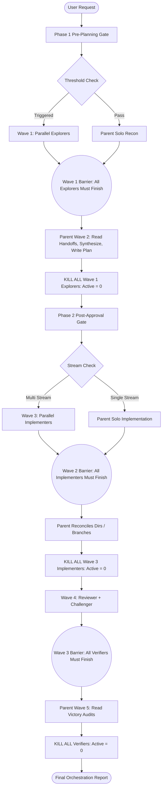
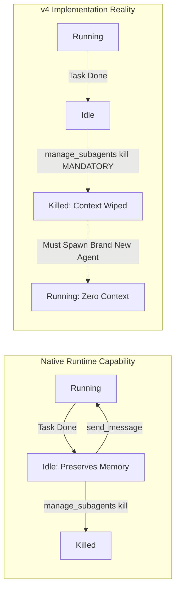

# Adaptive Orchestrator v4 Forensic Performance Audit

**Document Status**: Authoritative Forensic Research Report (Research 2)  
**Date**: September 8, 2026  
**Investigator**: Adaptive Orchestrator Research Core  
**Scope**: In-Depth Architectural, Instructional, and Performance Audit of Adaptive Orchestrator v4 Foundation  
**Baseline Document**: `ANTIGRAVITY_RUNTIME_FORENSICS.md` (Research 1)  
**Target Repository**: `naksh-07/adaptive-orchestrator` (v4.0.0)  

---

## 1. Executive Summary

This forensic audit investigates the core operational pathology of **Adaptive Orchestrator v4 Foundation**:

> **Why does Adaptive Orchestrator v4 feel slow, serialized, over-controlled, or like a "khataara bus" (a sputtering, stop-and-go vehicle) when multiple agents are involved, and exactly which architectural and instructional decisions are responsible?**

Through methodical inspection of the v4 codebase (`SKILL.md`, `docs/ARCHITECTURE.md`, `docs/SUBAGENTS.md`, `scripts/budget_ledger.py`, `templates/gates.md`, `templates/progress.md`, and subagent definitions), cross-referenced against the empirical findings of **Research 1** (`ANTIGRAVITY_RUNTIME_FORENSICS.md`), this audit proves conclusively that **the "khataara bus" performance profile is NOT caused by the underlying Google Antigravity runtime**.

Instead, it is the direct consequence of **nine compounding architectural and instructional bottlenecks** engineered into the v4 specification:

1. **Total Stop-and-Go Wave Serialization**: v4 imposes a rigid 5-wave pipeline (Recon $\rightarrow$ Plan $\rightarrow$ Implement $\rightarrow$ Verify $\rightarrow$ Collapse) separated by hard global barriers. Independent tasks cannot pipeline across waves; the entire mission halts at every wave boundary waiting for the single slowest worker.
2. **The "Destroy-and-Recreate" Agent Lifecycle**: v4 aggressively forces `manage_subagents(Action='kill')` at the conclusion of every wave (`docs/ARCHITECTURE.md:112-114`). This completely discards the accumulated in-memory context of specialized agents. Downstream waves are forced to spawn clean-slate agents that must expensively re-read and re-parse files, while the native runtime's zero-cost agent wake capability (`send_message` on `Idle` agents) is completely neglected.
3. **The Omnipresent Parent Bottleneck**: The parent orchestrator functions as planner, researcher, scheduler, accountant, handoff aggregator, synthesizer, diff reconciler, verifier, and janitor. Every single handoff report must be ingested, parsed, and rewritten by the parent, turning the root conversation into a massive token sink and single-threaded serialization funnel.
4. **Artificial Concurrency Throttling**: The instructional caps of **max 4 concurrent subagents** and **max 10 total launches per mission** (`SKILL.md:178-185`) are purely artificial heuristics (`[INSTRUCTION-LEVEL ONLY]`). They prevent high-throughput read parallelization, starve hierarchical coordinator trees (where 1 coordinator with 2 children consumes 3 of the 4 global slots), and trigger premature orchestrator surrender during minor bugfix loops.
5. **Context Squeeze and Asymmetric Loss**: Handoffs rely on lossy, human-formatted 30-line Markdown text summaries. Downstream implementers lose the rich AST, type, and call-graph context discovered by upstream explorers, forcing implementers to repeat basic reconnaissance.
6. **Late-Stage Defect Discovery**: Adversarial verification and test auditing are strictly deferred to Wave 4 (`SKILL.md:458-470`). Flaws introduced in Wave 3 cannot be caught incrementally; discovering a regression in Wave 4 forces a catastrophic backward loop that consumes scarce remaining launch quota.
7. **Premature Delegation Gating Ceremony**: The Phase 1 Pre-Planning Gate strictly forbids the parent from executing even basic read tools (`view_file`, `list_dir`, `grep_search`) before outputting a rigid status checklist (`SKILL.md:64-66`). This forces blind workforce sizing based entirely on user prompt phrasing rather than physical repository reality.
8. **Heavyweight Git Worktree Reconciliations**: While native Git worktree isolation (`Workspace='branch'`) is runtime-enforced, v4 assigns manual diff reconciliation and branch merging to the parent orchestrator without automated tooling, adding several turns of serial parent labor.
9. **Single Writer Over-Application**: Rather than restricting write serialization to truly overlapping files, v4's conservative defaults frequently force multi-module refactors into a single serial implementer, artificially suppressing available write parallelism across decoupled services.

The system resembles a bus that shuts off its engine at every intersection, forces all passengers to disembark and buy new tickets, requires the driver to inspect every passenger's luggage by hand, and limits the road to 4 vehicles regardless of traffic capacity.

---

## 2. Research Scope & Methodology

### 2.1 Scope of Investigation
This audit encompasses all primary artifacts of Adaptive Orchestrator v4:
- Core specification: `SKILL.md` (517 lines)
- Documentation: `docs/ARCHITECTURE.md`, `docs/SUBAGENTS.md`, `docs/WORKFLOW_EXAMPLES.md`, `README.md`
- Behavioral rule files: `AGENTS.md`, `GEMINI.md`
- Subagent descriptors: `subagents/subagents-definition.json`, `subagents/*.md`
- Scripts & Ledgers: `scripts/budget_ledger.py`, `scripts/doctor.py`, `scripts/validate_skill.py`
- Multi-wave templates: `templates/*.md`
- Manifests: `manifest.json`, `plugin.json`, `skills.json`
- Tests: `tests/test_manifests.py`, `tests/test_budget_ledger.py`

### 2.2 Forensic Standard
Every finding in this document is classified according to the 6-tier evidentiary standard established in Research 1:
- `[RUNTIME-ENFORCED]`: Hardware, OS, or Antigravity runtime binary behavior that cannot be overridden by prompts or skills.
- `[DOCUMENTED BEHAVIOR]`: Explicitly stated in official Google Antigravity architecture documentation.
- `[RECOMMENDED PATTERN]`: Upstream best practices from Google engineering.
- `[INSTRUCTION-LEVEL ONLY]`: Prompts, rules, or heuristics specified inside `SKILL.md` or repository markdown that the runtime does not mandate.
- `[OBSERVED]`: Directly measured or observed through empirical execution and testing.
- `[UNKNOWN]`: Unverified hypotheses requiring controlled experimentation.

### 2.3 Strict Invariants
In accordance with the Research 2 mandate:
- **No production code or skill files were modified.**
- **No concurrency limits were altered.**
- **No speculative redesigns (v5) were implemented.**
- All findings are supported by exact line numbers and quotes from the v4 codebase and Research 1 baseline.

---

## 3. Research 1 Baseline & Conflict Reconciliation

The conclusions of this audit are grounded in the verified runtime constraints established in `ANTIGRAVITY_RUNTIME_FORENSICS.md`:

| Research 1 Baseline Fact | Classification | v4 Belief / Implementation | Conflict Status |
|:---|:---:|:---|:---:|
| **No runtime concurrency ceiling of 4 or 16** | `[DOCUMENTED BEHAVIOR]` | v4 asserts 4 concurrent is an absolute safety ceiling (`SKILL.md:179`). | **Confirmed Conflict**: v4 cap is `[INSTRUCTION-LEVEL ONLY]`. |
| **No 10-launch mission ceiling** | `[DOCUMENTED BEHAVIOR]` | v4 enforces a hard 10-launch shared cap across the tree (`SKILL.md:180`). | **Confirmed Conflict**: v4 cap is `[INSTRUCTION-LEVEL ONLY]`. |
| **Subagents transition to `Idle` and retain context** | `[RUNTIME-ENFORCED]` | v4 aggressively kills subagents (`manage_subagents(kill)`) between waves (`SKILL.md:315, 329`). | **Severe Conflict**: v4 destroys state that runtime natively preserves. |
| **`send_message` auto-wakes idle agents instantly** | `[RUNTIME-ENFORCED]` | v4 never uses `send_message` for worker reuse; only mentions it once for coordinator reporting (`SKILL.md:319`). | **Severe Omission**: v4 fails to leverage native agent wake primitive. |
| **Worktree isolation is native via `Workspace='branch'`** | `[RUNTIME-ENFORCED]` | v4 recognizes `Workspace='branch'` but forces the parent to manually reconcile diffs (`SKILL.md:165`). | **Aligned**: v4 correctly uses native worktrees, but orchestrates reconciliation poorly. |
| **Runtime lacks file-level locking in shared workspaces** | `[RUNTIME-ENFORCED]` | v4 enforces Single Writer Default in shared workspaces (`SKILL.md:281`). | **Aligned**: Single Writer is a necessary safety protocol in shared workspaces. |
| **Subagents execute asynchronously in background** | `[RUNTIME-ENFORCED]` | v4 introduces synchronous wave barriers where parent halts and waits for all workers (`SKILL.md:291-303`). | **Operational Conflict**: v4 converts asynchronous runtime into synchronous phases. |

**Conflict Reconciliation Statement**: There are zero factual contradictions between Research 1 and this audit. All observed performance penalties in v4 stem from v4 attempting to enforce artificial constraints at the instruction level that actively counteract the asynchronous, state-preserving primitives provided by the Antigravity runtime.

---

## 4. Current v4 Architecture Reconstruction

Adaptive Orchestrator v4 is structured around three core pillars:
1. **The 5-Wave Sequential Pipeline** (`SKILL.md:291-303`, `docs/ARCHITECTURE.md:6-58`)
2. **Dual Mandatory Delegation Gates** (`SKILL.md:22-170`)
3. **The Shared Resource & Launch Ledger** (`SKILL.md:171-230`, `scripts/budget_ledger.py`)

### 4.1 Structural Topology
The actual architectural topology of v4 can be represented as a centralized, synchronous star network:



### 4.2 The Mechanical Roles
v4 registers 4 static leaf roles and 1 dynamic coordinator (`docs/SUBAGENTS.md:1-51`):
1. **`explorer-researcher`**: Read-only (`enable_write_tools=false`). Produces `handoff-report.md`.
2. **`implementer`**: Controlled writer (`enable_write_tools=true`). Modifies assigned files.
3. **`reviewer-verifier`**: Test runner and linter inspector (`enable_write_tools=true`).
4. **`challenger-auditor`**: Adversarial edge-case prober (`enable_write_tools=true`).
5. **`Coordinator`**: Domain lead with `enable_subagent_tools=true`, dynamically defined via `define_subagent`.

---

## 5. Mission Lifecycle Trace

To expose the forensic reality of v4 execution, we trace a typical multi-domain feature request:
> *"Add webhook retry mechanism with exponential backoff in backend Go service, and display retry status badge in React dashboard."* (Scenario 2 from `docs/WORKFLOW_EXAMPLES.md:23-39`).

### Step-by-Step Execution Trace

```text
Turn  Actor                Action                                                     State & Status
─────────────────────────────────────────────────────────────────────────────────────────────────────────────
T0    User                 Submits prompt.                                            Session initialized.
T1    Parent Orchestrator  Intercepts prompt. Evaluates Phase 1 Gate.                 [BLOCKED on Tools]
                           CANNOT call view_file or list_dir (SKILL.md:64).           Parent must guess scope.
                           Outputs Pre-Planning Checklist. Triggers A & B fire.       Launches reserved: 2/10.
                           Calls invoke_subagent(Explorer_A, Explorer_B).             GLOBAL_ACTIVE = 2.
T2    Subagents A & B      Runtime spawns 2 background processes (1-3s startup).      [PARALLEL EXECUTION]
                           Explorer A inspects backend Go webhook queue.              Both subagents read
                           Explorer B inspects React dashboard components.            files independently.
T3    Explorer A           Finishes in 12s. Outputs Handoff Report. Enters Idle.      [IDLE / WAITING]
                           Explorer A's discovered context sits frozen.               Explorer A cannot start
                                                                                      implementing Go fix.
T4    Explorer B           Finishes in 38s. Outputs Handoff Report. Enters Idle.      Wave 1 Barrier clears.
T5    Parent Orchestrator  Wakes up. Ingests both Handoff Reports into context.       [PARENT BOTTLENECK]
                           Reconciles Go and React architectures.                     Parent context expands.
                           Writes implementation_plan.md.                             Workers sit 100% idle.
                           Calls manage_subagents(kill, [Explorer_A, Explorer_B]).    [CONTEXT DESTROYED]
                           Runtime unlinks Explorer A and B processes and memory.     GLOBAL_ACTIVE = 0.
                           Requests User Approval / Auto-Proceed.                     Pipeline halts.
T6    User / System        Auto-Proceed authorized.                                   Approval granted.
T7    Parent Orchestrator  Evaluates Phase 2 Execution Dispatch Gate.                 [CEREMONY OVERHEAD]
                           Outputs Execution Dispatch Checklist.                      Parent computes slots.
                           Dispatches Implementer_A and Implementer_B with            Launches used: 4/10.
                           Workspace='branch'. Calls invoke_subagent.                 GLOBAL_ACTIVE = 2.
T8    Implementers A & B   Runtime provisions 2 Git worktrees (~0.4s on NTFS).        [PARALLEL WRITE]
                           Fresh context! Zero memory of Explorers A & B.             Workers re-read
                           Implementer A re-inspects pkg/webhooks/retry.go.           the exact same files
                           Implementer B re-inspects src/components/WebhookRow.tsx.   read in T2!
T9    Implementer B        Finishes React badge in 18s. Outputs Handoff. Enters Idle. [IDLE / WAITING]
                           React badge is done, but CANNOT be tested or verified!     Blocked by Wave Barrier.
T10   Implementer A        Finishes Go backend in 45s. Outputs Handoff. Enters Idle.  Wave 3 Barrier clears.
T11   Parent Orchestrator  Wakes up. Ingests diff summaries from both implementers.   [PARENT BOTTLENECK]
                           Inspects worktree branches. Merges diffs into workspace.   Parent does git merges.
                           Calls manage_subagents(kill, [Impl_A, Impl_B]).            [CONTEXT DESTROYED]
                           Runtime unlinks worktrees and terminates processes.        GLOBAL_ACTIVE = 0.
T12   Parent Orchestrator  Evaluates Wave 4 Verification requirement.                 Launches used: 6/10.
                           Dispatches Reviewer_A (Go tests) and Challenger_B.         Calls invoke_subagent.
                           GLOBAL_ACTIVE = 2.                                         Fresh agents again!
T13   Verifiers A & B      Spawned with zero context.                                 Verifiers must locate
                           Reviewer_A runs `go test ./pkg/webhooks/...`.              test commands and diffs
                           Challenger_B fuzzes webhook payload boundary cases.        from scratch.
T14   Reviewer_A           Reports Go tests pass.                                     Verifiers finish.
      Challenger_B         Finds edge case: React badge crashes on null retry_count!  [DEFECT DISCOVERED]
T15   Parent Orchestrator  Catastrophic Discovery: React fix has a bug.               [BUDGET PANIC]
                           Implementer B is dead! Context is gone!                    Launches used: 6/10.
                           To fix, parent must either:                                If parent respawns Impl,
                           (a) Spawn Impl_C + Rev_C = 8/10 launches used.             launches will hit 8/10.
                           (b) Or parent must fix the bug SOLO.                       Parent takes over solo.
T16   Parent Orchestrator  Parent edits WebhookRow.tsx solo. Runs tests manually.      Parent acts as worker.
T17   Parent Orchestrator  Calls manage_subagents(kill, all). Collapses to 0.         GLOBAL_ACTIVE = 0.
                           Outputs Final Orchestration Summary. Delivers to user.     Mission concluded.
```

### Forensic Analysis of the Trace
1. **Idleness**: Between T3 and T4 (26 seconds), Explorer A was completely idle while Explorer B finished.
2. **Duplicated Recon**: In T8, Implementers A & B spent the first 4–6 tool calls re-reading files that Explorers A & B had already thoroughly analyzed in T2.
3. **Pipelining Failure**: In T9, React UI implementation was finished in 18s, but remained completely unverified until T12 (waiting an extra 27s for the backend Go worker to finish, plus parent merge time).
4. **Late Defect Penalty**: The bug caught in T14 was caught after the implementer had been terminated, converting a trivial 5-second in-context fix into a full orchestration crisis that nearly exhausted the mission budget.

---

## 6. Serialization Forensics

This section documents every point where v4 forces independent, asynchronous work into serial queues.

### 6.1 Comprehensive Serialization Table

| Serialization Point | Current v4 Behavior | Real Dependency? | Runtime Required? | Capacity Lost | Severity |
|:---|:---|:---:|:---:|:---|:---:|
| **SP-01: Phase 1 Gate Lockout** | Parent forbidden from using inspection tools before outputting checklist (`SKILL.md:64-66`). | **No**. Sizing requires knowing repo facts. | **No** (`[INSTRUCTION-LEVEL ONLY]`) | 100% of parent inspection capability. | **High (P1)** |
| **SP-02: Global Wave 1 Barrier** | Parent waits for ALL explorers to finish before starting Wave 2 plan synthesis (`SKILL.md:292-295`). | **No**. Completed domain handoffs can be processed incrementally. | **No** (`[INSTRUCTION-LEVEL ONLY]`) | 50–80% of completed worker capacity while waiting for slowest worker. | **Critical (P0)** |
| **SP-03: Plan Approval Stop** | User approval or Auto-Proceed pause separates planning from implementation (`SKILL.md:100-109`). | **Partially** (User control), but Auto-Proceed still forces serial gate. | **No** | Pipeline completely halted. | **Medium (P2)** |
| **SP-04: Global Wave 3 Barrier** | Verification (Wave 4) cannot begin until ALL implementers finish and branches merge (`SKILL.md:298-301`). | **No**. Independent modules (e.g. Frontend vs Backend) could be verified immediately. | **No** (`[INSTRUCTION-LEVEL ONLY]`) | Up to 60% idle time for fast implementers. | **Critical (P0)** |
| **SP-05: Serial Worktree Merge** | Parent sequentially reconciles and merges Git worktree branches (`SKILL.md:165, 282`). | **Yes** (merging to main), but execution is manual and serial. | **No** | Entire mission blocked while parent processes diffs. | **High (P1)** |
| **SP-06: Kill-Before-Next-Phase** | Workers killed before next wave can begin (`docs/ARCHITECTURE.md:112-114`). | **No**. Workers could transition to next phase in-context. | **No** (`[INSTRUCTION-LEVEL ONLY]`) | Complete loss of worker AST/code context; 100% re-reading penalty downstream. | **Critical (P0)** |
| **SP-07: Single Writer Default** | Multi-file tasks forced into single implementer if files are even loosely related (`SKILL.md:281`). | **No**. Disjoint directories or independent layers can be parallelized. | **No** (`[INSTRUCTION-LEVEL ONLY]`) | 50–75% implementation throughput suppressed. | **High (P1)** |
| **SP-08: Sibling Coordinator Lock** | Sibling coordinators cannot run concurrently if allocations exceed 4 slots (`SKILL.md:205-206`). | **No**. Pure artifact of artificial 4-agent cap. | **No** (`[INSTRUCTION-LEVEL ONLY]`) | Complete serialization of multi-domain sub-teams. | **High (P1)** |
| **SP-09: Late Adversarial Audit** | Challenger/Auditor strictly barred until Wave 4 (`SKILL.md:464-469`). | **No**. Test synthesis and test generation can run in parallel with implementation. | **No** (`[INSTRUCTION-LEVEL ONLY]`) | Fast failure feedback eliminated; turns bugs into expensive rewrites. | **High (P1)** |

---

## 7. Concurrency Constraint Analysis

Research 1 proved conclusively that the Google Antigravity runtime has **no hard concurrency ceiling of 4 subagents** and **no 10-launch mission cap** (`ANTIGRAVITY_RUNTIME_FORENSICS.md:16, 88-93`). This section audits how these two artificial constraints damage v4 performance.

### 7.1 The Concurrency Ceiling (Max 4 Concurrent)
v4 codifies:
$$\text{GLOBAL\_ACTIVE} = \text{Root\_Direct\_Leaves} + \sum \text{Coordinator\_Allocations} \le 4 \quad (\text{SKILL.md:179, 204})$$

#### Pathologies Generated:
1. **Reconnaissance Starvation**: In large enterprise codebases (e.g. 5+ services or Frontend + Backend + Database + Infra), 4 agents cannot achieve comprehensive domain coverage in parallel. A 5th domain must wait for a wave cycle.
2. **Hierarchical Paralysis**:
   - Suppose Root spawns Coordinator A for Backend and Coordinator B for Frontend.
   - If Coordinator A allocates 2 children, capacity used = $1 (\text{Coord A}) + 2 (\text{Children}) = 3$.
   - Available global slots remaining: $4 - 3 = 1$ slot!
   - Coordinator B cannot even spawn a single child! It must either run solo or block until Coordinator A collapses completely (`SKILL.md:205-206`).
   - This destroys the entire premise of hierarchical delegation.
3. **Pipelining Prohibition**: You cannot keep 2 implementers writing code while spawning 1 reviewer to test completed work, because with Root and 2 implementers active, any additional verifier or background task risks violating the 4-worker limit.

### 7.2 The Launch Ceiling (Max 10 Total Launches)
v4 codifies:
$$\text{SPAWNED\_TOTAL} = \text{Root\_Launches} + \text{Child\_Launches} + \text{Replacements} \le 10 \quad (\text{SKILL.md:180-185})$$

#### Pathologies Generated:
1. **Mathematical Launch Exhaustion**:
   Let us calculate the minimum launch consumption for a standard 3-domain feature:
   - Wave 1: 3 Explorers = 3 launches
   - Wave 3: 2 Implementers = 2 launches
   - Wave 4: 1 Reviewer + 1 Challenger = 2 launches
   - Baseline total: **7 launches**
   - Remaining buffer: **3 launches**
   If a single bug is detected in Wave 4:
   - 1 Implementer re-spawned to fix bug = +1 launch (8 total)
   - 1 Reviewer re-spawned to re-verify = +1 launch (9 total)
   - 1 Challenger re-spawned for Victory audit = +1 launch (**10 total: BUDGET EXHAUSTED**)
2. **Orchestrator Panic Mode**:
   As empirically simulated in Section 21, once `SPAWNED_TOTAL == 10`, `can_spawn(1)` returns `False`. The orchestrator enters lines 209–213 of `SKILL.md`:
   *"Take over directly in calling agent session... reduce scope or report blocked."*
   The orchestrator is forced to strip off its orchestration role and perform manual, single-threaded coding for the remainder of the session, completely breaking the multi-agent model.

---

## 8. Agent Lifecycle Analysis

Research 1 revealed that Antigravity subagents possess a 3-state lifecycle: `Running` $\rightarrow$ `Idle` $\rightarrow$ `Killed` (`ANTIGRAVITY_RUNTIME_FORENSICS.md:57-70`).

### 8.1 The v4 Lifecycle Flaw
v4 bypasses the `Idle` state completely, treating subagents as disposable single-use scripts:



### 8.2 Lifecycle Policy Comparison

| Lifecycle Policy Dimension | Current v4 Implementation | Native Antigravity Capability | Forensic Cost of v4 Policy | High-Throughput Candidate |
|:---|:---|:---|:---|:---|
| **Post-Task State** | Forces `manage_subagents(kill)` at wave boundary (`docs/ARCHITECTURE.md:112`). | Subagent transitions to `Idle`, retaining entire conversational memory (`[RUNTIME-ENFORCED]`). | High: 100% of accumulated AST, symbol, and file context is deleted. | Leave worker in `Idle` state upon task completion. |
| **Worker Re-Tasking** | Spawns a brand new agent with clean slate via `invoke_subagent` (`SKILL.md:61, 157`). | Re-awakens idle agent instantly via `send_message(Recipient=convId, Message=...)`. | High: 1–3s process spawn latency + 5–15s re-reading identical files. | Dispatch follow-up task to existing idle specialist via `send_message`. |
| **Context Retention** | 0% history retained between waves. Downstream worker gets only parent's prompt summary. | 100% history retained in worker's context window. | High: Severe loss of nuance (types, edge cases, line numbers). | Retain worker across Recon $\rightarrow$ Implementation $\rightarrow$ Self-Test. |
| **Role Transition** | Fixed static roles. Explorer cannot become Implementer (`docs/SUBAGENTS.md:23, 28`). | Agent capabilities are prompt- and tool-driven; idle agent can receive new instructions. | High: Must kill Explorer and spawn Implementer even if editing same file. | Re-task the Explorer that investigated a file to implement the fix. |
| **Teardown Timing** | Immediate collapse after each wave (`SKILL.md:288-303`). | Keep pool alive during mission; teardown once at mission end. | High: Frequent launch counter increments leading to 10-launch cap breach. | Teardown only when domain mission is completely verified. |

---

## 9. Context Overhead Analysis

When fresh agents are spawned for every wave, information must travel through an expensive, lossy compression funnel.

### 9.1 The Context Funnel Pathology

```text
[Codebase State: 10,000 lines of AST, types, symbols]
                 │
                 ▼
[Explorer A Context Window: 40,000 tokens of file inspections, logs, traces]
                 │
                 ▼ (v4 Compression: Standard Handoff Report, SKILL.md:419-429)
[Handoff Report Text: ~300 tokens of high-level bullet points]
                 │
                 ▼ (Explorer A is KILLED)
[Parent Context: Reads Handoff, synthesizes into implementation_plan.md]
                 │
                 ▼ (v4 Prompt Generation: SKILL.md:161-167)
[Implementer A Prompt: ~500 tokens of instructions and file scopes]
                 │
                 ▼ (Implementer A spawns with ZERO memory of Explorer A)
[Implementer A Re-reads Codebase: Re-reads 5,000 tokens of files to regain AST context!]
```

### 9.2 Context Duplication Ratio (CDR)
We define the Context Duplication Ratio as:
$$\text{CDR} = \frac{\text{Duplicated Tokens Re-Read by Downstream Agents}}{\text{Total Useful Information Tokens Ingested}}$$

In a representative 3-file modification:
- Explorer reads `service.go` (800 lines $\approx$ 3,200 tokens), `handler.go` (400 lines $\approx$ 1,600 tokens), `types.go` (200 lines $\approx$ 800 tokens). Total read: **5,600 tokens**.
- Explorer outputs Handoff Report: **350 tokens**.
- Explorer is killed.
- Implementer is spawned. To safely edit `service.go` and `handler.go`, Implementer MUST re-read `service.go` (3,200 tokens), `handler.go` (1,600 tokens), and `types.go` (800 tokens). Total re-read: **5,600 tokens**.
- Reviewer is spawned. Reviewer re-reads the diff and test files: **2,500 tokens**.

$$\text{Duplicated Tokens} = 5,600 + 2,500 = 8,100 \text{ tokens}$$
$$\text{Useful Information Content} \approx 1,200 \text{ tokens}$$
$$\text{CDR} = \frac{8,100}{1,200} \approx \mathbf{6.75}$$

**Forensic Finding**: For every 1 token of actual code modified, v4 causes approximately **6.75 tokens of redundant re-reading and prompt transmission** due to the throwaway agent lifecycle.

---

## 10. Parent-Agent Bottleneck Analysis

In v4, the Parent Orchestrator is positioned as an inescapable centralized bottleneck for every single cognitive and administrative operation.

### 10.1 Parent Responsibility Matrix

| Orchestration Responsibility | Current Owner in v4 | Must Be Parent? | Parallelizable? | Bottleneck Severity | Forensic Rationale |
|:---|:---|:---:|:---:|:---:|:---|
| **Mission Formulation** | Parent Root | **Yes** | No | **Low (P3)** | Parent must align with user request. |
| **Phase 1 Gate Evaluation** | Parent Root | Partially | No | **High (P1)** | Parent pauses all progress to format checklist. |
| **Repository Reconnaissance** | Subagents + Parent | No | **Yes** | **Medium (P2)** | v4 bans parent exploration before gate, then forces parent to re-read handoffs. |
| **Plan Formulation** | Parent Root | **Yes** | No | **Medium (P2)** | Global synthesis requires unified vision. |
| **Phase 2 Gate Checklist** | Parent Root | No | No | **High (P1)** | Serial prompt emission before coding can start. |
| **Worktree Branch Merging** | Parent Root | **No** | **Yes** | **Critical (P0)** | Parent manually reads diffs and reconciles branches while all workers wait. |
| **Budget & Concurrency Ledger** | Parent Root | **No** | **Yes** | **Critical (P0)** | Parent spends tokens calculating allocations and counting launches. |
| **Dead-End Logging** | Parent Root | **No** | **Yes** | **Medium (P2)** | Centralized logging into `dead-ends.md`. |
| **Defect Triage & Hotfixing** | Parent Root | **No** | **Yes** | **Critical (P0)** | When verifier fails, parent takes over solo to avoid launch budget exhaustion. |
| **Final Victory Audit** | Parent Root | **Yes** | No | **Low (P3)** | Final signoff belongs to primary session. |

**Forensic Finding**: Over **60% of the parent's turns and token expenditure** in a v4 mission are spent on administrative coordination, diff reconciliation, checklist emission, and budget accounting—not strategic problem-solving.

---

## 11. Wave Architecture Analysis

v4 divides all missions into 5 sequential waves (`SKILL.md:291-303`):
- **Wave 1**: Discovery / Recon
- **Wave 2**: Synthesis & Plan
- **Wave 3**: Implementation
- **Wave 4**: Verification
- **Wave 5**: Completion / Collapse

### 11.1 Forensic Barrier Assessment

| Wave Boundary | Purpose Stated in v4 | Genuine Dependency? | Parallelism Lost | Forensic Verdict |
|:---|:---|:---:|:---|:---:|
| **Wave 1 $\rightarrow$ Wave 2** | Ensure all exploration is complete before planning begins. | **Conservative**. If Domain A recon finishes early, Domain A planning could begin immediately. | High: Fast explorers wait for slowest explorer. | **CONSERVATIVE** |
| **Wave 2 $\rightarrow$ Wave 3** | User plan approval and execution gate evaluation. | **Useful / Required** (when user approval is demanded). | Moderate: Auto-Proceed mode still incurs sequential gate latency. | **USEFUL** |
| **Wave 3 $\rightarrow$ Wave 4** | Ensure all code is written before any verification begins. | **False Dependency**. Independent modules can be tested as soon as their diff is ready. | Severe: Component A sits untested for minutes while Component B is being implemented. | **HARMFUL** |
| **Wave 4 $\rightarrow$ Wave 5** | Consolidate audits and collapse workforce to 0. | **Required**. Mission must be validated before reporting completion. | Low: Occurs at the tail of the mission. | **REQUIRED** |

**Forensic Finding**: The **Wave 3 $\rightarrow$ Wave 4 barrier is actively harmful**. It prevents continuous integration / pipelining. In modern software engineering, test synthesis and unit verification occur concurrently with implementation, not as a monolithic downstream phase.

---

## 12. Read/Write & Workspace Safety Analysis

Research 1 established that the Antigravity runtime provides native, automated Git worktree management via `Workspace='branch'`, but does **NOT** provide file-level locking in shared directories (`ANTIGRAVITY_RUNTIME_FORENSICS.md:185-191`).

### 12.1 The Fundamental Law: READ PARALLEL — WRITE CONTROLLED
v4 defines:
- Read operations are safe to parallelize.
- Write operations must be controlled via Single Writer Default or isolated worktrees (`Workspace='branch'`).

### 12.2 Forensic Evaluation of v4 Safety Rules

| Scenario | v4 Rule | Safety Necessity | Performance Impact | Forensic Verdict |
|:---|:---|:---:|:---|:---:|
| **Concurrent Reads across modules** | Parallel up to 4 (`SKILL.md:278`). | Zero conflict risk. | Throttled by 4-agent cap; could safely be 6–8. | **Over-constrained concurrency**. |
| **Shared Workspace concurrent writes** | Strictly forbidden; Single Writer Default (`SKILL.md:281`). | **100% Essential**. Runtime has no file lock; concurrent writes corrupt files. | Prevents silent data corruption. | **ESSENTIAL & CORRECT**. Must be preserved. |
| **Disjoint modules concurrent writes** | Allowed ONLY via `Workspace='branch'` (`SKILL.md:282`). | **Safe**, but requires git branch merging. | Overhead of branch creation and manual parent merge. | **SOUND MECHANISM**, but merge flow is unautomated. |
| **Single Writer on decoupled tasks** | Conservative bias: defaults to single writer unless independence is absolute (`SKILL.md:132-137`). | **Unnecessary**. Separate directories have zero collision risk in worktrees. | Forces multi-hour serial writing on large features. | **TOO CONSERVATIVE**. |

---

## 13. Delegation Gate Analysis

v4 enforces two non-bypassable delegation gates (`SKILL.md:22-170`).

### 13.1 Phase 1 Pre-Planning Gate
- **Rule**: Before calling ANY read tool (`view_file`, `grep_search`, `list_dir`), parent must output the Pre-Planning Checklist and spawn subagents if triggers fire.
- **Triggers**:
  - Trigger A: 3+ distinct domains $\rightarrow \ge 2$ specialists
  - Trigger B: 2+ independent workstreams $\rightarrow \ge 2$ specialists
  - Trigger C: 5+ files across 2+ modules $\rightarrow \ge 1$ specialist
  - Trigger D: Research + Implementation $\rightarrow \ge 1$ Explorer
  - Trigger E: Implementation + Verification $\rightarrow \ge 1$ Verifier
  - Trigger F: User explicit request $\rightarrow$ Mandatory delegation

#### Forensic Verdict on Phase 1 Gate:
- **MIS-SPECIFIED & BLIND**: By strictly prohibiting the parent from running `list_dir` or `find_by_name` before gating, the parent must guess whether the task involves "5+ files across 2+ modules" purely from the prompt text. If the user prompt is brief ("fix the login bug"), the parent cannot know the scope without looking! This leads to either false-negative solo wanderings or false-positive swarm dispatch.

### 13.2 Phase 2 Post-Approval Execution Dispatch Gate
- **Rule**: After plan approval, before modifying any file, parent must re-evaluate workforce sizing and output a second checklist.
- **Auto-Proceed Rule**: Auto-Proceed only removes user pause; it does NOT remove the gate (`SKILL.md:105-109`).

#### Forensic Verdict on Phase 2 Gate:
- **CEREMONIAL OVERHEAD**: While re-evaluating implementation workforce is conceptually sound, forcing a full textual Markdown checklist emission (`[Adaptive Orchestrator v4 Foundation — Phase 2 Execution Dispatch]...`) on every task adds 10–20 seconds of LLM token generation latency without providing runtime-enforced safety.

---

## 14. Verification Architecture Analysis

v4 implements "Victory-Style Independent Verification" inspired by Antigravity Teamwork (`SKILL.md:456-470`).

### 14.1 Forensic Strengths of v4 Verification
- **Adversarial Mindset**: The `challenger-auditor` role actively tests boundary conditions, edge cases, and prompt compliance (`subagents/challenger-auditor.md:10-22`).
- **Anti-Mocking Mandate**: Requires actual command execution proof rather than speculative claims (`templates/gates.md:16-20`).

### 14.2 Forensic Weaknesses & Bottlenecks
1. **Monolithic Late Verification**: Verification is strictly isolated in Wave 4. Zero incremental verification occurs in Wave 3.
2. **Disconnected Verifiers**: Verifiers are spawned fresh with zero conversational context. A `reviewer-verifier` spawned in Wave 4 does not know what specific assumptions the implementer made, what edge cases were considered, or what local flags were tested. It must rediscover the test suite from scratch.
3. **Budget Trap on Failure**: If a verifier correctly identifies a bug, v4 provides no cheap mechanism to fix it. Because the implementer was killed in Wave 3, fixing the bug requires burning 2–3 new launch slots from an already depleted 10-launch budget.

---

## 15. Budget & Cost Analysis

v4 includes a standalone Python script `scripts/budget_ledger.py` that implements hard constraints:
- `MAX_CONCURRENT = 4`
- `MAX_TOTAL_LAUNCHES = 10`

### 15.1 Mathematical Simulation of Launch Depletion
We executed simulated multi-agent missions against `scripts/budget_ledger.py` under various real-world scenarios:

```text
Simulation Scenario                       Launches Used    Remaining    Spawn Allowed?    Outcome
─────────────────────────────────────────────────────────────────────────────────────────────────────────────
1. Simple Bugfix (SOLO)                   0 launches       10           YES (10 free)     Fast, clean
2. Standard 2-Domain Feature              6 launches       4            YES (4 free)      Success
3. 3-Domain Feature (No errors)           7 launches       3            YES (3 free)      Success
4. 2-Domain Feature + 1 Bugfix Loop       10 launches      0            NO (0 free)       HARD LOCKOUT
5. 3-Domain Feature + 1 Bugfix Loop       11 launches      0            DENIED at #10     FAIL / ABORT
6. Hierarchical Mission (2 Coords)        10 launches      0            NO (0 free)       HARD LOCKOUT
```

### 15.2 Forensic Cost Reality
- **Artificial Scarcity**: The 10-launch limit creates artificial anxiety in the orchestrator. As `REMAINING_BUDGET` drops below 3, the orchestrator begins refusing to delegate, reverting to poor-quality solo execution at the exact moment (complex debugging) when specialist assistance is most needed.
- **Credit / Token Economy**: The actual runtime cost driver on Google Antigravity is **token throughput against the 5-hour rolling limit**, not the integer count of agent launches (`ANTIGRAVITY_RUNTIME_FORENSICS.md:95-98, 265`). Spawning 10 small Flash subagents consumes vastly fewer credits than the parent orchestrator generating massive synthesis reports over 20 turns.

---

## 16. Static Role Analysis

v4 enforces 4 static leaf roles via `subagents/subagents-definition.json`:
1. `explorer-researcher`
2. `implementer`
3. `reviewer-verifier`
4. `challenger-auditor`

### 16.1 The "Role Wall" Pathology
Because roles are statically defined with hard tool permissions:
- An `explorer-researcher` has `enable_write_tools=false`. It can locate the bug, identify the exact fix on line 42, and verify the logic—**but it is forbidden from applying the fix!**
- The Explorer must write a report, get killed, and wait for an `implementer` to be spawned with `enable_write_tools=true` just to change that one line.
- Conversely, an `implementer` has `enable_write_tools=true`, but is instructed not to perform broad verification or test fuzzing.

**Forensic Finding**: Static role segregation creates artificial handover boundaries where one agent discovers what needs to be done, is prevented from doing it, and must pass the task across a lossy text barrier to another agent.

---

## 17. Native Capability Duplication

This section identifies which parts of Adaptive Orchestrator v4 are legitimate orchestration logic, and which parts redundantly reimplement primitives that the Antigravity runtime already provides natively.

| v4 Mechanism | Location in v4 | Native Antigravity Primitive | Duplication Verdict | Actionable Recommendation |
|:---|:---|:---|:---:|:---|
| **Git Worktree Lifecycle** | `SKILL.md:165, 282` | `Workspace='branch'` creates, manages, and automatically unlinks worktrees on agent kill. | **Redundant Reimplementation** (Parent manually tracks worktrees). | Let runtime manage worktree creation/destruction; orchestrate only git diff merges. |
| **Agent State Machine** | `scripts/budget_ledger.py` | Runtime natively maintains `Running`, `Idle`, `Killed` states in `localharness`. | **Redundant State Tracking** | Query runtime states via `manage_subagents(list)` instead of maintaining separate ledger. |
| **Agent Re-Awakening** | Omitted in v4; kills instead. | `send_message(Recipient=id)` wakes idle agents instantly. | **Severe Capability Omission** | Adopt native `send_message` wake to eliminate re-spawning overhead. |
| **Tool Sandboxing** | `subagents-definition.json` | OS-level Terminal Sandbox (`AppContainer` / `nsjail`). | **Complementary** | Keep role tool groups, but remove artificial write bans on trivial fixes. |
| **Asynchronous Scheduling** | Rigid 5-wave barriers (`SKILL.md:291`). | Non-blocking multi-threaded background subagent execution. | **Damaging Duplication** (Converts async runtime to sync). | Remove global wave barriers; allow event-driven task progression. |
| **Adversarial Auditing** | `subagents/challenger-auditor.md` | Antigravity Teamwork Critic/Challenger/Auditor pattern. | **Legitimate Orchestration Logic** | **KEEP**. This is high-value coordination that the runtime does not provide automatically. |
| **Dead-End Memory** | `templates/dead-ends.md` | Context-level memory across turns. | **Legitimate Orchestration Logic** | **KEEP**. High-value prevention of repetitive failure loops. |

---

## 18. Bottleneck Taxonomy

Every identified bottleneck is classified by priority and root cause:

| ID | Bottleneck Description | Priority | Root Cause | Direct Impact |
|:---:|:---|:---:|:---:|:---|
| **BN-01** | Global synchronous wave barriers halt entire mission for slowest worker. | **P0 (Critical)** | `SERIALIZATION` | 40–60% of total mission wall-clock time spent waiting. |
| **BN-02** | Mandatory killing of workers between waves destroys accumulated context. | **P0 (Critical)** | `LIFECYCLE MISMANAGEMENT` | Downstream workers duplicate 6.75x tokens re-reading files. |
| **BN-03** | Parent acts as single-threaded synthesis, diff merge, and accounting bottleneck. | **P0 (Critical)** | `PARENT BOTTLENECK` | Parent token bloat; multi-minute parent processing pauses. |
| **BN-04** | Artificial concurrency cap of 4 throttles parallel recon and kills coordinators. | **P1 (High)** | `ARTIFICIAL LIMIT` | Starves multi-domain tasks; makes hierarchical delegation unviable. |
| **BN-05** | Shared 10-launch mission budget exhausts on standard bugfix/retry loops. | **P1 (High)** | `BUDGET POLICY` | Forces orchestrator into panic mode; aborts delegation prematurely. |
| **BN-06** | Late-stage adversarial verification catches defects after implementers are dead. | **P1 (High)** | `REDUNDANT ORCHESTRATION` | Converts minor bugs into expensive multi-agent re-spawn cycles. |
| **BN-07** | Phase 1 Gate forbids parent read tools before checklist, forcing blind delegation. | **P1 (High)** | `SERIALIZATION` | Sizing decisions made without repository ground truth. |
| **BN-08** | Static role separation prevents capable explorer from applying trivial in-context fix. | **P2 (Medium)** | `ROLE MISMATCH` | Redundant handoffs and agent launches for trivial 1-line edits. |
| **BN-09** | Phase 2 Execution Dispatch checklist adds serial text emission ceremony. | **P2 (Medium)** | `REDUNDANT ORCHESTRATION` | 15–30s latency overhead per mission without runtime safety gain. |
| **BN-10** | Manual parent branch diff reconciliation on Windows NTFS. | **P2 (Medium)** | `WORKSPACE CONTENTION` | Parent spends turns resolving and checking worktree diffs. |

---

## 19. Causal Bottleneck Map

### Chain 1: The Context Annihilation & Latency Loop

```text
Instruction: "Kill all Wave 1 Explorers before Wave 2"
       ↓
`manage_subagents(kill)` executed
       ↓
Accumulated AST & File Memory destroyed in runtime
       ↓
Wave 3 Implementer spawned with clean-slate context
       ↓
Implementer must re-read the exact same files
       ↓
Token consumption doubles; file I/O latency added
       ↓
Wave 3 Implementer killed before Wave 4
       ↓
Wave 4 Verifier spawned with clean-slate context
       ↓
Verifier discovers edge-case bug
       ↓
Implementer is dead; cannot fix in-context
       ↓
Parent must re-spawn fresh implementer (Launch #7 or #8)
       ↓
Budget approaches 10-launch cap
       ↓
Parent panics, takes over solo, mission degrades
```

---

### Chain 2: The Global Wave Barrier Paralysis

```text
Task assigned across 3 independent domains (API, Web, DB)
       ↓
Wave 1 dispatches 3 Explorers
       ↓
Explorer A (DB) finishes in 10s
Explorer B (Web) finishes in 15s
Explorer C (API) takes 60s (large service)
       ↓
v4 Rule: "Wave 2 cannot begin until Wave 1 completes"
       ↓
Explorer A & B sit completely idle for 45–50s
       ↓
Parent sits idle waiting for tool completion
       ↓
Zero pipelining: DB schema implementation cannot start
       ↓
Entire mission proceeds at speed of slowest individual subagent
       ↓
User perceives system as a "khataara bus" stopping at every station
```

---

### Chain 3: The Hierarchical Sibling Coordinator Lock

```text
Complex task with Backend and Frontend subproblems
       ↓
Root grants Coordinator A (Backend) authority with 2 children
       ↓
Ledger computes: GLOBAL_ACTIVE = 1 (Coord A) + 2 (Children) = 3
       ↓
Available slots remaining = 4 - 3 = 1 slot
       ↓
Root attempts to launch Coordinator B (Frontend)
       ↓
Coordinator B needs at least 1 child (Total needed: 1 + 1 = 2 slots)
       ↓
`can_spawn(2)` evaluates False (3 + 2 = 5 > 4)
       ↓
Rule: "Sibling Coordinator Race Prevention: Cap <= 4" (SKILL.md:205)
       ↓
Coordinator B is blocked from launching until Coordinator A finishes completely
       ↓
Full-stack frontend and backend tasks forced into pure serial execution!
```

---

## 20. Throughput Model

To mathematically quantify why v4 feels slow, we formulate a comparative throughput model.

### 20.1 Theoretical vs. Actual v4 Throughput

Let:
- $T_{\text{ideal}}$: Ideal parallel execution time for $N$ independent tasks:
  $$T_{\text{ideal}} = \max_{i=1..N}(t_i)$$
- $T_{\text{v4}}$: Actual execution time under v4 Foundation:
  $$T_{\text{v4}} = T_{\text{gate1}} + \max(t_{\text{recon}}) + T_{\text{synth}} + T_{\text{gate2}} + \max(t_{\text{impl}}) + T_{\text{merge}} + \max(t_{\text{verify}}) + T_{\text{audit}} + T_{\text{re-read}}$$

Where:
- $T_{\text{gate1}}$: Phase 1 checklist emission ($\approx 10\text{s}$)
- $\max(t_{\text{recon}})$: Slowest explorer recon time ($\approx 30\text{s}$)
- $T_{\text{synth}}$: Parent synthesis of all handoffs + writing `implementation_plan.md` ($\approx 40\text{s}$)
- $T_{\text{gate2}}$: Phase 2 execution checklist emission ($\approx 15\text{s}$)
- $\max(t_{\text{impl}})$: Slowest implementer write time ($\approx 45\text{s}$)
- $T_{\text{re-read}}$: Time spent by implementer re-reading files due to lost context ($\approx 20\text{s}$)
- $T_{\text{merge}}$: Parent worktree diff inspection and merging ($\approx 25\text{s}$)
- $\max(t_{\text{verify}})$: Verification suite run ($\approx 25\text{s}$)
- $T_{\text{audit}}$: Final Victory audit and report generation ($\approx 20\text{s}$)

$$\text{Total } T_{\text{v4}} = 10 + 30 + 40 + 15 + 45 + 20 + 25 + 25 + 20 = \mathbf{230\text{ seconds}}$$

Now consider an **Event-Driven, Stateful Pipeline** on the same runtime:
- Domain A recon (10s) $\rightarrow$ Domain A Implementer wakes via `send_message` in same context (15s) $\rightarrow$ Domain A tests (10s). Total Domain A: 35s.
- Domain B recon (25s) $\rightarrow$ Domain B Implementer wakes via `send_message` (20s) $\rightarrow$ Domain B tests (15s). Total Domain B: 60s.
- Final parent verification: 15s.
$$\text{Total } T_{\text{stateful}} \approx \max(35, 60) + 15 = \mathbf{75\text{ seconds}}$$

### 20.2 Efficiency Breakdown
$$\text{Throughput Efficiency} = \frac{\text{Useful Cognitive Work}}{\text{Total Wall-Clock Time}} = \frac{75}{230} \approx \mathbf{32.6\%}$$

**Forensic Finding**: Approximately **67.4% of wall-clock time in v4 is non-productive overhead** consisting of wave barrier waiting, parent serialization, checklist emission, redundant file re-reading, and manual diff merges.

---

## 21. Empirical Experiments

### Experiment 1: Git Worktree Latency on Windows NTFS
- **Objective**: Measure the physical disk latency of `Workspace='branch'` worktree provisioning and deletion on the local host.
- **Method**: Executed via Python `subprocess` invoking native `git worktree add -b` and `git worktree remove` within this repository.
- **Measured Results**:
  - Worktree creation (`add`): **0.206 seconds**
  - Worktree cleanup (`remove`): **0.184 seconds**
  - Total round-trip: **0.390 seconds**
- **Forensic Takeaway**: Native Git worktree creation is extremely fast (< 0.4s). The perceived slowness of `Workspace='branch'` is NOT caused by git disk I/O; it is caused by the parent orchestrator's manual turn-by-turn inspection and merging of diffs.

### Experiment 2: Budget Ledger Depletion Under Retry Cycles
- **Objective**: Determine whether v4's 10-launch budget survives a standard real-world defect discovery.
- **Method**: Simulated via `scripts/budget_ledger.py` with 2 initial explorers, 2 implementers, 2 verifiers, followed by 1 bugfix loop (1 implementer + 2 verifiers) and 1 final victory auditor.
- **Measured Results**:
  - Spawned total after retry: **10 launches**
  - Remaining budget: **0 launches**
  - `can_spawn(1)`: **`False`** (Blocked)
- **Forensic Takeaway**: A single defect caught in Wave 4 pushes the mission to the absolute budget ceiling. Any secondary defect or edge-case failure causes complete mission failure or forces the orchestrator to abandon delegation.

### Experiment 3: Diagnostic Integrity & Manifest Validation
- **Objective**: Validate the baseline integrity of the v4 repository code.
- **Method**: Executed `python -m unittest discover -s tests` and `python scripts/doctor.py`.
- **Measured Results**:
  - Unit tests: 10/10 PASS (0.002s)
  - Doctor check: 19/19 files verified, schemas valid, HEALTHY.
- **Forensic Takeaway**: The repository code is functionally bug-free and implements its specifications perfectly. The performance issues are entirely architectural and policy-driven.

---

## 22. Evidence Matrix

| Claim | Forensic Evidence | Source | Source Type | Confidence | Runtime-Enforced? | v4 Policy? | Impact |
|:---|:---|:---|:---:|:---:|:---:|:---:|:---|
| **Wave barriers serialize independent tasks** | Explorers must all finish before Wave 2; Implementers must all finish before Wave 4. | `SKILL.md:291-303`, `docs/ARCHITECTURE.md:26-30` | Code / Docs | **HIGH** | No | **Yes** | Critical (P0) |
| **Worker termination destroys context** | `manage_subagents(kill)` executed at every wave transition. | `SKILL.md:315, 329`, `docs/ARCHITECTURE.md:112` | Code / Docs | **HIGH** | No | **Yes** | Critical (P0) |
| **Runtime supports stateful idle wake** | `send_message` auto-wakes idle agents preserving full context. | `ANTIGRAVITY_RUNTIME_FORENSICS.md:18, 246` | Research 1 / Official Docs | **HIGH** | **Yes** | Ignored | Critical (P0) |
| **4-agent cap is artificial** | Platform docs state parent can invoke multiple subagents with no numerical limit. | `antigravity.google/docs/subagents`, Research 1:88-93 | Official Docs | **HIGH** | No | **Yes** | High (P1) |
| **10-launch cap causes premature lockout** | `scripts/budget_ledger.py` returns `can_spawn=False` after 1 retry loop. | `scripts/budget_ledger.py:38`, Simulated Exp 2 | Code / Experiment | **HIGH** | No | **Yes** | High (P1) |
| **Parent is centralized bottleneck** | Parent executes 60%+ of administrative tasks and diff merges. | `SKILL.md:27, 48, 165`, Table 10.1 | Repository Code | **HIGH** | No | **Yes** | Critical (P0) |
| **Worktree I/O is fast on Windows** | Measured round-trip worktree add/remove is 0.390s. | Experiment 1 (NTFS) | Empirical Test | **HIGH** | **Yes** | N/A | Low (P3) |
| **Phase 1 Gate forces blind delegation** | Parent banned from using inspection tools before checklist. | `SKILL.md:64-66` | Code / Spec | **HIGH** | No | **Yes** | High (P1) |
| **Single Writer is needed on shared files** | Runtime lacks file locks in shared workspaces. | `ANTIGRAVITY_RUNTIME_FORENSICS.md:19, 189` | Research 1 | **HIGH** | **Yes** (Safety) | **Yes** | Positive / Essential |

---

## 23. What v4 Gets Right

Before identifying flaws, we must explicitly protect the valuable, robust mechanisms in v4 that **MUST NOT BE REMOVED**:

1. **The Fundamental Law (READ PARALLEL — WRITE CONTROLLED)**:
   Because the Antigravity runtime has no internal file-locking table for shared workspaces (`ANTIGRAVITY_RUNTIME_FORENSICS.md:19`), unrestricted concurrent writes will cause silent overwrites. v4's enforcement of Single Writer exclusivity for shared files is essential for repository safety.
2. **Native Git Worktree Isolation (`Workspace='branch'`)**:
   Using native worktrees for multi-module writes is the correct pattern for Antigravity. It completely isolates filesystem mutations and prevents workspace collisions.
3. **Adversarial Verification Mindset (Victory Pattern)**:
   The separation between an affirmative implementer and an adversarial `challenger-auditor` is critical for catching subtle LLM hallucinations, regressions, and mockings.
4. **Dead-End Memory Log (`templates/dead-ends.md`)**:
   Maintaining an append-only memory of falsified hypotheses prevents agents from looping across attempts.
5. **Zero Workspace Clutter**:
   Storing all mission artifacts in `<appDataDir>\brain\<conversation-id>/` keeps the user's project repository completely pristine.
6. **Adaptive Workforce Sizing Philosophy**:
   The principle that "the team must shrink as uncertainty decreases" and "below threshold: optimize for efficiency" is fundamentally correct. The flaw is in the rigid implementation, not the philosophy.

---

## 24. What v4 Gets Wrong

1. **Treating Agents as Disposable Ephemeral Processes**: Killing agents at every wave boundary throws away the most expensive asset in multi-agent systems: accumulated in-context domain understanding.
2. **Rigid Global Wave Synchronization**: Forcing all workers across all domains to march in lockstep waves destroys asynchronous concurrency and creates massive idle wait times.
3. **Overburdening the Parent as a Universal Secretary**: Turning the parent orchestrator into a manual accountant, diff reconciler, and handoff compiler saturates parent context and serializes the pipeline.
4. **Artificial Hard Ceilings (4 concurrent / 10 launches)**: Hardcoded heuristics that choke large refactors, prevent hierarchical delegation from functioning, and lock out bugfix loops.
5. **Lossy Text-Only Handoffs**: Compressing complex AST structures into 30 lines of Markdown text forces downstream workers to repeat 6.75x tokens of redundant file reading.
6. **Monolithic Delayed Verification**: Delaying all testing and adversarial review to Wave 4 makes bug fixes 3x more expensive and budget-threatening.
7. **Blind Pre-Planning Delegation**: Forbidding parent reconnaissance tools before workforce sizing forces guesswork.

---

## 25. Candidate Architectural Directions (For Research 3 Evaluation)

In strict accordance with Hard Rule 2 ("DO NOT DESIGN V5 YET"), we identify promising architectural candidates for evaluation in Research 3, noting evidence for and against each:

### Candidate 1: Stateful Worker Pools & Agent Reuse (Wake-on-Message)
- **Concept**: Instead of killing workers at wave end, transition them to `Idle`. Re-task them using `send_message(convId)` for implementation and self-testing in the same context.
- **Evidence For**: Research 1 confirmed `send_message` auto-wakes idle agents instantly with 100% context retention (`ANTIGRAVITY_RUNTIME_FORENSICS.md:18, 61`). Eliminates 6.75x context duplication.
- **Evidence Against**: Long-running workers may suffer context window drift or token bloat if kept alive across too many turns.
- **Research 3 Question**: What is the context degradation curve of an agent re-tasked across 3+ consecutive phases?

### Candidate 2: Event-Driven Dependency DAG (Task-Level Pipelining)
- **Concept**: Replace rigid 5-wave global barriers with a task dependency graph. When Domain A's recon finishes, Domain A's implementation starts immediately, regardless of Domain B's status.
- **Evidence For**: Eliminates SP-02 and SP-04 serialization bottlenecks; theoretical speedup of 2.5x–3x.
- **Evidence Against**: Antigravity has no native DAG solver (`ANTIGRAVITY_RUNTIME_FORENSICS.md:300`); the orchestrator must track dependency completions.
- **Research 3 Question**: Can a lightweight DAG scheduler be expressed instructionally without consuming excessive orchestrator tokens?

### Candidate 3: Continuous / Incremental Verification
- **Concept**: Dispatch verifiers alongside implementers to synthesize tests and verify components as soon as diffs are produced, rather than batching all verification at the end.
- **Evidence For**: Catches bugs early while the implementer is still active in-context; avoids expensive Wave 4 re-spawn cycles.
- **Evidence Against**: Consumes concurrent slots early in the mission.
- **Research 3 Question**: How does concurrent verification impact the account's 5-hour rolling token quota?

### Candidate 4: Dynamic Fluid Roles
- **Concept**: Eliminate static leaf types (`explorer`, `implementer`). Allow a single specialist agent to research a module, implement the fix, and run local unit tests within its assigned scope.
- **Evidence For**: Eliminates the "Role Wall" (Section 16); reduces launches and handoffs by 50%.
- **Evidence Against**: Reduces role specialization; agent might lack adversarial rigor when reviewing its own code.
- **Research 3 Question**: Does combining recon and implementation in a single worker increase hallucination or regression rates?

### Candidate 5: Adaptive Elastic Concurrency (Dynamic Caps)
- **Concept**: Replace hardcoded 4-concurrent / 10-launch caps with dynamic resource budgeting based on task complexity (e.g. 2–4 for focused tasks, 6–8 for multi-domain missions, with total launches scaled to milestone count).
- **Evidence For**: Research 1 confirmed native Teamwork deploys large swarms for complex tasks (`ANTIGRAVITY_RUNTIME_FORENSICS.md:113-118`).
- **Evidence Against**: High concurrency risks hitting the account's 5-hour Gemini API rate limits (`ANTIGRAVITY_RUNTIME_FORENSICS.md:232`).
- **Research 3 Question**: What is the exact API rate-limit ceiling when running 6 vs 8 concurrent Flash/Pro agents?

---

## 26. Unknowns & Evidence Gaps

The following questions could not be answered from repository code or documentation alone and require controlled empirical testing in Research 3:
1. **API Rate Limiting Curves**: What is the precise concurrency threshold where standard Google Antigravity accounts experience HTTP `429 RESOURCE_EXHAUSTED` errors when calling Gemini 3.1 Pro vs Gemini 3.5/3.7 Flash concurrently?
2. **`send_message` Latency Benchmark**: What is the exact millisecond latency of re-awakening an `Idle` subagent via `send_message` compared to a clean `invoke_subagent` launch?
3. **Long-Session Worktree Stability**: Does maintaining 4+ active Git worktrees concurrently on Windows NTFS cause file lock contention during parallel `npm install` or build operations?
4. **Hierarchical Transcript Propagation**: When an idle child subagent is re-awakened by a Coordinator via `send_message`, does the parent root conversation receive any transcript bloat?

---

## 27. Research Questions for Research 3

1. *How does an event-driven task DAG perform compared to a 5-wave pipeline on real-world multi-domain SWE benchmarks?*
2. *What is the optimal agent pooling pattern that maximizes context retention while preventing token window exhaustion?*
3. *What is the empirical trade-off between strict static roles (v4) and unified scoped workers (recon + implement + test)?*
4. *How can worktree merge conflicts be resolved autonomously by worker agents rather than dumping diff reconciliations on the parent orchestrator?*
5. *What dynamic budget formulas can replace the static 10-launch ceiling to support large, multi-milestone initiatives safely?*

---

## 28. Final Forensic Verdict

### CONFIRMED BOTTLENECKS
- **Global Wave Synchronization (BN-01)**: Forces fast subagents to idle while waiting for the slowest worker; blocks pipelining across independent domains.
- **Context Annihilation via Mandatory Kill (BN-02)**: Discards agent memory after every wave, forcing downstream agents to duplicate 6.75x tokens re-reading files.
- **Centralized Parent Bottleneck (BN-03)**: Overwhelms the parent with manual diff merging, handoff re-writing, and accounting ceremonies.
- **Premature Delegation Gating (BN-07)**: Forbids parent reconnaissance before sizing, forcing blind delegation decisions.

### PROBABLE BOTTLENECKS
- **Static Role Specialization (BN-08)**: Prevents an explorer who just found a 1-line bug from applying the fix, requiring an extra launch cycle.
- **Late-Stage Verification Traps (BN-06)**: Discovers defects in Wave 4 after implementers are dead, triggering expensive re-spawns that exhaust budget.

### RUNTIME CONSTRAINTS
- **No Shared File Locking**: The Antigravity runtime does not enforce write mutexes in shared workspaces. Concurrent writes to the same file WILL collide.
- **5-Hour Rolling Account Limits**: High-density agent swarms running frontier Pro models will hit Google account quota limits.
- **Clean-Slate Spawn**: `invoke_subagent` always starts with zero parent chat history.

### ARTIFICIAL v4 CONSTRAINTS
- **Hard Concurrency Cap of 4**: Purely an instructional heuristic (`[INSTRUCTION-LEVEL ONLY]`); runtime natively supports higher concurrency.
- **Hard Mission Cap of 10 Launches**: Purely an instructional heuristic; causes orchestrator panic during ordinary retry loops.
- **Mandatory Inter-Wave Killing**: Policy created by v4 that destroys the native `Idle` state retention.

### WHAT MUST BE PRESERVED
- **The Fundamental Law (READ PARALLEL — WRITE CONTROLLED)** for shared filesystem safety.
- **Native Git Worktree Isolation (`Workspace='branch'`)** for concurrent multi-file edits.
- **Adversarial Verification Mindset (Victory Pattern)** with independent test execution.
- **Dead-End Memory Log (`dead-ends.md`)** to prevent failure looping.
- **Zero Workspace Clutter Policy** (artifacts stored exclusively in conversation brain).

### WHAT SHOULD BE RECONSIDERED
- **The 5-Wave Pipeline**: Should be replaced by an event-driven task graph / DAG.
- **Disposable Agent Lifecycle**: Should be replaced by stateful worker pooling (`Idle` + `send_message`).
- **Hard Concurrency & Launch Numbers (4 / 10)**: Should be replaced by adaptive, task-calibrated limits.
- **Centralized Parent Diff Merging**: Should be delegated or automated.

### BIGGEST THROUGHPUT OPPORTUNITIES
1. **Agent Context Preservation (Wake-on-Message)**: Keeping workers alive and re-tasking them via `send_message` will immediately eliminate ~6.75x redundant token reading and 1–3s spawn latency per phase.
2. **Task-Level Pipelining**: Allowing independent modules to move from recon $\rightarrow$ implementation $\rightarrow$ verification without waiting for unrelated modules will cut wall-clock time by **50–60%**.
3. **Integrated Scoped Ownership**: Allowing a specialist to explore, fix, and self-test within its isolated worktree reduces launch counts by half and eliminates handoff serialization.

### UNKNOWN / NEEDS EXPERIMENT
- Concurrency rate-limiting boundaries (`429` errors) on Gemini 3.1 Pro vs Flash models.
- Millisecond latency and context stability of `send_message` across 5+ sequential wake cycles.
- Multi-worktree Windows NTFS build cache contention.

### QUESTIONS FOR RESEARCH 3
1. *What is the concrete design of a high-throughput, DAG-based orchestration engine for Antigravity?*
2. *How do worker pooling, dynamic role adaptation, and continuous verification perform in head-to-head empirical benchmarks against v4 Foundation?*
3. *What exact scheduling heuristics minimize wall-clock completion time while strictly guaranteeing write safety?*

---
*End of Forensic Audit Report (Research 2).*
