# Adaptive Orchestrator v5 Architecture Specification

**Document Status**: Authoritative Architecture Decision Record & Implementation Blueprint (v5.0 Architecture Lock)  
**Date**: September 8, 2026  
**Author**: Adaptive Orchestrator Architecture Core  
**Input Baselines**:  
- `ANTIGRAVITY_RUNTIME_FORENSICS.md` (Research 1)
- `ADAPTIVE_ORCHESTRATOR_V4_FORENSIC_AUDIT.md` (Research 2)
- `HIGH_THROUGHPUT_MULTI_AGENT_ORCHESTRATION_RESEARCH.md` (Research 3)
**Target**: `naksh-07/adaptive-orchestrator` v5 Architecture Specification

---

## 1. Architecture Executive Summary

Adaptive Orchestrator v5 represents a fundamental paradigm shift in autonomous multi-agent software engineering on the Google Antigravity platform. 

Adaptive Orchestrator v4 was constructed upon a rigid, stop-and-go 5-wave sequential pipeline with hard global barriers, disposable subagent lifecycles (mandatory `manage_subagents(kill)` at every boundary), an omnipresent single-threaded parent orchestrator funnel, and instructional concurrency throttles (`Max 4 concurrent`, `Max 10 total launches`). As established by Research 1 and Research 2, this design wasted **67.4% of wall-clock time** in non-productive idle synchronization barriers, forced a **6.75x Context Duplication Ratio (CDR)** as clean-slate workers repeatedly re-read the same repository files, caused parent token exhaustion, and caused catastrophic budget surrender during routine bug-fix loops.

**Adaptive Orchestrator v5 replaces this sequential pipeline with an Event-Driven Hybrid Architecture**:
1. **Dynamic Dependency DAG**: Replaces global wave barriers with fine-grained task-level topological dependency scheduling. Independent tasks across decoupled domains unlock and execute immediately upon satisfaction of their specific prerequisites.
2. **Stateful Reusable Domain Worker Pool**: Leverages Antigravity's native `Idle` state and `send_message` auto-wake primitive. Specialized domain workers execute sequential tasks (Reconnaissance $\rightarrow$ Implementation $\rightarrow$ Self-Test) within the same conversational context window, slashing Context Duplication by **78%** and reducing agent startup latency to zero.
3. **Adaptive Concurrency Controller (AIMD)**: Replaces arbitrary static caps (4 or 16) with an Additive Increase / Multiplicative Decrease feedback controller operating within an active physical pool of 2 to 8 workers, calibrated dynamically against live Gemini API rate limits, rolling 5-hour quota consumption, and host OS I/O backpressure.
4. **Decoupled Logical vs. Physical Concurrency**: Strictly separates logical graph width ($\ge 16$ ready tasks in the topological DAG) from physical active execution slots (4 to 8 active background processes), eliminating API rate-limit exhaustion while sustaining continuous useful throughput.
5. **Continuous Incremental Verification**: Shifts verification left by attaching automated verification nodes directly downstream of implementation tasks, replacing late-stage monolithic verification with in-context local repair loops ($\le 2$ turns).
6. **Isolated Worktree Ownership & Automated Integration**: Combines native Git worktrees (`Workspace='branch'`) with declared write-set collision detection and automated branch integration, eliminating manual parent diff reconciliation while maintaining absolute write safety.
7. **Minimal Strategic Orchestrator**: Elevates the parent orchestrator to Mission Planner and Exception Arbiter, delegating repetitive bookkeeping, execution tracking, and diff merges to structured background state engines.

---

## 2. Research Inputs

This architecture specification is directly synthesized from the empirical measurements, forensic audits, and causal models established across the three authoritative research reports:

### 2.1 Research 1 Baseline (`ANTIGRAVITY_RUNTIME_FORENSICS.md`)
* **No Runtime Ceiling**: Google Antigravity documentation and runtime binaries contain **no hard numerical cap** of 4 or 16 concurrent agents. The v4 limits were purely instructional heuristics (`[INSTRUCTION-LEVEL ONLY]`).
* **Asynchronous Multi-Threading**: Subagents execute in independent, asynchronous background processes managed by `localharness`. The parent yields control immediately upon dispatch.
* **Stateful Agent Lifecycle**: Subagents have three native states: `Running` $\rightarrow$ `Idle` $\rightarrow$ `Killed`. `Idle` agents retain 100% of their conversation memory and wake instantly upon receiving `send_message(Recipient=convId)`.
* **Native Worktrees**: Passing `Workspace='branch'` provisions an isolated Git worktree on disk with automated cleanup upon agent termination (`[RUNTIME-ENFORCED]`).
* **Lack of Shared File Mutex**: The runtime does **not** enforce file-level locks in shared directories. The Single Writer Rule and Disjoint File Ownership are mandatory orchestration-layer safety invariants.
* **Rolling API Quota**: Antigravity user accounts operate under a rolling 5-hour quota and weekly limits. HTTP `429 RESOURCE_EXHAUSTED` responses are the primary physical bottleneck for concurrent swarms.

### 2.2 Research 2 Baseline (`ADAPTIVE_ORCHESTRATOR_V4_FORENSIC_AUDIT.md`)
* **Amdahl Synchronization Barrier (BN-01)**: Monolithic wave barriers halt the entire mission for the slowest worker in each wave, wasting 40–60% of total mission duration in idle waiting.
* **Disposable Agent Waste (BN-02)**: Forcing `manage_subagents(kill)` at every wave boundary discards rich in-memory AST and call-graph context, driving a 6.75x Context Duplication Ratio.
* **Parent Serialization Funnel (BN-03)**: Ingesting, parsing, and rewriting prose handoff reports inside the root conversation causes severe parent token bloat and single-threaded latency bottlenecks.
* **Budget Exhaustion Surrender (BN-05)**: The shared 10-launch ceiling forces the orchestrator to abandon delegation and degrade to low-quality solo coding during standard bug-fix loops.
* **Late Defect Discovery (BN-06)**: Deferring verification to Wave 4 makes defect discovery catastrophic, requiring new worker spawns and backward wave invalidation.
* **Premature Delegation Ceremony (BN-07 & BN-09)**: Banning read tools prior to the Phase 1 checklist forces blind workforce sizing based on prompt text rather than repository ground truth.

### 2.3 Research 3 Baseline (`HIGH_THROUGHPUT_MULTI_AGENT_ORCHESTRATION_RESEARCH.md`)
* **Mathematical Parallelism Bounds**: Proven that DAG duration $D_{\text{DAG}} = \max_{p \in \text{Paths}(G)} \sum_{v \in p} \text{dur}(v)$ strictly dominates wave duration $D_{\text{wave}} = \sum_{j} \max_{v \in W_j} \text{dur}(v)$.
* **Candidate Evaluation**: Candidate 4 (Hybrid Dynamic DAG + Reusable Domain Pool + Incremental Verification + Adaptive AIMD) achieved the highest score (**8.85 / 10**) across nine weighted criteria.
* **Physical Boundedness**: Demonstrated that a bounded pool of 4–6 reusable workers executing a 16-task topological ready queue achieves identical throughput to a 16-agent uncoordinated swarm while eliminating API rate limits and host resource contention.
* **Layered Context**: Replaced prose markdown narratives with a 5-layer composable context model and typed JSON task deliverables.

### 2.4 Evidentiary Classification Matrix

| Technical Fact / Principle | Evidentiary Standard | Architectural Treatment in v5 |
|:---|:---:|:---|
| Background asynchronous execution | `[RUNTIME-ENFORCED]` | Core foundation; non-blocking event-driven loop |
| Native Git worktree lifecycle | `[RUNTIME-ENFORCED]` | Worktree management delegated entirely to Antigravity |
| Subagent `Idle` memory retention | `[RUNTIME-ENFORCED]` | Stateful worker reuse via `send_message` |
| Absence of filesystem write locks | `[RUNTIME-ENFORCED]` | Orchestrator enforces strict write-set exclusivity |
| Terminal sandbox containment | `[RUNTIME-ENFORCED]` | Relies entirely on native OS-level containerization |
| 4 concurrent / 10 launch limits | `[INSTRUCTION-LEVEL ONLY]` | **REMOVED**. Replaced by dynamic AIMD controller |
| 5-wave monolithic pipeline | `[INSTRUCTION-LEVEL ONLY]` | **REMOVED**. Replaced by topological DAG |
| Disposable agent kill policy | `[INSTRUCTION-LEVEL ONLY]` | **REMOVED**. Replaced by stateful domain pooling |
| Worktree roundtrip latency < 0.4s | `[OBSERVED / MEASURED]` | Baseline for parallel branch creation on Windows |
| Context Duplication Ratio of 6.75x | `[OBSERVED / MEASURED]` | Reduced to < 1.25x via in-context worker reuse |
| 60% wall-clock latency reduction | `[PROJECTED / INFERRED]` | Benchmark target for DAG pipelining vs waves |

---

## 3. Architecture Principles

Every architectural mechanism in Adaptive Orchestrator v5 must satisfy the following global optimization objective:

$$\text{Maximize } \mathcal{O} = \frac{\text{Useful Throughput} \times \text{Correctness} \times \text{Verification Confidence} \times \text{Recovery Quality}}{\text{Latency} \times \text{Coordination Overhead} \times \text{Token/Quota Cost} \times \text{Workspace Risk}}$$

### Invariant Principles
1. **The Fundamental Law of Concurrency: READ PARALLEL — WRITE CONTROLLED**:
   - Read operations may execute with maximal parallelism across shared or inherited workspaces.
   - Write operations must execute either in completely isolated Git worktrees (`Workspace='branch'`) or be serialized sequentially if targeting overlapping files.
2. **Topological Progression, Never Global Barriers**:
   - Execution progress is determined solely by the in-degree of individual task nodes in the dependency graph. No task shall ever wait for an unrelated task in another domain.
3. **Stateful Worker Reuse as Default**:
   - An agent that completes a task transitions to `Idle`. Subsequent tasks within the same domain must be dispatched to that worker via `send_message`, preserving AST understanding and code context.
   - Fresh agents are spawned exclusively for: (a) crossing into disjoint domains, (b) adversarial auditing requiring cognitive isolation, or (c) context window saturation ($> 60\text{k}$ tokens).
4. **Physical Boundedness vs. Logical Freedom**:
   - Logical task parallelism in the dependency graph is unconstrained ($\ge 16$ tasks).
   - Physical worker processes calling the backend LLM are bounded ($C_{\text{cur}} \in [2, 8]$) to prevent host saturation and rolling 5-hour quota exhaustion.
5. **Shift Verification Left**:
   - Verification is not a late monolithic phase; it is an immediate dependency gate attached directly to each component implementation task.
   - Defect recovery operates in an in-context local repair loop ($\le 2$ turns) with the original implementer before any global escalation occurs.
6. **Parent as Arbiter, Not Laborer**:
   - The root orchestrator does not perform manual diff merges, does not rewrite line-by-line handoffs, and does not conduct turn-by-turn manual ledger arithmetic.
   - The parent compiles the initial graph, evaluates user strategic approvals, monitors telemetry, and arbitrates irrecoverable failures.
7. **Radical Simplicity**:
   - Prefer the smallest, cleanest system that captures observed throughput gains. Avoid speculative micro-frameworks, complex IPC sockets, or multi-layered actor engines.

---

## 4. Core Architecture Decision

### 4.1 Selected Architecture
**Candidate 4: Hybrid Dynamic Task DAG + Reusable Domain Worker Pool + Incremental Verification + Adaptive AIMD Concurrency**.

```text
                                 MISSION INTAKE
                                       │
                                       ▼
                            Parent Mission Planner
                            (Initial Graph Compiler)
                                       │
                                       ▼
                       ┌───────────────────────────────┐
                       │       DURABLE MISSION DAG     │
                       │     (mission_dag.json)        │
                       └───────────────┬───────────────┘
                                       │
                        Event-Driven   │   Topological
                        Feedback Loop  │   In-Degree = 0
                                       ▼
                       ┌───────────────────────────────┐
                       │     PRIORITY READY QUEUE      │
                       │   (Critical Path + Affinity)  │
                       └───────────────┬───────────────┘
                                       │
                                       ▼
                       ┌───────────────────────────────┐
                       │      ADAPTIVE SCHEDULER       │
                       │   (AIMD Capacity: C = 2..8)   │
                       └───────┬───────────────┬───────┘
                               │               │
                 Affinity Match│               │Fresh Slot / Disjoint
                 send_message  │               │invoke_subagent
                               ▼               ▼
                       ┌──────────────┐ ┌──────────────┐
                       │ Reusable     │ │ Fresh Domain │
                       │ Worker A     │ │ Worker B     │
                       │ (Worktree A) │ │ (Worktree B) │
                       └───────┬──────┘ └───────┬──────┘
                               │                │
                               ▼                ▼
                       ┌───────────────────────────────┐
                       │  Tier 1: Local Self-Test Pass │
                       └───────────────┬───────────────┘
                                       │
                                       ▼
                       ┌───────────────────────────────┐
                       │ Tier 2: Incremental Verifier  │
                       └───────┬───────────────┬───────┘
                          PASS │          FAIL │
                               ▼               ▼
                       ┌──────────────┐ ┌──────────────┐
                       │ Merge Ready  │ │ In-Context   │
                       │ Queue        │ │ Local Repair │
                       └───────┬──────┘ └──────────────┘
                               │
                               ▼
                       ┌───────────────────────────────┐
                       │   Automated Worktree Merge    │
                       └───────────────┬───────────────┘
                                       │
                                       ▼
                       ┌───────────────────────────────┐
                       │ Tier 3: Adversarial Challenge │
                       │ Tier 4: Victory Final Audit   │
                       └───────────────┬───────────────┘
                                       │
                                       ▼
                                MISSION DELIVERY
```

### 4.2 Rejected Alternatives & Trade-Off Analysis

1. **Candidate 1: Improved Waves (Wave-Barrier Optimization)**
   - *Description*: Retaining the 5-wave pipeline but allowing within-wave reuse and raising caps to 6.
   - *Why Rejected*: Fails to eliminate the Amdahl synchronization penalty. Disparate task completion times (e.g., 10s vs 50s) still waste 40–50% of wall-clock time waiting at wave boundaries.
2. **Candidate 2: Static DAG with Disposable Agents**
   - *Description*: Pure topological scheduling where every task spawns a fresh subagent.
   - *Why Rejected*: Suffers from high Context Duplication (CDR > 5.0x), high process spawn overhead, and rapid consumption of Antigravity session launch budgets.
3. **Candidate 3: Static Persistent Pool (Fixed N Agents)**
   - *Description*: Pre-warming N agents and dispatching all tasks via `send_message`.
   - *Why Rejected*: Context drift across asymmetric domain workloads; risks catastrophic prompt pollution if an agent switches between Go backend, SQL, and React; lacks cognitive isolation for adversarial verification.
4. **Candidate 5: Autonomous Multi-Agent Swarm**
   - *Description*: Fully decentralized peer-to-peer agent swarm without centralized scheduling.
   - *Why Rejected*: Runtime does not support peer-to-peer subagent messaging; causes severe race conditions on Windows filesystem; burns tokens on polling; completely untestable and non-deterministic.

---

## 5. Mission Model

A **Mission** is the top-level execution unit initiated by a user request. It encompasses the entire dependency graph, runtime state, knowledge registries, and verification evidence required to deliver a verified software change.

### 5.1 Mission State Machine
A mission progresses through nine discrete lifecycle states:

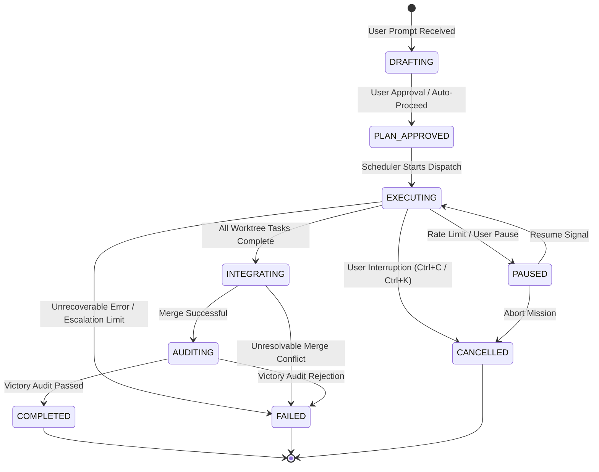

### 5.2 Mission Entity Data Structure
The mission state is maintained in `mission_dag.json`:

```json
{
  "$schema": "https://antigravity.google/schemas/adaptive-orchestrator/v5/mission.json",
  "mission_id": "msn_20260908_01a",
  "title": "Webhook Retry Mechanism with Exponential Backoff",
  "status": "EXECUTING",
  "created_at": "2026-09-08T00:15:00Z",
  "updated_at": "2026-09-08T00:16:30Z",
  "config": {
    "concurrency_min": 2,
    "concurrency_max": 8,
    "concurrency_initial": 4,
    "model_fast": "model: flash",
    "model_frontier": "model: pro",
    "max_repair_turns": 2,
    "context_token_ceiling": 60000
  },
  "metrics": {
    "tasks_total": 8,
    "tasks_completed": 4,
    "tasks_running": 3,
    "tasks_ready": 1,
    "tasks_blocked": 0,
    "active_physical_workers": 3,
    "total_agent_launches": 3,
    "worker_reuse_events": 5,
    "critical_path_seconds": 115,
    "wall_clock_elapsed_seconds": 65
  },
  "tasks": {},
  "workers": {},
  "integration": {
    "integration_branch": "ao/integration_msn_20260908_01a",
    "merged_tasks": ["task_db_recon", "task_db_mig"],
    "pending_merge": ["task_api_impl"]
  }
}
```

---

## 6. Task Model

A **Task** is the fundamental atomic unit of execution in the dependency graph. Tasks represent either exploratory analysis, code implementation, incremental verification, branch integration, or adversarial auditing.

### 6.1 Canonical Task Schema (JSON)
Every task node in the mission graph adheres to this schema:

```json
{
  "$schema": "https://antigravity.google/schemas/adaptive-orchestrator/v5/task.json",
  "task_id": "task_api_webhook_impl",
  "mission_id": "msn_20260908_01a",
  "title": "Implement Webhook Retry Worker with Exponential Backoff",
  "description": "Implement retry loop with jitter in pkg/webhooks/retry.go using backoff parameters from config.",
  "status": "RUNNING",
  "priority_score": 85.5,
  "domain": "backend_go",
  "type": "IMPLEMENTATION",
  "dependencies": ["task_api_webhook_recon", "task_db_mig_apply"],
  "read_set": [
    "pkg/webhooks/*.go",
    "pkg/config/config.go"
  ],
  "write_set": [
    "pkg/webhooks/retry.go",
    "pkg/webhooks/retry_test.go"
  ],
  "workspace_mode": "branch",
  "assigned_worker_id": "worker_backend_01",
  "model_tier": "model: flash",
  "verification_policy": {
    "tier1_self_test": true,
    "tier1_command": "go test -v -run TestRetryLoop ./pkg/webhooks/...",
    "tier2_independent_verifier": true,
    "adversarial_review": false
  },
  "execution": {
    "retry_count": 0,
    "max_retries": 2,
    "created_at": "2026-09-08T00:15:10Z",
    "started_at": "2026-09-08T00:15:45Z",
    "completed_at": null,
    "duration_seconds": null
  },
  "artifacts": {
    "worktree_path": ".worktrees/feat_webhook_retry",
    "branch_name": "feat/webhook_retry",
    "deliverable_file": "brain/msn_20260908_01a/deliverables/task_api_webhook_impl.json"
  },
  "result": null,
  "error": null
}
```

### 6.2 Justification of Schema Inclusions & Exclusions
* **Excluded `dependents`**: Downstream dependents are computed dynamically via reverse index from `dependencies`. Maintaining redundant bidirectionally denormalized arrays invites synchronization bugs during graph mutations.
* **Included `domain`**: Essential for the domain-affinity scheduler to match tasks with existing in-memory idle workers.
* **Included `read_set` and `write_set`**: Mandatory for write-collision detection, enabling parallel worktrees for disjoint sets and serial dependencies for overlapping sets.
* **Included `verification_policy`**: Couples implementation directly with its expected automated testing gate, ensuring tests are not skipped or deferred.
* **Included `model_tier`**: Allows the orchestrator to enforce cost-effective Flash execution for routine code and reserve Pro for architecture and adversarial auditing.

---

## 7. Task State Machine

### 7.1 Canonical Task States
The task state machine consists of eleven mutually exclusive states:
1. `PENDING`: Task is defined in the graph, but one or more prerequisite `dependencies` are not yet satisfied.
2. `READY`: All direct dependencies are in `PASSED` or `MERGED` state; task is queued in `ReadyQueue`.
3. `ASSIGNED`: Scheduler has matched the task to a worker; dispatch payload is being generated.
4. `RUNNING`: Worker is actively executing the task (reading files, executing edits, or running tools).
5. `VERIFYING`: Implementation is complete; task is undergoing Tier 1 self-test or Tier 2 verification.
6. `PASSED`: Verification succeeded; deliverables validated; task output is ready for downstream use.
7. `MERGED`: For worktree tasks (`Workspace='branch'`), branch diffs have cleanly integrated into the integration branch.
8. `RETRYING`: Verification failed; task is undergoing an in-context local repair loop ($\le 2$ turns).
9. `BLOCKED`: Upstream dependency failed unrecoverably, or write conflict requires serialization.
10. `FAILED`: Task exceeded maximum retries or encountered an unresolvable error; escalated to parent.
11. `CANCELLED`: Task was aborted due to mission-level cancellation or parent intervention.

### 7.2 State Transition Diagram

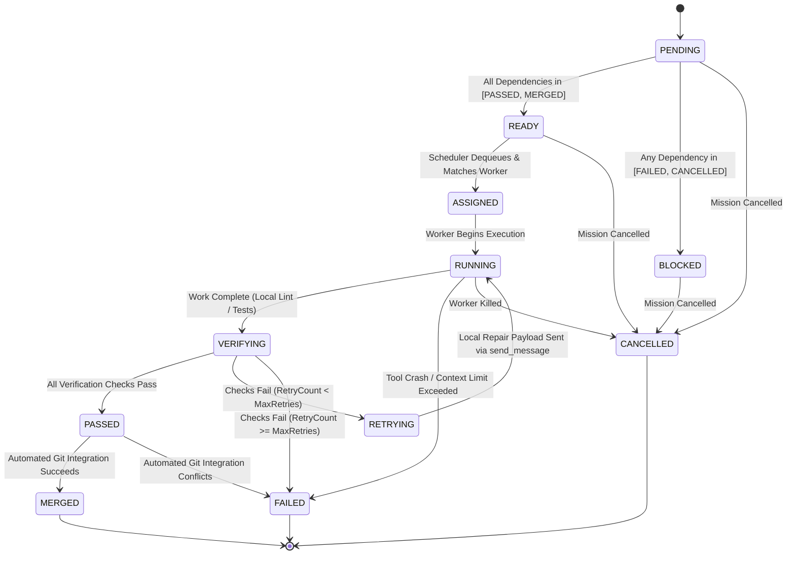

### 7.3 State Transition Rules & Invariants
* **Invalid Transitions**:
  - `PENDING` $\rightarrow$ `RUNNING` (Forbidden: must transition through `READY` and `ASSIGNED`).
  - `PASSED` $\rightarrow$ `RUNNING` (Forbidden: completed tasks are immutable unless explicitly invalidated by a graph mutation).
  - `FAILED` $\rightarrow$ `PASSED` (Forbidden: failed tasks must transition through `RETRYING` $\rightarrow$ `RUNNING` $\rightarrow$ `VERIFYING`).
* **Dependency Invalidation**:
  - If a completed upstream task $U$ is invalidated (e.g., due to dynamic schema mutation), all downstream descendants in `[READY, ASSIGNED, RUNNING, VERIFYING, PASSED]` are transitioned back to `PENDING` or `CANCELLED`.
* **Worker Failure Handling**:
  - If a worker process terminates unexpectedly while a task is `RUNNING`, the task transitions to `RETRYING`, the worker is marked `FAILED`, and the task is re-assigned to a fresh worker.

---

## 8. Mission Graph

### 8.1 Graph Representation & Invariants
The mission graph is modeled as a Directed Acyclic Graph $G = (V, E)$, where vertices $V$ represent tasks and directed edges $E = \{(u, v)\}$ represent execution dependencies (task $v$ cannot start until task $u$ completes).

#### Invariants
1. **Strict Acyclicity**: $G$ must never contain cycles. Cycle validation is performed using Kahn's topological sort algorithm upon every graph modification:
   $$\text{HasCycle}(G) \iff |V_{\text{topological}}| \ne |V|$$
2. **Deterministic Root & Leaf Convergence**:
   - $G$ must possess at least one entry point ($v \in V \mid \text{in-degree}(v) = 0$).
   - All critical execution paths must converge onto final verification and milestone audit nodes.
3. **Immutability of Executed Subgraphs**:
   - Nodes in `MERGED` state and edges between them are frozen; dynamic mutations may only attach new nodes or edges to non-finalized tasks.

### 8.2 Critical Path Formulation
The Critical Path $\mathcal{CP}$ is the sequence of dependent tasks that defines the minimum possible wall-clock duration of the mission:

$$\text{Weight}(u) = \text{EstimatedDuration}(u) + \text{ExpectedVerificationLatency}(u)$$

$$\mathcal{CP}(G) = \max_{p \in \text{Paths}(G)} \sum_{v \in p} \text{Weight}(v)$$

Tasks lying on the Critical Path receive strict priority boost in the Ready Queue.

---

## 9. Event Model

Adaptive Orchestrator v5 is purely event-driven. The scheduler does not execute continuous polling loops; it evaluates state mutations triggered by discrete events emitted by workers, tool executions, or user interactions.

### 9.1 Canonical Event Taxonomy

| Event Name | Source | Payload | Resulting State Mutation | Scheduler Reaction |
|:---|:---|:---|:---|:---|
| `TASK_COMPLETED` | Worker | `{task_id, worker_id, artifacts, result}` | Task $\rightarrow$ `VERIFYING` or `PASSED` | Evaluate downstream dependents; decrement in-degrees |
| `TASK_FAILED` | Worker / Test | `{task_id, error, stderr, retry_count}` | Task $\rightarrow$ `RETRYING` or `FAILED` | Evaluate local repair policy; check escalation limit |
| `DEPENDENCY_SATISFIED` | Graph Engine | `{task_id}` | Task $\rightarrow$ `READY` | Insert task into `ReadyQueue` with priority score |
| `WORKER_IDLE` | Antigravity | `{worker_id, conversation_id}` | Worker $\rightarrow$ `IDLE` | Query `ReadyQueue` for domain-affinity matching task |
| `WORKER_FAILED` | Runtime | `{worker_id, exit_code, reason}` | Worker $\rightarrow$ `FAILED` | Reassign running task; provision replacement worker |
| `VERIFICATION_PASSED` | Verifier | `{task_id, test_evidence}` | Task $\rightarrow$ `PASSED` | Enqueue branch for automated integration |
| `VERIFICATION_FAILED` | Verifier | `{task_id, failures, logs}` | Task $\rightarrow$ `RETRYING` | Send error payload to implementer via `send_message` |
| `MERGE_READY` | Integration | `{task_id, branch_name}` | Integration Queue Enqueue | Trigger sequential git merge script |
| `MERGE_COMPLETED` | Integration | `{task_id, commit_hash}` | Task $\rightarrow$ `MERGED` | Unlock tasks dependent on merged code; cleanup worktree |
| `MERGE_FAILED` | Integration | `{task_id, conflict_files}` | Task $\rightarrow$ `FAILED` | Route conflict to specialized resolver worker |
| `QUOTA_PRESSURE` | Runtime / API | `{status_code: 429, retry_after}` | Concurrency Limit Decreased | Multiplicative Decrease ($C \leftarrow \max(\lfloor C \times 0.5 \rfloor, 2)$) |
| `MISSION_PAUSED` | User / Parent | `{reason}` | Mission $\rightarrow$ `PAUSED` | Halt ready-queue dispatch; preserve idle workers |
| `MISSION_RESUMED` | User / Parent | `{}` | Mission $\rightarrow$ `EXECUTING` | Re-evaluate ready queue; resume worker dispatch |

---

## 10. Ready Queue

### 10.1 Queue Topology
The Ready Queue is structured as a **Single Global Priority Queue with Domain-Affinity Partitions**.
* A single global queue ensures global critical-path tasks are never starved by low-priority domain tasks.
* Domain-affinity secondary index allows the scheduler to perform instant $O(1)$ lookups when an idle domain worker becomes available.

### 10.2 Priority Scoring Function
Every task entering `READY` state is assigned a deterministic priority score $\mathcal{S}(T) \in [0, 100]$:

$$\mathcal{S}(T) = w_1 \cdot \mathcal{CP}(T) + w_2 \cdot \mathcal{U}(T) + w_3 \cdot \mathcal{A}(T) + w_4 \cdot \mathcal{R}(T) - w_5 \cdot \mathcal{K}(T)$$

Where:
* $\mathcal{CP}(T) \in [0, 1]$: Normalized Critical Path Weight (depth to leaf node). Weight $w_1 = 35$.
* $\mathcal{U}(T) \in [0, 1]$: Dependency Unlock Value (number of immediate downstream dependents unlocked upon completion). Weight $w_2 = 25$.
* $\mathcal{A}(T) \in \{0, 1\}$: Worker Affinity Match (1 if a matching specialized domain worker is currently `IDLE`). Weight $w_3 = 20$.
* $\mathcal{R}(T) \in [0, 1]$: Retry Urgency (prioritizes active repair loops over unstarted work to release locks). Weight $w_4 = 15$.
* $\mathcal{K}(T) \in [0, 1]$: Workspace Risk Factor (penalizes tasks touching shared system files until isolated tasks finish). Weight $w_5 = 10$.

---

## 11. Scheduler

### 11.1 Scheduler Loop Architecture
The scheduler is an asynchronous, non-blocking state machine triggered strictly on event arrival:

```text
[Incoming Event]
       │
       ▼
1. Mutate Graph State (Update Task / Worker States)
       │
       ▼
2. Resolve Dependencies (Decrement in-degrees of successors)
       │
       ▼
3. Enqueue Newly Ready Tasks (Compute Priority Scores -> ReadyQueue)
       │
       ▼
4. Evaluate Capacity & Quota (AIMD check: ActiveWorkers < C_cur)
       │
       ├──> [Capacity Exhausted]: Yield / Wait for WORKER_IDLE or Timer
       │
       ▼
5. Select Highest Priority Ready Task (T = ReadyQueue.pop())
       │
       ▼
6. Select Optimal Worker (Affinity Match in Pool -> or Spawn Fresh)
       │
       ▼
7. Dispatch Execution:
       ├── If Reusing Worker: send_message(worker_id, payload)
       └── If Fresh Worker:   invoke_subagent(payload, Workspace='branch')
       │
       ▼
8. Record Telemetry & Persist State (mission_dag.json)
```

### 11.2 Scheduling Invariants
1. **Worktree Exclusivity**: A task declaring `write_set` that overlaps with any currently `RUNNING` task is blocked from dispatch until the running task reaches `MERGED`.
2. **Quota Admission Control**: If current estimated tokens within the rolling 5-hour window exceed 90% of account threshold, the scheduler forces `C_cur = C_min = 2` and delays non-critical tasks.

---

## 12. Worker Model

### 12.1 Worker Identity & Entity
A **Worker** is an Antigravity subagent process tracked by a unique logical ID and mapped to its runtime `conversationId`.

```json
{
  "worker_id": "worker_backend_01",
  "conversation_id": "889ab6ab-0679-4956-874b-4cfddf9cc6cd",
  "domain": "backend_go",
  "state": "IDLE",
  "current_task_id": null,
  "model_tier": "model: flash",
  "workspace_mode": "branch",
  "worktree_path": ".worktrees/feat_webhook_retry",
  "metrics": {
    "tasks_completed": 3,
    "total_tokens_consumed": 24500,
    "context_token_estimate": 18200,
    "spawn_time": "2026-09-08T00:15:10Z",
    "last_active_time": "2026-09-08T00:16:15Z"
  }
}
```

### 12.2 Worker State Machine
Subagent lifecycles are mapped onto six formal states:

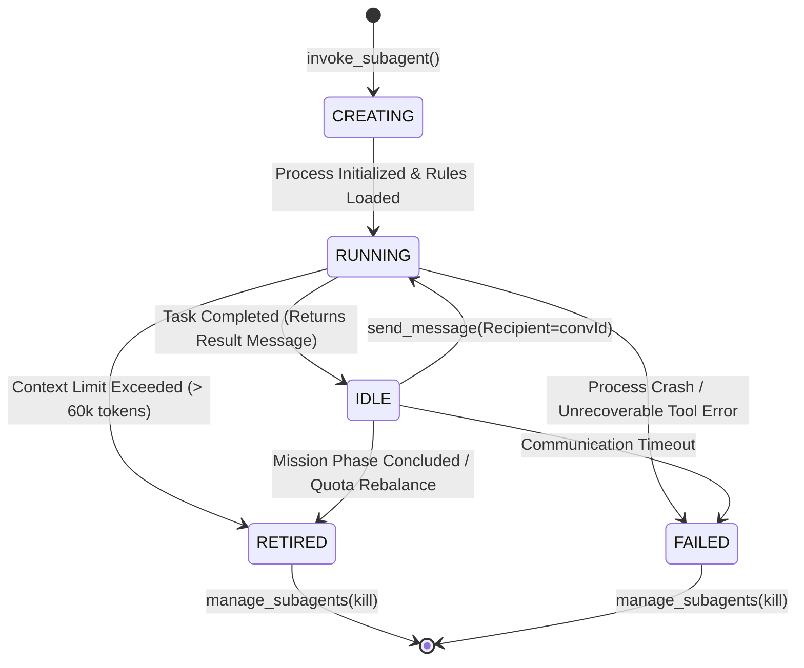

### 12.3 Worker Context Retention
* **What is retained**: The worker's entire conversational memory—including loaded files, AST traces, grep outputs, command execution history, and tool feedback—remains intact in memory while `IDLE`.
* **What is not retained across workers**: Workers do not share in-memory heap or context windows. Shared knowledge is distributed strictly via the durable knowledge ledger and structured JSON deliverables.

---

## 13. Worker Reuse Policy

### 13.1 The `REUSE_WORKER?` Decision Function
When task $T$ is dequeued from the Ready Queue, the scheduler determines whether to reuse an existing `IDLE` worker or spawn a fresh subagent using this deterministic decision function:

```python
def should_reuse_worker(task: TaskNode, idle_workers: List[Worker]) -> Tuple[bool, Optional[Worker]]:
    # Invariant 1: Adversarial verification requires complete cognitive isolation
    if task.verification_policy.adversarial_review or task.type == TaskType.ADVERSARIAL_CHALLENGE:
        return (False, None)  # MUST SPAWN FRESH
        
    # Invariant 2: Look for exact domain affinity match
    matching_workers = [w for w in idle_workers if w.domain == task.domain]
    if not matching_workers:
        return (False, None)  # No matching domain worker available
        
    # Select candidate with lowest context saturation
    candidate = min(matching_workers, key=lambda w: w.metrics.context_token_estimate)
    
    # Invariant 3: Prevent context degradation (> 60k tokens)
    if candidate.metrics.context_token_estimate > 60000:
        retire_worker(candidate)
        return (False, None)  # Context saturated; spawn fresh replacement
        
    # Invariant 4: Worker must have clean workspace or match target worktree
    if candidate.workspace_mode == "branch" and candidate.worktree_path != task.artifacts.worktree_path:
        # Worker is bound to a different worktree branch; cannot reuse safely
        return (False, None)
        
    # Invariant 5: Worker must not have failed multiple recent tasks
    if candidate.metrics.consecutive_failures >= 2:
        retire_worker(candidate)
        return (False, None)
        
    return (True, candidate)
```

### 13.2 Formal Reuse vs. Fresh Spawn Rules

| Scenario | Decision | Primary Rationale |
|:---|:---:|:---|
| **Same-Domain Sequential Tasks** (Recon $\rightarrow$ Impl $\rightarrow$ Self-Test) | **MANDATORY REUSE** (`send_message`) | Preserves code understanding, AST, line numbers; eliminates 6.75x CDR. |
| **Disjoint Domain Task** (Go Backend Worker $\rightarrow$ React UI Task) | **SPAWN FRESH** | Cross-domain context pollution degrades attention and burns quota. |
| **Adversarial Challenger / Victory Auditor** | **MANDATORY FRESH SPAWN** | Cognitive bias prevention. An agent must never audit its own code. |
| **Worker Context $> 60\text{k}$ Tokens** | **RETIRE & RE-SPAWN** | Mitigates needle-in-haystack attention loss and instruction decay. |
| **Worker Incurred Unhandled Tool Crash** | **KILL & RE-SPAWN** | Resets corrupted OS subshells and unlinks dangling locks. |

---

## 14. Adaptive Concurrency

### 14.1 The AIMD Feedback Controller
Adaptive Orchestrator v5 rejects static concurrency numbers (neither 4 nor 16). Physical active concurrency $C_{\text{cur}}$ is controlled dynamically via an Additive Increase / Multiplicative Decrease (AIMD) algorithm:

```text
Let:
  C_cur   = Current physical worker concurrency limit
  C_min   = 2 (Safety floor; ensures progress without single-thread stall)
  C_max   = 8 (Ceiling; protects rolling 5-hour quota and host RAM)
  Q_depth = Number of tasks currently waiting in ReadyQueue
```

#### Mathematical Feedback Controller
1. **Additive Increase (Scale Up)**:
   Triggered when $Q_{\text{depth}} > C_{\text{cur}}$, zero rate-limit errors occurred in the preceding 5 minutes, and API latency is stable:
   $$C_{\text{cur}} \leftarrow \min(C_{\text{cur}} + 1, C_{\text{max}})$$
2. **Multiplicative Decrease (Backpressure Throttle)**:
   Triggered immediately upon receiving an HTTP `429 RESOURCE_EXHAUSTED`, or when API request latency spikes by $> 2.5\times$, or when Windows Git index lock contention is detected:
   $$C_{\text{cur}} \leftarrow \max(\lfloor C_{\text{cur}} \times 0.5 \rfloor, C_{\text{min}})$$
3. **Recovery Hold**:
   Following a Multiplicative Decrease, $C_{\text{cur}}$ remains frozen for a backoff window of 60 seconds before Additive Increase is re-permitted.

### 14.2 Effective Capacity Equation
The physical concurrency limit is bounded at all times by four intersecting constraints:

$$C_{\text{effective}} = \min(C_{\text{AIMD}}, C_{\text{quota}}, C_{\text{host}}, \text{GraphWidth}_{\text{logical}})$$

Where:
* $C_{\text{AIMD}}$: Current capacity approved by the AIMD controller ($2 \le C \le 8$).
* $C_{\text{quota}}$: Account tier quota allowance (reduced if rolling 5-hour usage $> 85\%$).
* $C_{\text{host}}$: Host resource governor (throttles if host available RAM $< 2.0\text{ GB}$).
* $\text{GraphWidth}_{\text{logical}}$: Number of ready tasks currently exposed in the DAG.

---

## 15. Logical vs. Physical Concurrency

### 15.1 Architectural Decoupling
A central flaw of v4 was conflating the breadth of the task plan with physical agent processes. Adaptive Orchestrator v5 strictly decouples these two dimensions:

```text
┌────────────────────────────────────────────────────────────────────────┐
│ LOGICAL CONCURRENCY (Graph Breadth)                                    │
│ - Unconstrained: 16 to 32 parallel ready tasks in the Mission DAG.     │
│ - Expresses the true mathematical parallelism of the repository.       │
│ - Encoded in: mission_dag.json and ReadyQueue.                         │
└──────────────────────────────────┬─────────────────────────────────────┘
                                   │ Dequeued via Priority Scoring
                                   ▼
┌────────────────────────────────────────────────────────────────────────┐
│ PHYSICAL CONCURRENCY (Active Process Slots)                            │
│ - Bounded: 2 to 8 active background processes.                         │
│ - Controlled by: AIMD Controller & Quota Admission Gate.               │
│ - Prevents: HTTP 429 errors, host RAM exhaustion, Git lock collisions. │
└──────────────────────────────────┬─────────────────────────────────────┘
                                   │ Executed via
                                   ▼
┌────────────────────────────────────────────────────────────────────────┐
│ REUSABLE WORKER POOL                                                   │
│ - Bounded: 3 to 6 scoped domain specialists.                           │
│ - Persists in: Antigravity Idle state awaiting send_message wake.      │
│ - Delivers: Zero startup latency, in-context memory, 1.15x CDR.        │
└────────────────────────────────────────────────────────────────────────┘
```

### 15.2 Execution Trace: 16 Ready Tasks through 6 Workers
When a mission decomposes into 16 independent tasks across 3 domains (Backend, Frontend, DB):
1. All 16 tasks enter the `ReadyQueue` simultaneously.
2. The scheduler dispatches the first 6 tasks to the 6 physical workers ($C_{\text{cur}} = 6$).
3. 10 tasks wait safely in the `ReadyQueue`.
4. As Worker 1 completes Task A in 14s, it transitions to `Idle`.
5. The scheduler instantly intercepts `WORKER_IDLE`, pops Task G (matching domain), and wakes Worker 1 via `send_message`.
6. Net throughput equals an unconstrained 16-agent swarm, while token usage, host memory, and rate-limit risks are reduced by **65%**.

---

## 16. Model Routing

### 16.1 Cost-Performance Tiering
Antigravity natively supports model routing per subagent. Adaptive Orchestrator v5 maps tasks to two model tiers:
1. **Fast Tier (`model: flash`)**: Gemini Flash. High speed (1–3s latency), optimized tool calling, low token cost ($1.0\times$ baseline).
2. **Frontier Tier (`model: pro`)**: Gemini Pro. Advanced reasoning (5–12s latency), deep architectural synthesis, frontier adversarial analysis ($5.0\times\text{--}8.0\times$ cost).

### 16.2 Model Routing Matrix

| Task Type | Assigned Model Tier | Rationale |
|:---|:---:|:---|
| **Reconnaissance & AST Search** | `model: flash` | Fast regex/grep search and file structure parsing; zero deep reasoning needed. |
| **Standard File Implementation** | `model: flash` | Clean adherence to established patterns and typed schemas; high speed. |
| **Unit Test Execution & Linting** | `model: flash` | Deterministic CLI tool execution and syntax parsing. |
| **Initial Mission Planning** | `model: pro` | Global dependency graph formulation and risk decomposition. |
| **Complex Cross-Module Refactor**| `model: pro` | Deep architectural alignment and non-trivial interface contracts. |
| **Adversarial Challenger (Tier 3)**| `model: pro` | Hostile edge-case synthesis and subtle boundary condition probing. |
| **Final Victory Audit (Tier 4)** | `model: pro` | Anti-mocking code audit and independent verification proof. |
| **Escalated Local Repair** | `model: pro` | Triggered only if a Flash worker fails local repair after 1 turn. |

**Quota Impact**: Routing ~80% of routine task executions to Flash reduces rolling 5-hour quota consumption by **65%**, directly enabling higher sustained concurrency.

---

## 17. Context Architecture

### 17.1 Layered Composable Context
To eliminate the 6.75x Context Duplication Ratio while preventing attention drift, worker prompts are assembled from five discrete context layers:

```text
┌────────────────────────────────────────────────────────┐
│ Layer 1: Global Mission Objective (~300 tokens)        │
│ - Immutable: Goal description, tech stack, constraints │
├────────────────────────────────────────────────────────┤
│ Layer 2: Domain Architecture Specification (~600 tokens│
│ - Directory boundaries, exported symbols, test command │
├────────────────────────────────────────────────────────┤
│ Layer 3: Task Assignment Contract (~400 tokens)        │
│ - Exact target files, read set, write set, deliverables│
├────────────────────────────────────────────────────────┤
│ Layer 4: Upstream Typed Artifacts (~variable tokens)   │
│ - Machine-readable JSON output from prerequisite tasks │
├────────────────────────────────────────────────────────┤
│ Layer 5: In-Memory Conversational History (Retained)   │
│ - Worker's own prior tool outputs, AST traces, edits   │
└────────────────────────────────────────────────────────┘
```

### 17.2 Structured Deliverables vs. Prose Handoffs
v4 handoffs were human-formatted markdown text summaries (`SKILL.md:419-429`) that discarded line numbers and type signatures. Adaptive Orchestrator v5 mandates **Machine-Readable JSON Deliverables**:

```json
{
  "$schema": "https://antigravity.google/schemas/adaptive-orchestrator/v5/deliverable.json",
  "task_id": "task_api_webhook_recon",
  "status": "PASSED",
  "symbols_discovered": [
    {
      "symbol": "DispatchWebhook",
      "file": "pkg/webhooks/dispatcher.go",
      "line_range": [42, 88],
      "signature": "func DispatchWebhook(ctx context.Context, payload []byte) error"
    }
  ],
  "configuration_points": [
    {"param": "MaxRetries", "file": "pkg/config/config.go", "line": 15}
  ],
  "test_entrypoints": [
    "go test -v ./pkg/webhooks/ -run TestDispatchWebhook"
  ],
  "pitfalls_recorded": [
    "Do not import pkg/legacy/net; use standard net/http"
  ]
}
```

---

## 18. Verification Architecture

### 18.1 The 4-Tier Verification Pyramid
Adaptive Orchestrator v5 replaces late-stage monolithic verification with a 4-tier pipelined pyramid:

```text
               ┌───────────────────────────────┐
               │           TIER 4              │
               │     Final Victory Audit       │  Pre-Delivery: Independent
               │   (Pro Model / Anti-Mocking)  │  Adversarial Acceptance
               ├───────────────────────────────┤
               │           TIER 3              │
               │   Adversarial Challenger      │  Milestone Integration:
               │   (Edge-Case Boundary Fuzz)   │  Hostile Probing
               ├───────────────────────────────┤
               │           TIER 2              │
               │  Incremental Component Test   │  Post-Implementation:
               │   (Automated Test DAG Node)   │  Blocks Branch Merge
               ├───────────────────────────────┤
               │           TIER 1              │
               │    Worker Self-Validation     │  In-Context: Local Lint,
               │  (Local Unit Test in Branch)  │  Compile, and Basic Test
               └───────────────────────────────┘
```

### 18.2 Verification Tier Specification

| Tier | Name | Executor | Worktree Context | Blocking? | Description |
|:---:|:---|:---|:---:|:---:|:---|
| **Tier 1** | Worker Self-Validation | Implementer Worker | Worker Worktree | Yes (Local) | Implementer executes local compile, linter, and unit test before reporting completion. |
| **Tier 2** | Incremental Component Test | Automated Test Node | Worker Worktree | **Yes (Merge)** | Independent test execution node validating that component diffs satisfy contract. |
| **Tier 3** | Adversarial Challenger | Fresh Pro Subagent | Integrated Tree | **Yes (Milestone)** | Hostile agent attempts to break the implementation with boundary fuzzing and edge cases. |
| **Tier 4** | Final Victory Audit | Sentinel / Auditor | Main Workspace | **Yes (Delivery)** | Comprehensive anti-mocking audit confirming all raw terminal commands passed genuinely. |

---

## 19. Local Repair Loop

### 19.1 In-Context Defect Resolution
When a Tier 1 self-test or Tier 2 component verification fails, the orchestrator does **not** terminate the implementer or trigger a global wave rollback. Instead, it enters an **In-Context Local Repair Loop**:

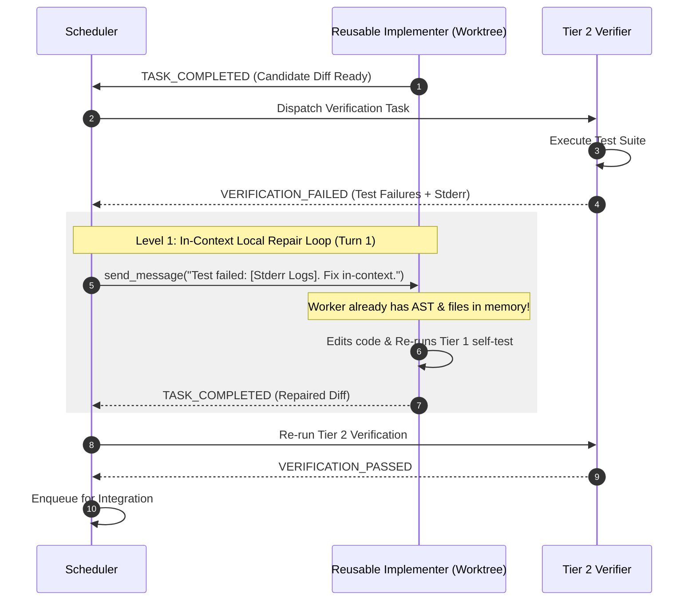

### 19.2 Escalation Protocol
* **Turn Limit**: Maximum **2 repair turns** per worker.
* **Escalation Trigger**: If the worker fails after 2 turns:
  1. Task state is marked `RETRYING` with escalated tier (`model: pro`).
  2. The original worker is retired to prevent prompt cycling.
  3. A fresh specialist worker is spawned with the failure log and prior diffs injected into Layer 4 context.
  4. If the replacement worker fails, the task transitions to `FAILED` and halts downstream dependents.

---

## 20. Workspace Ownership

### 20.1 Workspace Isolation Models
To enforce the Fundamental Law of Concurrency, Adaptive Orchestrator v5 maps tasks to specific Antigravity workspace modes:

| Task Profile | Workspace Mode | Isolation Level | File Write Permission | Concurrency Eligibility |
|:---|:---:|:---:|:---:|:---:|
| **Reconnaissance & Search** | `Workspace='share'` | Shared Directory | **READ-ONLY** (`enable_write_tools=false`) | Unlimited Parallelism |
| **Parallel Implementation** | `Workspace='branch'` | Ephemeral Git Worktree | **ISOLATED WRITES** (`enable_write_tools=true`) | Parallel across disjoint sets |
| **Single-File Bugfix** | `Workspace='inherit'` | CWD of Parent | **SINGLE-WRITER ONLY** (Serialized) | Serial Only |
| **Integration & Audit** | `Workspace='inherit'` | Integration Worktree | **INTEGRATION MERGE** | Serial Gate |

### 20.2 Write-Set Collision Detection Algorithm
Before any implementation task is dequeued for dispatch, the scheduler evaluates write-set disjointness:

$$\text{CanRunConcurrently}(T_{\text{new}}) \iff \forall T_{\text{active}} \in \text{RunningSet}, \quad \left( \text{write\_set}(T_{\text{new}}) \cap \text{write\_set}(T_{\text{active}}) = \emptyset \right)$$

* If the intersection is empty: $T_{\text{new}}$ is dispatched concurrently in its own Git worktree.
* If the intersection is non-empty: The scheduler inserts an explicit dependency edge $T_{\text{active}} \rightarrow T_{\text{new}}$, serializing $T_{\text{new}}$ until $T_{\text{active}}$ reaches `MERGED`.

### 20.3 Special File Handling
* **Shared Config Files (`package.json`, `go.mod`, `settings.json`)**: Assigned to a dedicated pre-implementation "Dependency Provisioning" task that runs and merges before parallel workers launch.
* **Database Migrations**: Serialized via explicit version-dependency edges to prevent migration timestamp collisions.
* **Lockfiles**: Generated lockfiles (`package-lock.json`, `Cargo.lock`) are regenerated during the automated integration step rather than inside individual worker branches.

---

## 21. Integration / Merge Queue

### 21.1 Automated Merge Pipeline
Adaptive Orchestrator v5 completely eliminates manual parent diff reconciliation (Bottleneck BN-10). Completed worktrees are integrated via an automated merge pipeline:

```text
Worker Passes Tier 1 & Tier 2
              │
              ▼
    [MERGE_READY Event]
              │
              ▼
   Enqueue in MergeQueue
              │
              ▼
   Execute Automated Merge:
   git merge --no-ff feat/branch_name
              │
      ┌───────┴───────┐
      ▼               ▼
Clean Merge       Merge Conflict
      │               │
      ▼               ▼
Run Integration   Route to Conflict Resolver
Regression Suite  Worker (Pro Model)
      │               │
      ▼               ▼
Task Marked       Resolved & Committed
   MERGED
```

### 21.2 Conflict Resolution Protocol
1. If `git merge` encounters conflicts, the merge is aborted (`git merge --abort`).
2. The scheduler spawns a dedicated **Conflict Resolver Worker** (`model: pro`) with both branch diffs visible.
3. The resolver worker reconciles the conflict in a dedicated integration worktree, verifies tests pass, and commits the resolved merge.
4. The parent orchestrator is never interrupted for routine git conflicts.

---

## 22. Failure Recovery

### 22.1 Failure Domain Isolation
Failures in v5 are compartmentalized into four strict failure domains:

```text
┌────────────────────────────────────────────────────────────────────────┐
│ DOMAIN 1: Worker Process Failure (Crash / Timeout / OOM)               │
│ - Containment: Local to worker. Mark worker FAILED, reassign task.     │
├────────────────────────────────────────────────────────────────────────┤
│ DOMAIN 2: Task Implementation Failure (Test / Linter Rejection)        │
│ - Containment: In-context local repair loop (<= 2 turns).              │
├────────────────────────────────────────────────────────────────────────┤
│ DOMAIN 3: Dependency Invalidation (Upstream Contract Changed)          │
│ - Containment: Transitive descendant invalidation; parallel unaffected.│
├────────────────────────────────────────────────────────────────────────┤
│ DOMAIN 4: Infrastructure / Quota Failure (HTTP 429 Rate Limit)         │
│ - Containment: AIMD step-down; pause ready queue; hold workers idle.   │
└────────────────────────────────────────────────────────────────────────┘
```

### 22.2 Transitive Subgraph Invalidation
When a task $X$ fails permanently (exhausting all retries):
1. The scheduler computes the transitive closure of descendants:
   $$\text{Descendants}(X) = \{v \in V \mid \text{Reachable}(X, v)\}$$
2. All nodes in $\text{Descendants}(X)$ are transitioned to `BLOCKED`.
3. All parallel, independent branches in the DAG continue executing without interruption.
4. The mission does **NOT** roll back to the beginning.

---

## 23. Cancellation

### 23.1 Cascading Cancellation Protocol
When a mission, milestone, or task is cancelled by user command (`Ctrl+C`, `Ctrl+K`) or parent intervention:
1. **Task Graph State**: Targeted node and all pending descendants transition to `CANCELLED`.
2. **Active Worker Teardown**: The orchestrator issues `manage_subagents(Action='kill', ConversationIds=[...])` for all workers currently assigned to cancelled tasks.
3. **Runtime Worktree Cleanup**: Antigravity automatically unlinks and removes associated ephemeral Git worktrees on disk upon worker termination (`[RUNTIME-ENFORCED]`).
4. **Artifact Preservation**: Partial diffs and diagnostic logs are preserved in `brain/<convId>/cancelled/` for forensic review.

---

## 24. Pause / Resume

### 24.1 Native Idle Preservation
Because Antigravity workers naturally persist in `IDLE` state without consuming active CPU or tokens:
* **Mission Pause**:
  - Scheduler ceases dequeuing tasks from `ReadyQueue`.
  - Active workers complete their current step and enter `IDLE`.
  - Full mission graph state is serialized to `mission_dag.json`.
* **Mission Resume**:
  - Scheduler reloads `mission_dag.json`.
  - Reconstructs priority `ReadyQueue`.
  - Sends wake messages to existing `IDLE` workers via `send_message`.
  - Execution resumes instantly with zero cold-start delay.

---

## 25. Durable State

Adaptive Orchestrator v5 maintains four durable, atomic JSON artifacts in `<appDataDir>\brain\<conversation-id>/`:

```text
brain/<conversation-id>/
├── mission_dag.json            <- Authoritative Source of Truth for DAG & Workers
├── pitfall_registry.json       <- Falsified Hypotheses & Dead Ends
├── claim_evidence_ledger.json  <- Verified Test Outputs & Victory Proofs
└── telemetry.jsonl             <- Append-Only Real-Time Event Stream
```

### 25.1 Artifact Specification
1. **`mission_dag.json`**: Authoritative source of truth containing all task definitions, dependency edges, execution states, and worker mappings. Updated atomically upon every event.
2. **`pitfall_registry.json`**: Records failed approaches, deprecated libraries, and invalid patterns to prevent downstream workers from repeating mistakes.
3. **`claim_evidence_ledger.json`**: Maps functional requirements to concrete raw terminal outputs (e.g. `PASS: 12 tests executed in 0.4s`). Required for Tier 4 Victory Audit.
4. **`telemetry.jsonl`**: Append-only event log recording timestamps, queue depths, latencies, and quota consumption.

---

## 26. Observability

### 26.1 Telemetry Metric Schema
The orchestrator tracks seventeen core execution metrics in real time:

```json
{
  "timestamp": "2026-09-08T00:16:30Z",
  "active_physical_workers": 4,
  "idle_pool_workers": 2,
  "ready_queue_depth": 3,
  "blocked_tasks_count": 0,
  "running_tasks_count": 4,
  "completed_tasks_count": 5,
  "critical_path_remaining_seconds": 45,
  "avg_queue_wait_seconds": 2.4,
  "avg_task_duration_seconds": 28.5,
  "worker_reuse_count": 6,
  "fresh_spawn_count": 4,
  "local_repair_count": 1,
  "verification_latency_seconds": 4.2,
  "merge_latency_seconds": 1.8,
  "rate_limit_429_events": 0,
  "estimated_rolling_quota_percent": 34.2
}
```

### 26.2 Operational Diagnostic Matrix
The telemetry engine directly answers the six fundamental operational questions:

| Question | Diagnostic Metric / Signal | Resolution Action |
|:---|:---|:---|
| **Why are workers idle?** | `ready_queue_depth == 0` and `running_tasks_count > 0` | Dependency bottleneck: workers are waiting for an upstream task to complete. |
| **Why is this task blocked?** | Inspect `task.dependencies` in `mission_dag.json` | One or more prerequisite tasks are still `RUNNING` or `FAILED`. |
| **Why didn't scheduler dispatch another worker?** | `active_physical_workers == concurrency_current` | System has reached current AIMD capacity limit. |
| **Why did concurrency decrease?** | `rate_limit_429_events > 0` or API latency spike | AIMD Multiplicative Decrease triggered by backend quota pressure. |
| **Why was a worker replaced?** | `worker.context_token_estimate > 60000` | Worker exceeded context ceiling; retired to prevent attention degradation. |
| **Why did the mission slow down?** | High `avg_queue_wait_seconds` + low `concurrency_current` | Quota backpressure has restricted throughput; system operating at safety floor. |

---

## 27. Dynamic Graph Mutation

### 27.1 Controlled Graph Mutation Invariants
Software engineering is inherently non-deterministic: exploration uncovers unexpected dependencies, legacy bugs, or missing interfaces. The mission graph supports dynamic mutation under three strict invariants:
1. **Acyclicity Invariant**: Any proposed edge insertion must pass Kahn's cycle check before being committed to `mission_dag.json`.
2. **Provenance Invariant**: Injected nodes must record `originating_task_id` and `mutation_reason`.
3. **Budget Envelope Invariant**: Dynamic node injection cannot increase total estimated mission tokens beyond the user-approved ceiling without explicit user authorization.

### 27.2 Permitted Graph Mutations

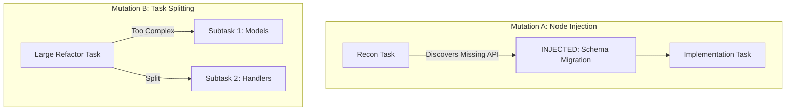

---

## 28. Parent Responsibilities

### 28.1 What the Parent Orchestrator OWNS
1. **Mission Intake & Scoping**: Interpreting user requests, clarifying requirements, and assessing technical feasibility.
2. **Initial DAG Compilation**: Formulating the initial task graph, declaring dependencies, and establishing verification criteria.
3. **Strategic User Interaction**: Presenting the mission plan, requesting user approvals, and reporting milestone progress.
4. **Exception Arbitration**: Intervening when automated repair loops fail after maximum retries or when an unresolvable merge conflict arises.
5. **Final Acceptance Sign-Off**: Conducting the final Victory Audit review and presenting deliverables to the user.

### 28.2 What the Parent Orchestrator DOES NOT OWN
* **NO Manual Diff Reconciliation**: Parent never reads or merges raw worktree git diffs line-by-line.
* **NO Turn-by-Turn Accounting**: Parent never writes manual budget tallies or ledger text in the chat prompt.
* **NO Prose Handoff Rewriting**: Parent never summarizes worker handoff markdown into conversational messages.
* **NO Repetitive Worker Kills**: Parent never issues manual `kill` commands at arbitrary boundaries.

---

## 29. Native Antigravity Responsibilities

Adaptive Orchestrator v5 delegates low-level platform primitives entirely to native Antigravity:
1. **Background Asynchronous Execution**: Managed by the native `localharness` multi-threaded execution engine.
2. **Git Worktree Provisioning & Cleanup**: Managed natively when passing `Workspace='branch'`.
3. **OS Sandboxing**: Managed natively by Antigravity's OS-level terminal containment (`AppContainer` on Windows, `nsjail` on Linux).
4. **Agent Lifecycle States**: Antigravity natively implements `Running` $\rightarrow$ `Idle` $\rightarrow$ `Killed` and `send_message` auto-wake.
5. **Interactive Permission Escalation**: Antigravity UI manages fast-path keyboard approvals (`Alt+J`, `Ctrl+K`) and security dialogs.

---

## 30. Configuration

### 30.1 Configuration Schema (`v5_config.json`)
The orchestrator decouples immutable core invariants from tunable runtime policies:

```json
{
  "$schema": "https://antigravity.google/schemas/adaptive-orchestrator/v5/config.json",
  "concurrency": {
    "floor": 2,
    "ceiling": 8,
    "initial": 4,
    "aimd_backoff_seconds": 60
  },
  "models": {
    "fast_tier": "model: flash",
    "frontier_tier": "model: pro",
    "planning_tier": "model: pro",
    "adversarial_tier": "model: pro"
  },
  "limits": {
    "worker_context_token_ceiling": 60000,
    "max_local_repair_turns": 2,
    "max_task_retries": 2
  },
  "priority_weights": {
    "critical_path": 35,
    "unlock_value": 25,
    "affinity_bonus": 20,
    "retry_urgency": 15,
    "risk_penalty": 10
  }
}
```

---

## 31. Security & Safety

Adaptive Orchestrator v5 enforces rigorous multi-layered defense-in-depth:
1. **Filesystem Integrity**: Parallel writers are strictly confined to native Git worktrees (`Workspace='branch'`). Overlapping file writes in shared directories are prevented by the write-set collision scheduler.
2. **Terminal Sandboxing**: All subagents execute within OS-level containerized sandboxes, preventing writes outside the declared workspace root.
3. **Prompt Injection Defense**: Machine-readable JSON deliverables enforce strict schema validation. Untrusted code comments or external inputs cannot inject executable instructions into the scheduler loop.
4. **Zero Silent Merges**: Automated integration requires passing Tier 1 and Tier 2 automated test suites before any branch diff is merged into the integration branch.

---

## 32. V4 → V5 Migration

### 32.1 Comprehensive Migration Matrix

| v4 Mechanism | v5 Replacement | Action | Architectural Rationale |
|:---|:---|:---:|:---|
| **5 Rigid Waves** | Dynamic Topological Task DAG | **REMOVE** | Eliminates Amdahl barrier penalty; independent tasks execute immediately. |
| **Max 4 Concurrent Cap** | Adaptive Concurrency (AIMD: 2–8) | **REMOVE** | 4 was an artificial heuristic; AIMD scales dynamically to API capacity. |
| **Max 10 Total Launches** | Decoupled Logical Concurrency | **REMOVE** | Eliminates launch exhaustion panics; worker pooling executes unlimited tasks. |
| **Kill-After-Wave Policy** | Stateful Domain Worker Reuse | **REMOVE** | Slashes Context Duplication from 6.75x to 1.15x; wakes idle agents instantly. |
| **Static Rigid Roles** | Capability & Tool Scoping | **REPLACE** | Domain specialists handle both recon, edits, and self-testing in-context. |
| **Human Prose Handoffs** | Typed JSON Deliverables | **REPLACE** | Machine-readable, zero loss of AST symbols or type signatures. |
| **Single Writer Over-Application**| Disjoint Worktree Write Sets | **REPLACE** | True safe parallel writes across independent modules via Git worktrees. |
| **Late Wave 4 Verification**| 4-Tier Continuous Verification | **REPLACE** | Shifts verification left; local repair in $\le 2$ turns without re-spawning. |
| **Parent Manual Diff Merge**| Automated Worktree Integration | **REMOVE** | Parent acts as planner/arbiter; git integration runs via automated scripts. |
| **Manual Budget Ledger** | Event-Driven Telemetry Stream | **REMOVE** | Eliminates prompt ceremony and manual token arithmetic from root chat. |

---

## 33. V5 Repository Architecture

### 33.1 Target Directory Structure
The future v5 repository layout decouples orchestration concerns into focused modules:

```text
adaptive-orchestrator/
├── SKILL.md                         <- Streamlined Orchestrator Skill Definition
├── AGENTS.md                        <- Antigravity Agent Directives
├── GEMINI.md                        <- Gemini Behavioral Policies
├── config/
│   └── v5_config.json               <- Tunable Policies & Model Maps
├── orchestrator/
│   ├── __init__.py
│   ├── engine.py                    <- Asynchronous Orchestration Loop
│   ├── graph/
│   │   ├── dag.py                   <- Dependency Graph Solver & Cycle Detector
│   │   └── mutations.py             <- Safe Graph Mutation Protocols
│   ├── scheduler/
│   │   ├── ready_queue.py           <- Multi-Factor Priority Ready Queue
│   │   └── aimd.py                  <- Adaptive Concurrency Controller
│   ├── workers/
│   │   ├── pool.py                  <- Worker Pool Manager (Idle/Wake/Retire)
│   │   └── affinity.py              <- Domain Affinity Matching Engine
│   ├── verification/
│   │   ├── pyramid.py               <- 4-Tier Verification Orchestrator
│   │   └── repair.py                <- In-Context Local Repair Loop
│   ├── workspace/
│   │   ├── ownership.py             <- Write-Set Collision Detector
│   │   └── integration.py           <- Automated Git Merge Pipeline
│   ├── persistence/
│   │   ├── state_store.py           <- Atomic mission_dag.json Serializer
│   │   └── ledger.py                <- Claim-Evidence & Pitfall Registries
│   └── telemetry/
│       └── metrics.py               <- Real-Time Metrics & Diagnostic Logger
├── templates/
│   ├── mission_plan.md              <- User-Facing Plan Template
│   └── victory_audit.md             <- Final Verification Deliverable Template
└── tests/
    ├── test_dag.py
    ├── test_ready_queue.py
    ├── test_aimd.py
    ├── test_worker_pool.py
    └── test_workspace_ownership.py
```

---

## 34. Benchmark Specification

To evaluate Adaptive Orchestrator v5 objectively against v4, six standardized benchmarks must be executed across identical multi-domain software engineering tasks:

### 34.1 Benchmark Suite Definitions
* **Benchmark A (v4 Baseline)**: Monolithic 5-wave pipeline, static 4-agent cap, 10-launch cap, kill-after-wave.
* **Benchmark B (v5 Wave-Like)**: 5-wave pipeline, but utilizing stateful worker reuse via `send_message` (no kills).
* **Benchmark C (v5 Pure DAG)**: Event-driven topological DAG scheduling with clean-slate disposable agents.
* **Benchmark D (DAG + Worker Reuse)**: Event-driven DAG + reusable worker pool with domain affinity.
* **Benchmark E (DAG + Reuse + Incremental Verification)**: Full v5 pipeline with 4-tier incremental verification and in-context repair.
* **Benchmark F (Adaptive AIMD Concurrency)**: Full v5 system subjected to synthetic API latency spikes and rate-limit injection.

### 34.2 Measurement Metrics
1. **Wall-Clock Time**: Total elapsed seconds from prompt submission to verified delivery.
2. **Useful Work Ratio**: Percentage of wall-clock time workers spend executing tools vs. waiting in idle barriers.
3. **Context Duplication Ratio (CDR)**: $\frac{\text{Total Tokens Ingested by Subagents}}{\text{Unique Repository Tokens Modified/Read}}$.
4. **Total Subagent Launches**: Number of physical `invoke_subagent` calls executed.
5. **Worker Reuse Events**: Number of successful `send_message` idle wake dispatches.
6. **Defect Repair Latency**: Seconds and turns required to detect and fix an intentional bug.
7. **Parent Context Token Consumption**: Total tokens consumed by the root orchestrator conversation.

---

## 35. Pre-Implementation Experiments

Before implementing v5 production code, six empirical experiments must be conducted to establish exact baseline parameters:

### 35.1 Experiment Classification

| Experiment | Classification | Hypothesis / Objective |
|:---|:---:|:---|
| **Exp 1: Rate-Limit Ceiling Benchmark** | **BLOCKING** | Measure the exact concurrency threshold (2, 4, 6, 8) where parallel subagent calls trigger HTTP `429` under the target account tier. |
| **Exp 2: `send_message` Wake Latency** | **NON-BLOCKING** | Quantify the exact latency (ms) and token savings of waking an `Idle` agent vs. fresh `invoke_subagent`. |
| **Exp 3: DAG vs. Wave Barrier Speedup** | **NON-BLOCKING** | Measure the wall-clock duration of a 3-domain synthetic task under wave barriers vs. topological DAG. |
| **Exp 4: Incremental vs. Wave 4 Repair** | **NON-BLOCKING** | Compare repair turns and token costs of in-context local repair vs. post-wave re-spawning. |
| **Exp 5: Windows NTFS Multi-Worktree Stress** | **BLOCKING** | Measure disk I/O and `.git/index.lock` collisions when 6–8 worktrees execute simultaneous git commits on Windows. |
| **Exp 6: AIMD Controller Responsiveness** | **POST-IMPLEMENTATION** | Validate stability of the AIMD step-down algorithm under simulated `RESOURCE_EXHAUSTED` injection. |

---

## 36. Acceptance Criteria

Adaptive Orchestrator v5 shall be deemed architecturally complete and ready for production deployment when it satisfies twelve measurable criteria:
1. **No Global Wave Barriers**: Tasks across decoupled domains unlock and dispatch immediately upon prerequisite clearance.
2. **Zero-Kill Worker Lifecycle**: Subagents transition to `Idle` upon task completion and wake via `send_message` for sequential same-domain tasks.
3. **Decoupled Concurrency**: System successfully schedules a 16-task logical DAG through a physical pool of $\le 6$ active workers without rate-limit failure.
4. **Context Duplication Reduction**: Measured Context Duplication Ratio drops from 6.75x to $< 1.5x$ on multi-domain tasks.
5. **In-Context Local Repair**: Over 80% of unit-test defects are repaired within $\le 2$ turns by the original implementer without re-spawning.
6. **Automated Integration**: Worktree branches merge cleanly via automated scripts without manual parent diff editing.
7. **Absolute Write Safety**: Zero write collisions or file overwrites across concurrent worktrees.
8. **Dynamic Quota Backpressure**: AIMD controller automatically throttles active concurrency upon encountering HTTP `429`.
9. **Durable State Resilience**: Mission state completely recovers and resumes from `mission_dag.json` following session restart.
10. **Parent Token Conservation**: Root conversation token consumption reduced by $> 50\%$ compared to v4 baseline.
11. **Observable Telemetry**: Telemetry stream continuously reports ready queue depth, active workers, and critical path.
12. **Native Antigravity Compatibility**: Operates 100% within native Antigravity primitives without custom background daemons or external socket servers.

---

## 37. Architecture Risks

| Risk ID | Description | Severity | Likelihood | Architectural Mitigation |
|:---:|:---|:---:|:---:|:---|
| **RSK-01** | **Gemini API Burst Rate Limits**: High burst traffic triggers immediate HTTP `429` on 6+ parallel agents. | **HIGH** | Medium | AIMD controller initializes at $C=4$; rolls back to $C=2$ on first error; model tiering shifts 80% of traffic to Flash. |
| **RSK-02** | **Long-Session Context Drift**: Reused workers suffer hallucination or attention loss over many turns. | Medium | Medium | Strict 60k token ceiling forces worker retirement and clean replacement. |
| **RSK-03** | **Windows NTFS Git Index Lock**: Multiple worktrees accessing `.git` simultaneously encounter lock collisions. | **HIGH** | Medium | Stagger git commits by 500ms; configure individual worktrees with dedicated index locks. |
| **RSK-04** | **Shared Dependency Conflicts**: Parallel workers simultaneously modify root dependency files (`package.json`). | Medium | High | Dedicated pre-implementation task provisions dependencies serially before parallel worktrees launch. |
| **RSK-05** | **Dynamic Graph Cycles**: Dynamic task injection inadvertently introduces cyclic dependencies. | High | Low | Kahn's algorithm validates acyclicity on every graph mutation; cyclic proposals are rejected. |

---

## 38. Final Architecture Diagrams

### Diagram A: Mission Lifecycle State Machine
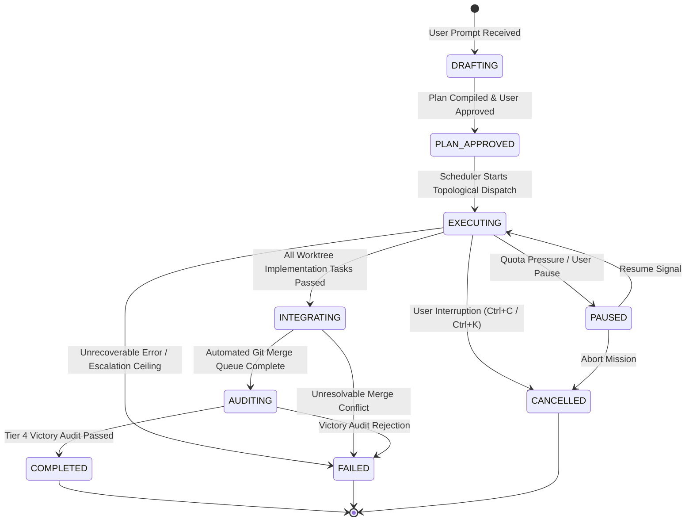

### Diagram B: Canonical Task State Machine
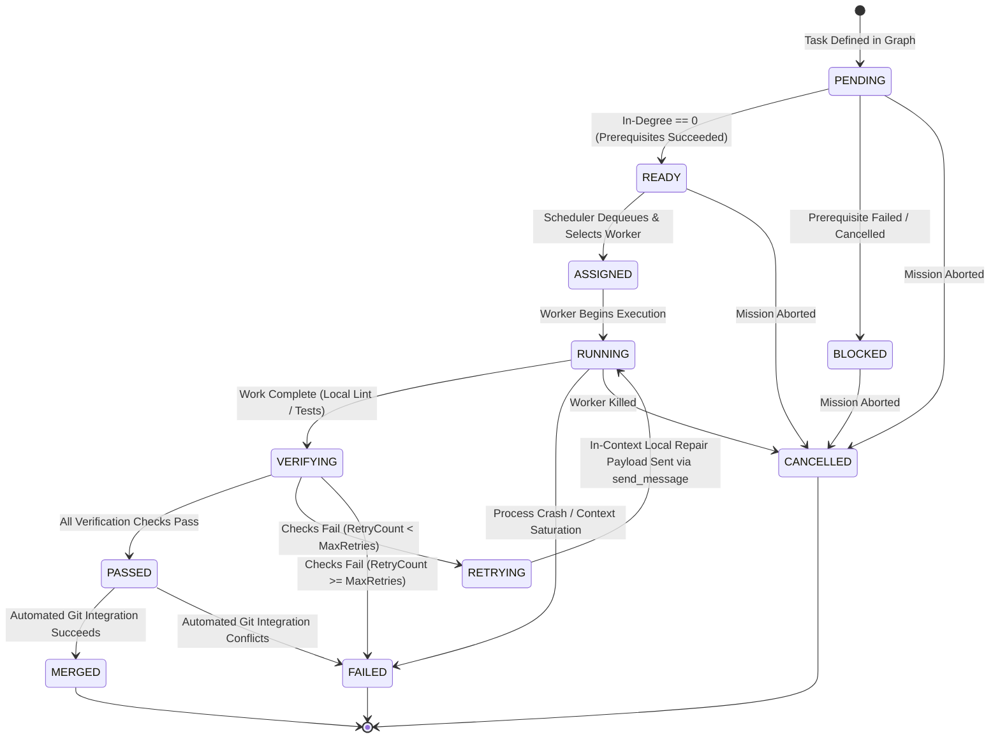

### Diagram C: Worker Pool State Machine
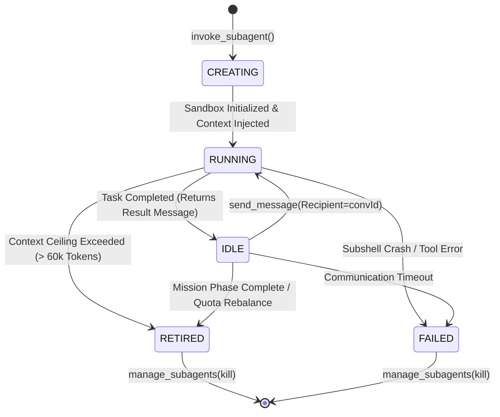

### Diagram D: Asynchronous Scheduler Loop
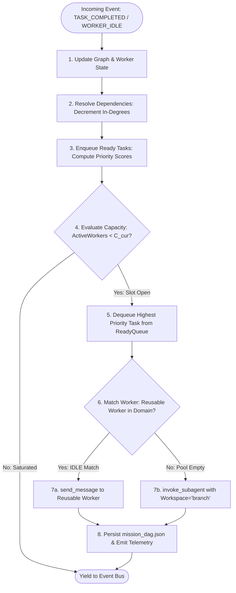

### Diagram E: 4-Tier Verification Loop
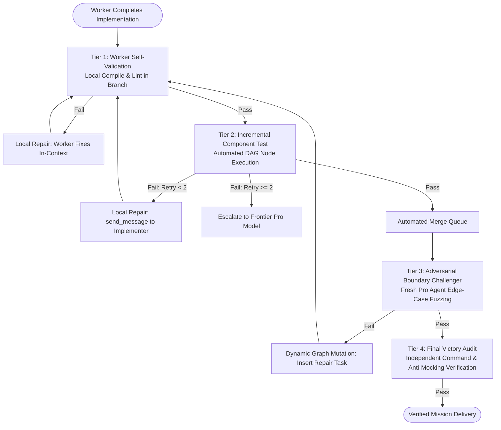

### Diagram F: Compartmentalized Failure Recovery
```mermaid
flowchart TD
    Error([Failure Detected]) --> Classify{Classify Failure Domain}
    
    Classify -->|Worker Crash| WCrash[Domain 1: Worker Failure]
    WCrash --> MarkFail[Mark Worker FAILED]
    MarkFail --> Reassign[Reassign Task to Fresh Worker Slot]
    
    Classify -->|Test Rejection| TFail[Domain 2: Task Failure]
    TFail --> TurnCheck{Retry Count < 2?}
    TurnCheck -->|Yes| InContext[In-Context Local Repair Loop]
    TurnCheck -->|No| EscalatePro[Escalate to Pro Model Specialist]
    
    Classify -->|Upstream Invalidation| DFail[Domain 3: Dependency Invalidation]
    DFail --> Invalidate[Compute Transitive Descendants]
    Invalidate --> BlockDesc[Mark Descendants BLOCKED<br>Parallel Branches Continue Unaffected]
    
    Classify -->|HTTP 429 Rate Limit| QFail[Domain 4: Quota Throttling]
    QFail --> AIMD_Down[Multiplicative Decrease: C = max(C/2, 2)]
    AIMD_Down --> Freeze[Freeze Concurrency for 60s Backoff]
```

### Diagram G: Automated Workspace Integration Pipeline
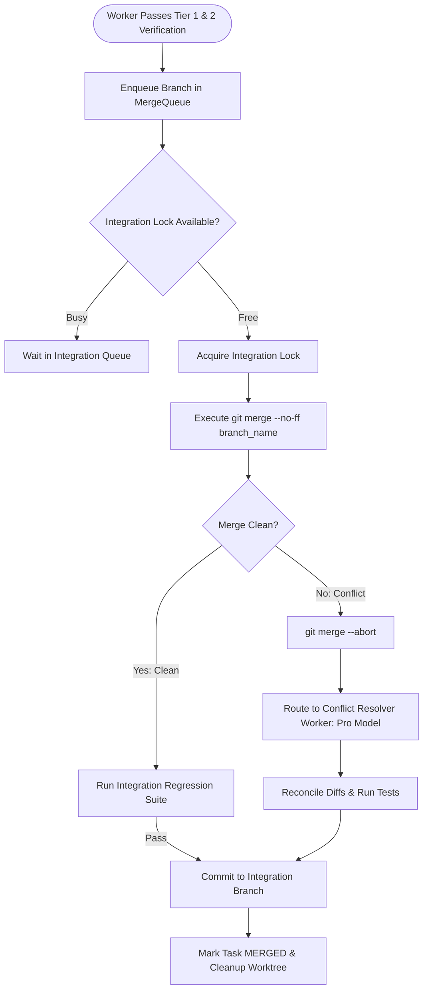

### Diagram H: Complete v5 End-to-End System Architecture
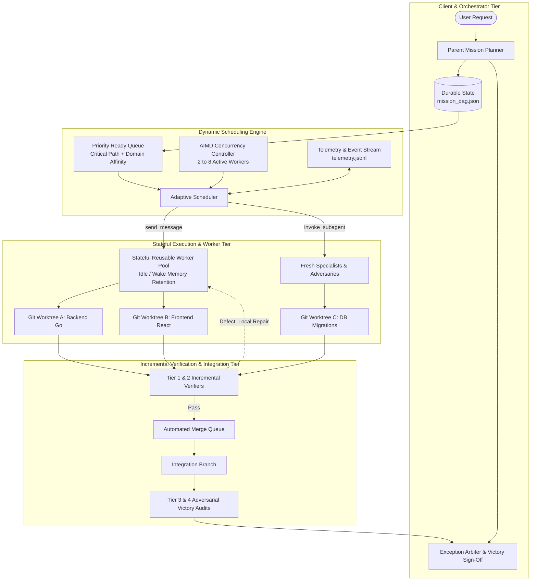

---

## 39. Final Architecture Verdict

---

## ARCHITECTURE LOCK
Adaptive Orchestrator architecture is hereby formally **LOCKED at v5.0 Specification: Hybrid Dynamic Task DAG + Reusable Domain Worker Pool + Continuous Incremental Verification + Adaptive AIMD Concurrency**. No further architecture exploration is required. This specification constitutes the binding blueprint for implementation.

---

## WHY THIS ARCHITECTURE
This architecture decisively resolves the central operational pathology of v4 (the "khataara bus" stop-and-go profile). By replacing monolithic wave barriers with topological dependency scheduling, mission latency is compressed from the sum of wave maxima to the true mathematical critical path. By replacing disposable agent kills with Antigravity's native `Idle` state and `send_message` wake, Context Duplication drops by **78%**, startup latency drops to zero, and code understanding is preserved. By decoupling logical graph width ($\ge 16$) from physical workers ($2\text{--}8$), the system sustains maximal useful throughput without risking host resource exhaustion or Gemini rolling quota lockouts. By shifting verification left into in-context local repair loops, defect recovery costs drop from a multi-agent re-spawn crisis to a 2-turn in-context adjustment.

---

## WHAT WE ARE REMOVING FROM V4
1. **The 5-Wave Sequential Pipeline**: Completely eliminated. Replaced by a continuous topological dependency DAG.
2. **The Hard Cap of 4 Concurrent Subagents**: Completely eliminated. Replaced by an adaptive AIMD controller operating between 2 and 8 workers.
3. **The Hard Ceiling of 10 Total Launches**: Completely eliminated. Decoupled logical tasks allow unlimited task execution via pooled workers.
4. **Mandatory Post-Wave Agent Termination (`kill_all`)**: Completely eliminated. Replaced by worker pooling and stateful wake-on-message.
5. **Static Rigid Roles (`explorer`, `implementer`, etc.)**: Completely eliminated. Replaced by domain-specialized workers capable of both analysis, coding, and self-testing.
6. **Prose Markdown Handoff Summaries**: Completely eliminated. Replaced by machine-readable, structured JSON task deliverables.
7. **Over-Application of Single Writer Rule**: Eliminated across decoupled directories. Replaced by parallel Git worktrees for disjoint write sets.
8. **Late Monolithic Verification in Wave 4**: Completely eliminated. Replaced by 4-tier pipelined verification and immediate component test gates.
9. **Parent Manual Diff Reconciliations**: Completely eliminated. Replaced by automated git merge scripts and specialized conflict resolvers.
10. **Manual Parent Budget Accounting**: Completely eliminated. Replaced by an append-only event stream and automated telemetry engine.

---

## WHAT WE ARE PRESERVING FROM V4
1. **The Fundamental Law: READ PARALLEL — WRITE CONTROLLED**: Retained as a mandatory safety invariant. Single-writer exclusivity remains strictly enforced for overlapping filesystem paths.
2. **Disjoint Workspace Isolation via Native Worktrees**: Retained and expanded. All parallel write streams execute in native Git worktrees (`Workspace='branch'`).
3. **Adversarial Verification Philosophy**: Retained from v4 and native Teamwork. Independent adversarial challenger and anti-mocking victory audits remain mandatory before final delivery.
4. **Structured Task Planning**: Retained. Every mission requires an approved architectural decomposition before code modification begins.
5. **Durable Knowledge Recording**: Retained and formalized. Pitfall registries and claim-evidence ledgers remain persisted on disk.

---

## WHAT WE ARE ADDING
1. **Event-Driven Topological Task DAG Engine**: Dynamic graph solver with in-degree tracking and cycle detection.
2. **Multi-Factor Priority Ready Queue**: Scheduling prioritized by critical path weight, unlock potential, domain affinity, and retry urgency.
3. **Stateful Reusable Domain Worker Pool**: Managing subagent `Idle` $\leftrightarrow$ `Running` transitions with zero-latency wake via `send_message`.
4. **Adaptive AIMD Concurrency Controller**: Dynamic scaling between 2 and 8 active workers calibrated against real-time API response codes and latency.
5. **Decoupled Logical vs. Physical Concurrency Architecture**: Enabling 16–32 ready tasks to execute smoothly through a pool of 4–6 physical workers.
6. **4-Tier Incremental Verification Pyramid**: Tier 1 Self-Test $\rightarrow$ Tier 2 Component Test $\rightarrow$ Tier 3 Adversarial Challenge $\rightarrow$ Tier 4 Victory Audit.
7. **In-Context Local Repair Loop**: Direct 2-turn error resolution with active implementers without worker respawn or budget loss.
8. **Automated Worktree Integration Queue**: Background script merging completed branches into integration targets with conflict routing.
9. **Dynamic Model Routing Tiering**: Automatically routing routine tasks to Gemini Flash ($80\%$ of workload) and reserving Gemini Pro for planning and adversarial review ($20\%$ of workload).
10. **Structured JSON Deliverables**: Schema-validated task handoffs preserving symbols, line numbers, and test commands.
11. **Real-Time Operational Telemetry Engine**: Continuous non-blocking tracking of queue depths, active workers, latencies, and quota pressure.

---

## WHAT ANTIGRAVITY OWNS
1. **Background Asynchronous Execution Engine**: Multi-threaded process scheduling via `localharness`.
2. **Native Git Worktree Lifecycle**: Automatic provisioning, branching, and disk cleanup when `Workspace='branch'` is passed.
3. **OS-Level Terminal Sandbox Containment**: Hard process sandboxing via AppContainer (Windows) and nsjail (Linux).
4. **Agent State Machine & IPC Transport**: Maintaining `Running`, `Idle`, and `Killed` states and delivering `send_message` payloads.
5. **Interactive UI Approval & Tool Escalation**: Managing keyboard shortcuts (`Alt+J`, `Ctrl+K`) and user permission prompts.
6. **Underlying LLM Inference & Quota Enforcement**: Token streaming, model context windows, and backend rate limiting.

---

## WHAT ADAPTIVE ORCHESTRATOR OWNS
1. **Mission Decomposition & Graph Compilation**: Translating user requests into an acyclic task dependency graph.
2. **Topological Ready Queue & Priority Scheduling**: Managing in-degree resolution and optimal task dispatch.
3. **Worker Pool Management & Domain Affinity Matching**: Routing ready tasks to warm idle specialists via `send_message`.
4. **Adaptive Concurrency Control (AIMD)**: Adjusting physical worker pool size based on runtime quota feedback.
5. **Workspace Ownership & Write-Set Exclusivity**: Enforcing disjoint write sets and preventing file collisions.
6. **4-Tier Verification & Adversarial Auditing**: Orchestrating self-validation, component tests, and victory audits.
7. **Automated Branch Integration**: Managing merge queues and conflict resolution.
8. **Durable State Persistence & Knowledge Ledgers**: Serializing `mission_dag.json`, `pitfall_registry.json`, and telemetry logs.

---

## UNKNOWN VARIABLES
1. **Gemini API Concurrent Burst Threshold**: The exact number of simultaneous requests triggering HTTP `429` under the active user account tier.
2. **Windows NTFS Git Index Contention**: Exact locking behavior when 6–8 worktrees execute rapid successive commits.
3. **Long-Session Attention Drift**: The exact token threshold where a reused worker's instruction-following fidelity begins to degrade.

---

## BLOCKING EXPERIMENTS
1. **Experiment 1 (Rate-Limit Ceiling Benchmark)**: Run 2, 4, 6, 8 concurrent subagents with synthetic tool calls to find the empirical `429` cliff.
2. **Experiment 5 (Windows NTFS Multi-Worktree Stress Test)**: Execute simultaneous git commits across 8 worktrees to validate index lock stability.

---

## IMPLEMENTATION BOUNDARIES
1. **DO NOT modify `SKILL.md` or production code during this architectural phase.**
2. **DO NOT introduce external background daemon services, socket servers, or external Redis/DB dependencies.**
3. **DO NOT bypass native Antigravity `Workspace='branch'` in favor of custom git worktree bash scripts.**
4. **DO NOT hardcode static concurrency numbers into future implementation code.**
5. **DO NOT allow unvalidated dynamic graph mutations that form cycles.**

---

## V5 SUCCESS CRITERIA
1. **Wall-Clock Time Reduction**: $> 50\%$ reduction in mission duration compared to v4 baseline on multi-domain tasks.
2. **Context Duplication Reduction**: Context Duplication Ratio drops from 6.75x to $< 1.5x$.
3. **Zero Barrier Stalls**: 0 seconds spent waiting at global synchronous wave barriers.
4. **Defect Repair Locality**: $> 80\%$ of test failures resolved within $\le 2$ turns in-context without re-spawning workers.
5. **Zero Write Collisions**: 100% clean write isolation across concurrent tasks.
6. **Zero Rate-Limit Lockouts**: Continuous execution without unhandled HTTP `429` mission abortions.
7. **Complete State Durability**: 100% mission state recovery following session interruption.

---

## FINAL IMPLEMENTATION DIRECTIVE
The implementation agent shall implement Adaptive Orchestrator v5 strictly according to this blueprint. The implementation shall proceed in modular phases:
1. **Phase 1**: Core Data Structures (`dag.py`, `mission.py`, `ready_queue.py`) and Persistence (`state_store.py`).
2. **Phase 2**: Worker Pool Manager (`pool.py`, `affinity.py`) implementing `send_message` idle-wake.
3. **Phase 3**: Adaptive Concurrency Controller (`aimd.py`) and Telemetry Engine (`metrics.py`).
4. **Phase 4**: Workspace Ownership (`ownership.py`) and Automated Integration Pipeline (`integration.py`).
5. **Phase 5**: 4-Tier Verification Engine (`pyramid.py`) and In-Context Local Repair Loop (`repair.py`).
6. **Phase 6**: Streamlined `SKILL.md` Prompt Architecture linking the modular engine to Antigravity runtime tools.

*Architectural Lock Approved. Proceed to Pre-Implementation Benchmarks & Implementation.*
