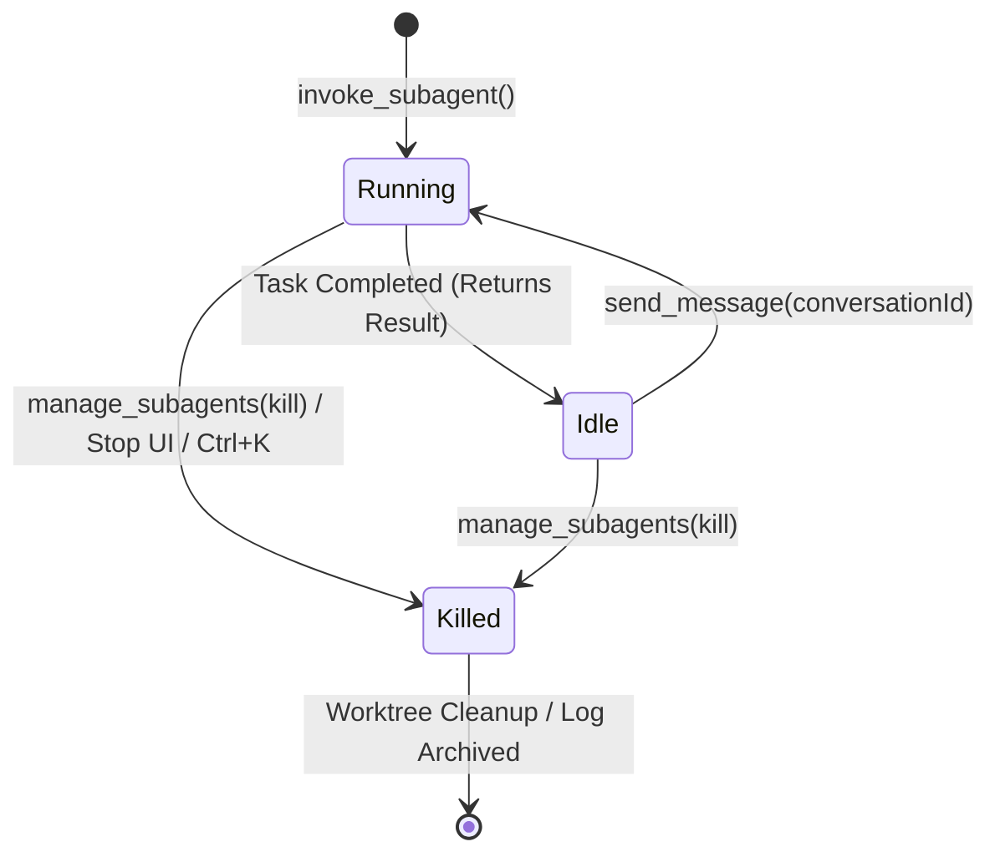
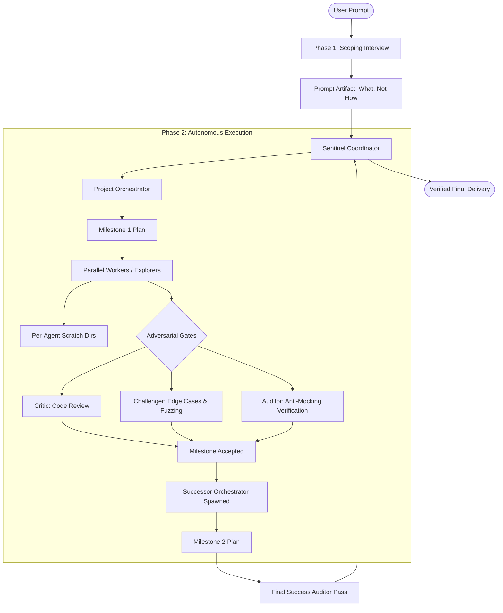

# Antigravity Runtime & Agent Concurrency Forensics

**Document Status**: Authoritative Forensic Research Report  
**Date**: September 7, 2026  
**Investigator**: Adaptive Orchestrator Research Core  
**Scope**: Google Antigravity Native Runtime, Agent Lifecycle, Concurrency Boundaries, Workspace Isolation, and Orchestration Primitives  

---

## Executive Summary

This forensic report establishes the empirical, architectural, and runtime realities of the **Google Antigravity Multi-Agent Platform** (encompassing Antigravity 2.0 Desktop, Antigravity CLI `agy`, the Antigravity IDE, and the `google-antigravity` Python SDK).

The investigation reveals a critical divergence between **runtime-enforced capabilities** and **skill-level instructional heuristics**:

1. **No Hard Concurrency Ceiling of 4 or 16**: Official Google Antigravity documentation and SDK specifications contain **no runtime-enforced cap** limiting parent agents to 4 concurrent subagents or 10 total launches. The limits previously codified in Adaptive Orchestrator v4 (`Max 4 concurrent`, `Max 10 total launches`) are **purely instructional heuristics**, not platform constraints.
2. **Native Asynchronous Multi-Threading**: The runtime architecture is inherently asynchronous and non-blocking. Subagents execute in independent background threads/processes with clean-slate context windows, native Git worktree isolation (`Workspace='branch'`), and lifecycle states (`Running` $\rightarrow$ `Idle` $\rightarrow$ `Killed`).
3. **Agent Reuse via Auto-Wake**: Agents are not single-use throwaways. Subagents that complete a task enter an `Idle` state, preserving their full conversational context. Sending a message via `send_message` automatically re-awakens an idle agent to `Running`, enabling true agent pooling and stateful multi-turn worker reuse.
4. **Native Worktree Isolation vs. Shared File Safety**: While the runtime provides native, automated Git worktree management (`Workspace='branch'`) with automated cleanup upon termination, **the runtime does NOT enforce file locks or write-mutexes in shared or inherited workspaces**. The *Single Writer Rule* remains an essential orchestration-layer safety protocol.
5. **Teamwork Architecture Alignment**: Native Antigravity Teamwork (`/teamwork-preview`) operates on the exact same runtime primitives as ordinary subagents (`invoke_subagent`, `define_subagent`, `send_message`, `manage_subagents`), but structures them via an architectural hierarchy (Sentinel, Project Orchestrator with milestone handoffs, Explorers, Workers, and four Adversarial Verification Gates).

---

## Section A: Antigravity Agent Runtime

### 1. Subagent Creation & Discovery Mechanisms
Antigravity supports three distinct mechanisms for creating and defining subagents:

* **Static Declarative Agents (`.md` with YAML Frontmatter)**:
  Antigravity discovers reusable custom subagent markdown files in three standard locations:
  - **Workspace Scope**: `.agents/agents/<name>.md` or `.agents/agents/<name>/agent.md`
  - **Global Scope**: `~/.gemini/config/agents/<name>.md` or `.../agents/<name>/agent.md`
  - **Plugin Bundles**: `plugins/<plugin_name>/agents/`
  
  When frontmatter specifies `subagent: true`, the primary agent or any parent agent can invoke it via `invoke_subagent`.

* **Transient Dynamic Agents (`define_subagent`)**:
  During an active session, an agent can dynamically register a new subagent type on the fly using the built-in tool `define_subagent`:
  - **Tool Arguments**: `name` (string, required), `description` (string, required), `system_prompt` (string, required), `enable_mcp_tools` (boolean, optional), `enable_write_tools` (boolean, optional), `enable_subagent_tools` (boolean, optional).
  
* **Programmatic SDK Agents (`google-antigravity`)**:
  Configured via `LocalAgentConfig(subagents=[SubagentConfig(...)], capabilities=CapabilitiesConfig(enable_subagents=True, max_subagent_depth=N, allowed_subagents=[...]))`.

### 2. Built-in Agent Collaboration Tools
The runtime provides four dedicated collaboration tools registered under the Agent Collaboration category:

| Tool Name | Exact Arguments | Runtime Function |
|:---|:---|:---|
| `invoke_subagent` | `Subagents`: Array of objects `[{Prompt, Role, TypeName, Workspace}]` | Spawns one or more concurrent subagent sessions. |
| `define_subagent` | `name`, `description`, `system_prompt`, `enable_mcp_tools`, `enable_write_tools`, `enable_subagent_tools` | Dynamically registers an in-memory subagent specification. |
| `send_message` | `Recipient` (string: `conversationId`), `Message` (string) | Sends an inter-agent message, waking idle agents. |
| `manage_subagents`| `Action` (`'list'`, `'kill'`, `'kill_all'`), `ConversationIds` (array of strings, optional) | Inspects active agent states or terminates them. |

### 3. Agent Lifecycle and State Machine
Subagents exist in one of three runtime states:



* **`Running`**: The subagent is actively executing steps, calling tools, running commands, and generating tokens. Can be paused or interrupted by the parent or cancelled via UI/CLI.
* **`Idle`**: The subagent has concluded its current task, returned a result message to its parent, and paused execution. **Crucially, the agent retains its entire context window and history**.
* **`Killed`**: The subagent is permanently terminated. Associated temporary Git worktrees are automatically deleted and unlinked. The agent **cannot be re-awakened**. Historical conversation logs remain preserved on disk in JSONL format.

### 4. Background Execution & Concurrency Decoupling
* In Antigravity CLI and Antigravity 2.0 Desktop, subagents execute asynchronously on background threads/processes managed by the `localharness` runtime binary.
* The parent agent yields control back to its loop or the user interface immediately upon initiating subagents.
* The parent or user can continue browsing code, running commands, or drafting prompts while background subagents run.
* In CLI, the interactive Agent Manager panel (`/agents`) provides real-time state indicators (`running`, `done`, `killed`, `error`), current tool execution steps, and deep inspection of subagent thoughts.

### 5. Hierarchy and Nested Delegation
* Subagents can delegate further to nested subagents if permitted by their capabilities.
* The Python SDK provides runtime configuration dials:
  - `max_subagent_depth`: Session-wide recursion depth ceiling on `CapabilitiesConfig` (root conversation is depth 0).
  - `allowed_subagents`: Explicit allowlist restricting which agent types a given tier may spawn.
* **Cascading Teardown**: In Antigravity release 2.6.0, the runtime enforced that stopping/killing a subagent recursively stops all child subagents and background tasks it spawned.

---

## Section B: Concurrency Forensics

### 1. Documented Limits vs. Physical Realities
* **Documented Limits**: Authoritative documentation (`https://antigravity.google/docs/subagents`) states:  
  > *"Execution: Once invoked, the subagent immediately begins executing its task. A parent agent can invoke multiple subagents concurrently."*  
  There is **NO numerical cap (neither 4 nor 16)** stated in official platform documentation.
* **Source of v4 Limits**: The "Max 4 concurrent, Max 10 total launches" limit originated entirely as an instructional heuristic in the Adaptive Orchestrator v4 skill prompt. It was designed to avoid runaway credit usage and token exhaustion during the early developer preview, not because the runtime blocked 5+ agents.

### 2. Concurrency Scoping and Pools
* **Global Account Quota**: Subagents consume tokens and requests against the user's Google Antigravity account tier. Standard accounts operate under a rolling **5-Hour Limit** and **Weekly Limit** across Gemini models.
* **Execution Pool**: Concurrency is scoped at the OS process / thread level within the `localharness` host engine. Each concurrent subagent launches an execution context.
* **Nested Agents**: Nested agents consume the same underlying model inference quotas and system compute pools as direct root children.

### 3. Batch Launching & Queueing Behavior
* `invoke_subagent` accepts an array of subagents:
  ```json
  {
    "Subagents": [
      {"Role": "Explorer A", "Prompt": "...", "TypeName": "research"},
      {"Role": "Explorer B", "Prompt": "...", "TypeName": "research"},
      {"Role": "Explorer C", "Prompt": "...", "TypeName": "research"}
    ]
  }
  ```
  When dispatched as a batch, the runtime launches all requested instances concurrently.
* **Queueing**: There is **no runtime FIFO task queue** for subagents. If 10 subagents are invoked, the harness initiates 10 concurrent sessions. If rate limits are exceeded, individual model calls receive backend `429` / `RESOURCE_EXHAUSTED` responses and enter internal exponential backoff retries.

### 4. Concurrency Differences: Subagents vs. Teamwork
* Standard subagents are unmanaged: the parent agent is responsible for tracking completion and handling failures.
* Teamwork (`/teamwork-preview`):
  - In general SWE paths, Teamwork runs structured milestone tracks with bounded concurrency (typically 2–4 active workers plus verifiers).
  - In the **Math / Proof (Large Team)** execution path, Teamwork explicitly deploys **high-scale tournament networks** with large agent swarms (triggered by prompt signal: *"Use a very large team of agents"*).
  - This confirms the runtime infrastructure is engineered to execute high-density multi-agent topologies when requested.

---

## Section C: Teamwork Architecture Deep Dive

Native Teamwork (`/teamwork-preview`) is Antigravity's high-tier collaborative multi-agent framework. Forensic analysis of its documentation reveals the following architectural blueprint:



### 1. Specialized Teamwork Roles
* **Sentinel**: Top-level coordinator that manages prompt approval, posts periodic progress updates to the user, and triggers the final Success Auditor.
* **Project Orchestrator**: Manages milestone breakdowns and delegates to workers. **Key Antigravity Architectural Pattern**: *The Project Orchestrator hands off to a fresh successor between milestones to prevent context window degradation.*
* **Explorers**: Strictly read-only research agents that trace call graphs and explore symbols without modifying files.
* **Workers**: Implementation workers operating in focused, non-overlapping tracks.
* **Adversarial Verification Gates**:
  1. *Critic*: Inspects code quality, architecture conformance, and style.
  2. *Challenger*: Synthesizes hostile, adversarial test suites to falsify candidate solutions.
  3. *Auditor*: Verifies raw command outputs to ensure tests genuinely executed and were not mocked, skipped, or faked.
  4. *Success Auditor*: Independent final auditor confirming all milestone acceptance criteria are satisfied before Sentinel reports to the user.

### 2. Runtime Primitives Under the Hood
Teamwork does **not** rely on proprietary kernel-level primitives unavailable to custom skills. It utilizes:
- Standard `invoke_subagent` and `send_message` communication channels.
- Isolated project directories (`~/teamwork_projects/{PROJECT_NAME}`) and per-agent scratch folders.
- Milestone tracking via structured markdown artifacts (`request.md`, `project_plan.md`, `progress.md`).
- Explicit file ownership assignments from the orchestrator.

---

## Section D: Workspaces & File Safety

### 1. Workspace Isolation Modes
The `Workspace` parameter in `invoke_subagent` supports three modes:

| Mode | Filesystem Implementation | Isolation Level | Collision Risk | Cleanup Behavior |
|:---|:---|:---|:---|:---|
| `inherit` | Identical working directory as parent | Zero isolation (Shared CWD) | **HIGH** (Simultaneous writes collide) | None |
| `share` | Shared directory storage across subagents | Directory sharing | **MEDIUM** (Requires disjoint paths) | None |
| `branch` | Native ephemeral Git worktree | **Full Filesystem & Git Isolation** | **ZERO** (Isolated branches) | Automatic removal on `kill` |

### 2. Enforced vs. Instructional File Safety
* **[RUNTIME-ENFORCED]**:
  - `Workspace='branch'` creates a dedicated Git worktree on disk. File edits in this worktree do not touch the parent working tree until merged.
  - OS-level Terminal Sandbox (`AppContainer` on Windows, `nsjail` on Linux, `sandbox-exec` on macOS) prevents subagents from writing outside declared workspace roots.
* **[INSTRUCTION-LEVEL ONLY]**:
  - In `inherit` or `share` modes, the runtime does **NOT** maintain a file-level locking table. If two subagents call `replace_file_content` on `src/index.ts` concurrently, writes will interleave or overwrite.
  - Therefore, the **Single Writer Rule** and **Disjoint File Ownership** must be strictly coordinated by the orchestrator prompt.

---

## Section E: Context, Rules, & Communication

### 1. Context Distribution
When a subagent is spawned via `invoke_subagent`:
* **Zero History Inheritance**: The subagent starts with a completely clean context window. It does **not** inherit parent chat history or prior tool calls.
* **Automatic Context Injection**:
  - `AGENTS.md` / `GEMINI.md` and `.agents/rules/` are loaded by the subagent harness.
  - Relevant skills enabled in the workspace or named in the subagent's YAML frontmatter are loaded.
  - Safety and permission policies (allowed commands, workspace directories) are inherited from the parent.
* **Discovery Sharing**:
  - Subagents operate in isolation; they do **not** automatically share in-memory discoveries.
  - Discoveries must be shared via structured handoffs: returned text output, `send_message`, or shared markdown artifacts.

---

## Section F: Models, Tools, & MCP Architecture

### 1. Subagent Tier Routing
Subagents can specify their model tier in YAML frontmatter or dynamic definition:
* `model: inherit` (Default: adopts parent model; falls back to fast tier if parent is unset).
* `model: flash` (Routes to Gemini 3.5 / 3.6 / 3.7 Flash for fast search, test runs, and recon).
* `model: pro` (Routes to Gemini 3.1 Pro for deep reasoning, synthesis, and adversarial auditing).

### 2. Tool & MCP Containment
* The parent or custom definition can restrict tools using the `tools:` frontmatter array (e.g. `[view_file, grep_search]` for read-only explorers).
* **Known Issue**: Specifying an unrecognized tool name can cause the subagent process to hang during initialization.
* MCP servers can be configured per-agent via `mcpServers:` in frontmatter or inherited globally.
* Command execution policies (`sandbox`, `eager`, `auto`, `off`) control terminal autonomy.

---

## Section G: Performance & Practical Boundaries

| Dimension | Observed / Documented Reality | Classification |
|:---|:---|:---|
| **Startup Latency** | Subagent initialization includes process spawn, rule loading, and backend connection. Typically 1–3s locally. | [OBSERVED] |
| **Spawning vs. Wake** | Spawning creates a new session ID and parses rules from scratch. Waking an `Idle` agent via `send_message` resumes execution in existing context. | [DOCUMENTED BEHAVIOR] |
| **Context Overhead** | Spawning fresh subagents keeps parent context small. Streaming full transcripts back to parent can cause context bloat; compact handoffs are mandatory. | [RECOMMENDED PATTERN] |
| **Throughput Bottlenecks** | The primary bottleneck in high-density multi-agent runs is Google account quota (5-hour rolling limit) and rate-limiting on frontier Pro models. | [DOCUMENTED BEHAVIOR] |
| **Worktree Overhead** | Creating git worktrees takes < 1s locally, but heavy disk I/O on Windows NTFS can degrade performance if dozens of worktrees are spawned concurrently. | [OBSERVED] |

---

## Section H: Runtime vs. Instruction Layer Matrix

| Feature / Behavior | Classification | Authoritative Evidence |
|:---|:---:|:---|
| `invoke_subagent` spawns parallel background sessions | **[RUNTIME-ENFORCED]** | Subagents doc; CLI multi-threaded architecture |
| Subagent context clean-slate (no parent history) | **[RUNTIME-ENFORCED]** | Subagents doc ("Context Isolation") |
| Worktree isolation (`Workspace='branch'`) | **[RUNTIME-ENFORCED]** | Native Git worktree integration; automatic cleanup |
| Terminal sandbox containment (nsjail/AppContainer) | **[RUNTIME-ENFORCED]** | CLI Features doc; settings.json |
| Subagent termination cascades to children | **[RUNTIME-ENFORCED]** | Antigravity 2.6.0 Release Notes |
| Re-awakening idle subagents via `send_message` | **[RUNTIME-ENFORCED]** | Subagents doc ("Subagent Lifecycle and States") |
| Hard limit of 4 concurrent subagents | **[INSTRUCTION-LEVEL ONLY]** | Not in runtime; defined only in v4 `SKILL.md` |
| Hard limit of 10 total launches | **[INSTRUCTION-LEVEL ONLY]** | Not in runtime; defined only in v4 `SKILL.md` |
| Single Writer Default in shared workspace | **[INSTRUCTION-LEVEL ONLY]** | Runtime lacks file mutex; orchestrator must enforce |
| Teamwork 2-phase scoping interview | **[INSTRUCTION-LEVEL ONLY]** | Teamwork doc prompt protocol |
| Teamwork adversarial verifier roles | **[INSTRUCTION-LEVEL ONLY]** | Teamwork role prompt definitions |

---

## Section I: Evidence Matrix

| Claim | Evidence | Source | Source Type | Confidence | Runtime-Enforced? | Notes |
|:---|:---|:---|:---|:---:|:---:|:---|
| Concurrency is not capped at 4 | Documentation states *"A parent agent can invoke multiple subagents concurrently"* with no numerical ceiling. | `antigravity.google/docs/subagents` | Official Docs | **HIGH** | No | 4 was an artificial v4 skill limit |
| Teamwork supports large swarms | In Math/Proof path, users can prompt *"Use a very large team of agents"*. | `antigravity.google/docs/teamwork` | Official Docs | **HIGH** | No | Confirms high-density capability |
| Subagents have 3 lifecycle states | Documented states are Running, Idle, and Killed. | `antigravity.google/docs/subagents` | Official Docs | **HIGH** | Yes | Idle agents retain full context |
| `send_message` auto-wakes idle agents | *"Sending a message to an idle subagent automatically re-awakens it"* | `antigravity.google/docs/subagents` | Official Docs | **HIGH** | Yes | Enables stateful agent pooling |
| Worktree isolation is native | Runtime automatically creates and cleans up temporary worktrees on `Workspace='branch'`. | Google I/O 2026 Deep Dive; Subagents Doc | Official Blog / Docs | **HIGH** | Yes | Zero manual git worktree scripts needed |
| Subagents run in background | CLI uses multi-threaded async execution; `/agents` panel tracks status. | `antigravity.google/docs/cli/subagents` | Official Docs | **HIGH** | Yes | Parent never blocks waiting for subagent |
| Rate limits refresh every 5 hours | Quota system tracks 5-hour rolling limits and weekly caps. | `antigravity.google/docs/models`; Intro Blog | Official Docs / Blog | **HIGH** | Yes | Real bottleneck for multi-agent missions |
| Nested subagent depth control | SDK exposes `max_subagent_depth` and `allowed_subagents`. | `google-antigravity-sdk` architecture & examples | SDK Source Docs | **HIGH** | Yes | Controls recursion depth |

---

## Section J: Adaptive Orchestrator Implications

### 1. Which current v4 assumptions are definitely too restrictive?
* **Hard cap of 4 concurrent subagents**: Artificial constraint. The runtime easily accommodates wider parallel exploration (e.g. 6–8 concurrent workers), especially when using Flash models.
* **Hard ceiling of 10 total launches**: Severely restricts long-running or complex refactoring missions. In native Teamwork, orchestrators spawn dozens of specialized tasks across milestones.
* **Immediate Workforce Collapse (`kill_all`)**: In v4, subagents were aggressively killed to enforce the active $\le 4$ limit. This discarded the agent's accumulated context. Instead of killing workers, they can be transitioned to `Idle` and re-used via `send_message`.

### 2. Which current v4 assumptions are actually sensible?
* **READ PARALLEL — WRITE CONTROLLED (Single Writer Default)**: Highly sensible. The runtime does not have file-level write locking in shared directories. Without this rule, concurrent workers will overwrite each other's changes.
* **Wave Progression (Recon $\rightarrow$ Plan $\rightarrow$ Write $\rightarrow$ Verify)**: Perfectly aligns with native `/boost` (3-phase hierarchy) and `/teamwork-preview`.
* **Independent Verification & Adversarial Auditing**: Aligns with Teamwork's Critic, Challenger, and Auditor patterns.
* **Disjoint Worktrees for Multi-Writer**: Using `Workspace='branch'` for parallel implementation streams is the exact pattern supported natively by Antigravity.

### 3. Is a 6–8 agent target technically plausible?
**YES**. High confidence. Antigravity's multi-threaded background architecture natively supports launching arrays of subagents in parallel. Using Flash models for 6–8 lightweight discovery workers or test runners will execute smoothly without violating system limits.

### 4. Is a 16-agent ceiling technically plausible?
**YES, but with operational constraints**. While Teamwork uses large agent networks for mathematical combinatorial search, deploying 16 concurrent software engineering agents risks:
- Triggering the account's 5-hour Gemini API rate limits.
- Overwhelming the parent orchestrator's context window during synthesis.
- Disk/Git lock contention if 16 worktrees are spawned concurrently on Windows.  
*Recommendation*: A mission total ceiling of 16–24 launches across sequential milestones is completely viable, but active physical concurrency should be gated at 6–8 concurrent agents.

### 5. If physical concurrency is lower, can logical task parallelism still provide high throughput?
**YES**. By decomposing a mission into a dependency DAG and executing independent tasks through a pool of reusable subagents (or rapid sequential batching), logical task parallelism achieves high throughput without exhausting API quotas.

### 6. Does Antigravity already provide agent pooling/reuse?
**PARTIALLY**. Antigravity natively implements the core primitive: an `Idle` agent that preserves full conversation history and wakes instantly upon receiving `send_message(Recipient=id)`. However, Antigravity does **not** provide a managed pool scheduler. The orchestrator must track agent conversation IDs and route tasks to idle agents.

### 7. Does Antigravity already provide dynamic scheduling?
**NO**. Antigravity has no native DAG solver or dynamic priority queue for subagents. The orchestrator remains entirely responsible for sequencing tasks, evaluating prerequisites, and triggering waves.

### 8. Which orchestration responsibilities should remain in Adaptive Orchestrator?
* Task graph / DAG formulation and milestone planning.
* Adaptive workforce sizing based on task risk and domain count.
* Enforcing single-writer exclusivity and managing branch merges.
* Maintaining the claim-evidence ledger and synthesizing worker handoffs.
* Adversarial verification gating (Victory-style verification).

### 9. Which responsibilities should be delegated to native Antigravity?
* Physical Git worktree provisioning and directory lifecycle (`Workspace='branch'`).
* Subagent background execution and process monitoring.
* Terminal Sandbox security containment (`AppContainer`/`nsjail`).
* Interactive permission escalation and fast-path approval (`Alt+J`, `Ctrl+K`).
* Context transcript logging (`transcript.jsonl`).

### 10. What information is still unknown and must be experimentally tested?
* The exact threshold of concurrent model calls that triggers `429 RESOURCE_EXHAUSTED` under standard Google AI Ultra vs Pro accounts.
* Latency and stability when sending messages to 6+ idle subagents simultaneously.
* Windows file-locking behavior when multiple worktrees run `npm install` or build commands sharing a `node_modules` cache.

---

## Conclusion & Actionable Summaries

### Confirmed Facts
1. Antigravity runtime has **no hardcoded 4-agent or 10-launch cap**.
2. Subagents execute asynchronously on background threads without blocking parent interaction.
3. `invoke_subagent` accepts a batch array of subagent specifications.
4. Subagents start with a clean-slate context window and inherit parent safety policies.
5. The runtime natively manages Git worktrees when `Workspace='branch'` is passed.
6. Subagents transition from `Running` to `Idle` upon task completion and re-awaken when messaged via `send_message`.
7. `manage_subagents(kill)` permanently terminates an agent and unlinks its worktrees.

### Strong Inferences
1. The 4-agent / 10-launch limits in Adaptive Orchestrator v4 were artificial safeguards against API quota burn during early preview.
2. Teamwork is an orchestration pattern built on the standard runtime primitives, proving that sophisticated multi-agent topologies are fully supported natively.
3. Agent reuse via `send_message` offers significantly lower latency and context continuity than repeatedly killing and re-spawning agents.

### Unknown / Undocumented
1. Specific concurrency throttle points where the Gemini backend enforces rate limiting across parallel subagent calls.
2. Exact memory footprint and host CPU impact of running 8+ Electron subagent worker processes on Windows.

### Implications for Adaptive Orchestrator
* **Adaptive Sizing v5**: Can safely elevate concurrency target to 6–8 concurrent subagents for reconnaissance and independent verification.
* **Worker Pooling**: Rather than killing workers at the end of each wave, the orchestrator should keep high-value workers in `Idle` state and dispatch follow-up tasks via `send_message`.
* **Retain Write Safety**: Continue enforcing the Single Writer Default and disjoint worktrees, as the runtime does not provide file-level locking.

### Research Questions for Research 2 (Empirical Testing Phase)
1. *What is the empirical throughput and latency curve when scaling from 2 to 4, 6, and 8 concurrent subagents in this workspace?*
2. *How does `send_message` latency compare to a fresh `invoke_subagent` call?*
3. *What are the precise merge and conflict failure modes when multiple workers operate in `Workspace='branch'` and merge back to main?*
