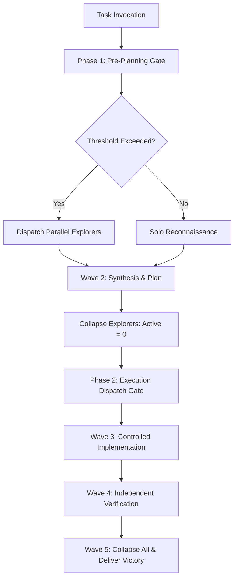

# Adaptive Orchestrator (v4 Foundation)

[](https://opensource.org/licenses/Apache-2.0)
[](https://github.com/naksh-07/adaptive-orchestrator)
[](https://github.com/naksh-07/adaptive-orchestrator/releases)
[](https://www.python.org/downloads/)
[](https://github.com/naksh-07/adaptive-orchestrator/actions)

> **Production-Grade Antigravity-Native Global Multi-Agent Orchestration Engine.**
> Deliver Teamwork Preview-grade rigor with intelligent workforce sizing, shallow hierarchical delegation, hard resource limits (max 4 concurrent, max 10 total launches), progressive coordination depth, dead-end memory, and Victory-style independent verification.

---

## Table of Contents
- [Executive Overview](#executive-overview)
- [Why Adaptive Orchestrator?](#why-adaptive-orchestrator)
- [Core Architecture & Lifecycle](#core-architecture--lifecycle)
  - [The 5-Wave Execution Pipeline](#the-5-wave-execution-pipeline)
  - [Dual Mandatory Delegation Gates](#dual-mandatory-delegation-gates)
  - [Hard Resource Limits & Tree-Aware Ledger](#hard-resource-limits--tree-aware-ledger)
- [Specialist Subagent Taxonomy](#specialist-subagent-taxonomy)
- [Coordination Depth & Templates](#coordination-depth--templates)
- [Comparison Matrix](#comparison-matrix)
- [Quick Start & Installation](#quick-start--installation)
- [Built-In CLI Tools & Diagnostics](#built-in-cli-tools--diagnostics)
- [Repository Structure](#repository-structure)
- [Testing & Quality Assurance](#testing--quality-assurance)
- [License](#license)

---

## Executive Overview

**Adaptive Orchestrator** is an orchestration framework natively tailored for **Google Antigravity** and Gemini agentic environments. It addresses the two most critical failure modes in autonomous multi-agent systems:
1. **Premature Solo Wanderings**: Agents burning tokens exploring massive codebases without delegating.
2. **Runaway Swarm Chaos**: Uncoordinated subagents flooding the workspace, colliding on shared files, and rapidly consuming token quotas without verification.

### The Mandate
```text
"Deliver Teamwork Preview-grade rigor with intelligent workforce sizing,
shallow hierarchical delegation, hard resource limits, and aggressive workforce collapse."
```



---

## Why Adaptive Orchestrator?

- **Dual Mandatory Gates**: Explicit, non-bypassable pre-planning and post-approval gates eliminate guesswork and prevent uncoordinated file writes.
- **Credit-Aware Budget Bounds**: Enforces **max 4 concurrent subagents** and **max 10 total launches** across the entire hierarchical tree (Root + Children + Grandchildren).
- **Fundamental Law (Read Parallel — Write Controlled)**: Parallelize read operations across specialists while strictly enforcing Single Writer boundaries (or isolated `Workspace='branch'` worktrees) during code modifications.
- **Dead-End Memory Log (`dead-ends.md`)**: An append-only record of falsified hypotheses to ensure subagents never repeat failed approaches across waves.
- **Victory-Style Independent Verification**: Independent Reviewer and adversarial Challenger subagents audit diffs and probe boundary conditions before marking tasks complete.
- **Zero Workspace Pollution**: All coordination artifacts are saved in the conversation's artifact directory (`<appDataDir>/brain/<conversation-id>/`), leaving the user's workspace pristine.

---

## Core Architecture & Lifecycle

### The 5-Wave Execution Pipeline

```text
Wave 1: Reconnaissance & Discovery
   │  └── Read-only Explorer/Researcher specialists gather hard facts with line numbers.
   ▼
Wave 2: Synthesis & Architectural Plan
   │  └── Parent reconciles findings into implementation_plan.md; collapses Wave 1 workers.
   ▼
Wave 3: Controlled Implementation
   │  └── Scoped Implementers modify assigned files under Single Writer policy.
   ▼
Wave 4: Independent Verification & Audit
   │  └── Reviewer runs tests/linters; Challenger performs adversarial edge-case probing.
   ▼
Wave 5: Final Delivery & Workforce Collapse
      └── All subagents terminated (Active Total = 0); Victory confirmed.
```

---

### Dual Mandatory Delegation Gates

#### 1. Phase 1: Pre-Planning Dispatch Gate
Executes immediately upon invocation, **BEFORE** substantive repository exploration.
- **Trigger A (3+ Domains)**: 2+ concurrent specialists.
- **Trigger B (2+ Independent Lanes)**: 2+ concurrent specialists.
- **Trigger C (5+ Files / 2+ Modules)**: $\ge 1$ specialist.
- **Trigger D (Research + Implementation)**: $\ge 1$ Explorer dispatched before planning.

```text
[Adaptive Orchestrator v4 Foundation — Phase 1 Pre-Planning]
Mode:             [SOLO | FOCUSED | SMALL | PARALLEL | STAGED | HIERARCHICAL | MAX]
Dispatch Gate:    [REQUIRED | NOT REQUIRED]
Initial Workforce:[0 | 1 | 2 | 3 | 4]
Reason:           [e.g., 3 independent domains, 14-file scope across 3 modules]
Budget:           [X]/10 launches reserved
```

#### 2. Phase 2: Post-Approval Execution Dispatch Gate
Executes **AFTER** plan approval (or Auto-Proceed), **BEFORE** the first code modification.
- Re-evaluates concrete implementation workstreams.
- If $\ge 2$ independent streams exist, SOLO implementation is **strictly forbidden**.

```text
[Adaptive Orchestrator v4 Foundation — Phase 2 Execution Dispatch]
IMPLEMENTATION_WORKSTREAMS: [List of streams identified in plan]
INDEPENDENT_STREAMS:        [Count of genuinely independent lanes]
COUPLING:                   [TIGHTLY_COUPLED | DECOUPLED | MODULAR]
FILE_OWNERSHIP:             [Disjoint file/module assignments per worker]
RISK:                       [LOW | MEDIUM | HIGH | CRITICAL]
MODE:                       [SOLO | FOCUSED | PARALLEL | STAGED | HIERARCHICAL]
INITIAL_WORKFORCE:          [N implementation workers / coordinators]
HIERARCHY_REQUIRED:         [YES | NO]
BUDGET_AVAILABLE:           [X]/10 launches remaining
```

---

### Hard Resource Limits & Tree-Aware Ledger

Every mission operates under hard ceilings shared across the entire hierarchy:

| Metric | Normal Default | Mission Hard Limit | Invariant |
|:---|:---:|:---:|:---|
| **Concurrent Subagents** | **2** initial | **4 Max** | $	ext{Active Direct Leaves} + \sum 	ext{Coordinator Quotas} \le 4$ |
| **Total Launches** | **4–6** total | **10 Max** | $	ext{Root Launches} + \sum 	ext{Child Launches} + 	ext{Retries} \le 10$ |

#### Tree-Aware Ledger Schema:
```text
SPAWNED_TOTAL:           [all subagent launches across entire tree so far]
ACTIVE_TOTAL:            [currently active subagents across whole tree (<= 4)]
REMAINING_BUDGET:        [10 - SPAWNED_TOTAL]
COORDINATOR_ALLOCATIONS: [local child budgets reserved for active coordinators]
CURRENT_DEPTH:           [max nesting depth in active tree (<= 2 normal)]
```

---

## Specialist Subagent Taxonomy

| Subagent Role | Tool Group & Nature | Primary Mandate | Antigravity Mapping |
|:---|:---|:---|:---|
| **Explorer / Researcher** | Read-Only | Rapid codebase navigation, AST analysis, symbol tracing. | `TypeName='research'` or `self` |
| **Implementer** | Controlled Writer | Precise, surgical code edits within disjoint boundaries. | `TypeName='self'` |
| **Reviewer / Verifier** | Verification | Independent verification, automated tests, diff inspection. | `TypeName='self'` or `research` |
| **Challenger / Auditor** | Adversarial | Edge-case probing, fuzzing, Victory compliance audit. | `TypeName='self'` (Adversarial) |
| **Coordinator** | Domain Lead | Decomposes complex subproblems into 1–2 child leaves. | `define_subagent` (Dynamic) |

### Standard Handoff Protocol
Every specialist handoff conforms to this strict, evidence-backed schema:
```text
### HANDOFF REPORT
- OBJECTIVE:           [Assigned mandate or question investigated]
- OBSERVATIONS:        [Key factual findings with exact file paths and line numbers]
- LOGIC_CHAIN:         [Technical reasoning, root cause analysis, or architectural trace]
- EVIDENCE:            [Exact code snippets, grep matches, test outputs, or diffs]
- CAVEATS:             [Assumptions, risks, edge cases, or unverified items]
- CONCLUSION:          [Actionable recommendation, fix summary, or approval verdict]
- VERIFICATION_METHOD: [Exact command/check next owner can run to verify this finding]
- NEXT_OWNER:          [Implementer | Reviewer / Verifier | Challenger / Auditor | Parent Orchestrator]
```

---

## Coordination Depth & Templates

Adaptive Orchestrator scales state tracking to mission complexity:
- **L0 (Tiny / Solo)**: No persistent files.
- **L1 (Focused / Small)**: Structured markdown summaries in tool responses.
- **L2 (Multi-Wave)**: Artifacts created in conversation brain: `mission.md`, `progress.md`, `dead-ends.md`.
- **L3 (Large / Staged / Hierarchical)**: Full state suite including `gates.md` and `final-audit.md`.

| Template | File | Purpose |
|:---|:---|:---|
| **Mission Ledger** | `templates/mission.md` | Live budget tracker, active workers registry, decisions. |
| **Progress Tracker** | `templates/progress.md` | Wave-by-wave execution timeline and deliverables. |
| **Dead-End Memory** | `templates/dead-ends.md` | Append-only log of falsified hypotheses to avoid repeat loops. |
| **Stage-Gates** | `templates/gates.md` | Pre-transition verification checklist between waves. |
| **Final Victory Audit** | `templates/final-audit.md` | Requirement compliance matrix and sign-off evidence. |
| **Handoff Report** | `templates/handoff-report.md` | Universal specialist structured communication block. |

---

## Comparison Matrix

| Feature | Naive Multi-Agent | Teamwork Preview | Adaptive Orchestrator v4 |
|:---|:---:|:---:|:---:|
| **Delegation Triggers** | Ad-hoc / Prompt Dependent | Fixed Heavyweight Tree | **Dual Mandatory Gates (Phase 1 & 2)** |
| **Concurrency Limit** | Unbounded (Swarm sprawl) | Variable / High | **Hard Cap (4 Max Tree-Wide)** |
| **Mission Launch Ceiling** | Infinite / Unchecked | Often 20–50+ launches | **Strict Shared 10-Launch Cap** |
| **File Writing Policy** | Concurrent writes to same file | Locking or Merge hell | **Single Writer Default / Branch Trees** |
| **Hypothesis Memory** | None (Loops on failures) | Context-dependent | **Append-Only Dead-End Memory Log** |
| **Workforce Lifecycle** | Agents persist indefinitely | Deep nesting | **Aggressive Multi-Phase Collapse to 0** |
| **Independent Audit** | Rare | Built-in | **Victory-Style Adversarial Challenger** |
| **Workspace Cleanliness** | Pollutes project root | Varies | **Zero Pollution (Brain Artifacts Only)** |

---

## Quick Start & Installation

### Option 1: Automatic 1-Command Installer
Install directly into your local Gemini / Antigravity skills directory:

```bash
# Clone the repository
git clone https://github.com/naksh-07/adaptive-orchestrator.git
cd adaptive-orchestrator

# Run the installer
python scripts/install.py
```

### Option 2: Manual Installation
Copy the core assets to your Antigravity skills path:
```bash
mkdir -p ~/.gemini/config/skills/adaptive-orchestrator
cp -r SKILL.md AGENTS.md GEMINI.md manifest.json plugin.json skills.json subagents templates ~/.gemini/config/skills/adaptive-orchestrator/
```

### Activation in Antigravity
When you ask Antigravity to handle a complex task or use orchestration:
```text
"Activate adaptive-orchestrator and refactor the authentication module across frontend and backend."
```

---

## Built-In CLI Tools & Diagnostics

### 1. Doctor (Diagnostic Health Check)
Run self-diagnostics to verify environment health, manifest syntax, subagent schemas, and templates:

```bash
python scripts/doctor.py
```

Output:
```text
=================================================================
       Adaptive Orchestrator v4.0.0 — Doctor Self-Check
=================================================================
  Python Environment:     PASS       (3.11.16 on win32)
  Core Assets Integrity:  PASS       (19/19 files verified)
  Manifests & Schemas:    PASS       (JSON & YAML syntax valid)
  Subagent Definitions:   PASS       (4 leaf subagents registered)
  Multi-Wave Templates:   PASS       (6 markdown templates verified)
-----------------------------------------------------------------
  Overall System Health:  HEALTHY (v4.0.0 Ready for Deployment)
=================================================================
```

### 2. Budget & Concurrency Calculator
Inspect or simulate mission budget allowances:

```bash
# Check if a spawn is permitted with 3 spawned and 2 currently active
python scripts/budget_ledger.py --check 3 2
# Output: Spawn Check [3/10 spawned, 2/4 active]: ALLOWED

# Output ledger state in JSON
python scripts/budget_ledger.py --json
```

### 3. Schema & Manifest Validator
Verify all JSON schemas and Markdown structural invariants:

```bash
python scripts/validate_skill.py
```

---

## Repository Structure

```text
adaptive-orchestrator/
├── .github/
│   └── workflows/
│       └── validate.yml              # GitHub Actions CI for manifest & test validation
├── docs/
│   ├── ARCHITECTURE.md               # 5-Wave lifecycle, Dual Gates, and State Machine
│   ├── SUBAGENTS.md                  # Comprehensive guide for the 4 subagents & Coordinators
│   └── WORKFLOW_EXAMPLES.md          # Real-world execution walkthroughs & sizing examples
├── scripts/
│   ├── doctor.py                     # Self-check diagnostic script
│   ├── budget_ledger.py              # 10-launch budget & concurrency calculator
│   ├── install.py                    # 1-command installer into ~/.gemini/config/skills
│   └── validate_skill.py             # Manifest, template & subagent schema validator
├── subagents/
│   ├── challenger-auditor.md         # Adversarial Victory-style auditor subagent
│   ├── explorer-researcher.md        # Read-heavy reconnaissance subagent
│   ├── implementer.md                # Controlled single-writer implementer subagent
│   ├── reviewer-verifier.md          # Independent verification subagent
│   └── subagents-definition.json     # Machine-readable subagent schema definitions
├── templates/
│   ├── dead-ends.md                  # Append-only falsification memory log template
│   ├── final-audit.md                # Victory completion report template
│   ├── gates.md                      # Stage-gate verification matrix template
│   ├── handoff-report.md             # Standardized handoff schema template
│   ├── mission.md                    # Live mission status & budget ledger template
│   └── progress.md                   # Multi-wave progress tracker template
├── tests/
│   ├── __init__.py
│   ├── test_manifests.py             # Manifest & schema integrity test suite
│   └── test_budget_ledger.py         # Budget calculator & concurrency invariant tests
├── .gitignore
├── AGENTS.md                         # Orchestration behavioral rules
├── CHANGELOG.md                      # Release notes & version history
├── CONTRIBUTING.md                   # Contribution guidelines
├── GEMINI.md                         # Gemini model instruction rules
├── LICENSE                           # Apache 2.0 License
├── manifest.json                     # Antigravity skill manifest
├── plugin.json                       # Plugin descriptor
├── pyproject.toml                    # Python project packaging metadata
├── README.md                         # Primary documentation
├── requirements.txt                  # Minimal dev dependencies
├── SKILL.md                          # Full v4 Foundation core skill specification
└── skills.json                       # Standard skill registry manifest
```

---

## Testing & Quality Assurance

Run the automated test suite locally:

```bash
python -m unittest discover -s tests -p "test_*.py" -v
```

All 10 unit tests validate:
- Manifest JSON integrity & cross-referenced file existence
- Subagent schema definitions & leaf mappings
- Budget ledger concurrency caps (4 active max)
- Total launch mission ceiling (10 launches max)
- Coordinator quota reservation and automatic unused quota release
- Workforce collapse state transitions

---

## License

Adaptive Orchestrator is released under the **Apache-2.0 License**.
See the [LICENSE](LICENSE) file for details.

Copyright (c) 2026 Suraj ([@naksh-07](https://github.com/naksh-07)) and Adaptive Orchestrator Contributors.
