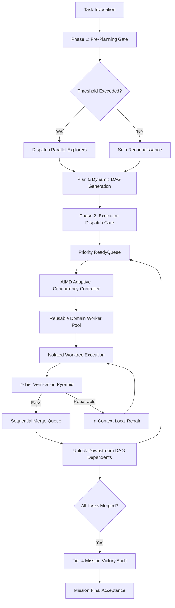

# Adaptive Orchestrator (v5 Architecture)

[](https://opensource.org/licenses/Apache-2.0)
[](https://github.com/naksh-07/adaptive-orchestrator)
[](https://github.com/naksh-07/adaptive-orchestrator/releases)
[](https://www.python.org/downloads/)
[](https://github.com/naksh-07/adaptive-orchestrator/actions)

> **Production-Grade Antigravity-Native High-Throughput Multi-Agent Orchestration Engine.**
> High-throughput orchestration with dynamic task DAGs, reusable domain workers, adaptive AIMD concurrency, isolated worktree integration, durable persistence, and 4-tier Victory verification.

---

## Table of Contents
- [Executive Overview](#executive-overview)
- [Why Adaptive Orchestrator v5?](#why-adaptive-orchestrator-v5)
- [Core Architecture & Lifecycle](#core-architecture--lifecycle)
  - [Continuous Dynamic DAG Pipeline](#continuous-dynamic-dag-pipeline)
  - [Dual Mandatory Delegation Gates](#dual-mandatory-delegation-gates)
  - [V5 Resource Model & AIMD Concurrency](#v5-resource-model--aimd-concurrency)
  - [4-Tier Verification Pyramid & Local Repair](#4-tier-verification-pyramid--local-repair)
  - [Controlled Integration & Sequential Merge Queue](#controlled-integration--sequential-merge-queue)
- [Specialist Subagent Taxonomy & Worker Pool](#specialist-subagent-taxonomy--worker-pool)
- [Coordination Depth & Templates](#coordination-depth--templates)
- [Comparison Matrix](#comparison-matrix)
- [Quick Start & Installation](#quick-start--installation)
- [Built-In CLI Tools & Diagnostics](#built-in-cli-tools--diagnostics)
- [Repository Structure](#repository-structure)
- [Testing & Quality Assurance](#testing--quality-assurance)
- [License](#license)

---

## Executive Overview

**Adaptive Orchestrator v5** is a production-grade multi-agent orchestration engine natively designed for **Google Antigravity** and Gemini agentic ecosystems. It eliminates the bottlenecks of stop-and-go wave barriers, context thrashing, and arbitrary mission launch limits while preserving strict safety, isolation, and verification rigor.

### The v5 Mandate
```text
"Maximize useful parallel progress, verification quality, and correctness per token
through dynamic task DAGs, reusable domain workers, adaptive AIMD concurrency,
isolated worktree writes, and 4-tier verification rigor."
```



---

## Why Adaptive Orchestrator v5?

- **Continuous Dynamic DAG Execution**: Replaces rigid stop-and-go wave barriers with a topologically sorted task DAG that dynamically pushes ready work into a priority queue.
- **Reusable Domain Workers**: Workers remain in the worker pool (`IDLE` state) with warm context, avoiding context duplication and repeatedly reloading repository files.
- **Adaptive AIMD Concurrency**: Physical subagent concurrency dynamically expands upon success ($C \leftarrow C + 1$) and throttles upon failure or rate pressure ($C \leftarrow \max(1, \lfloor C \times 0.5 \rfloor)$).
- **Decoupled Logical Task Width**: Missions can execute arbitrarily large task graphs without hitting artificial mission launch limits.
- **Fundamental Law (Read Parallel — Write Controlled)**: Read operations scale concurrently across specialists, while write operations are isolated in git worktrees and merged sequentially through a conflict-checked queue.
- **4-Tier Verification Pyramid**:
  - **Tier 1**: Worker self-test.
  - **Tier 2**: Independent verification and lint/diff audit.
  - **Tier 3**: Adversarial challenge (write-set contract checking and stress testing).
  - **Tier 4**: Mission-level Victory Audit before final acceptance.
- **In-Context Local Repair**: Failures are repaired in the same worker and warm workspace without abandoning partial work.
- **Atomic Persistence & Crash Recovery**: State snapshots are written atomically with `fsync`, allowing interrupted tasks to recover cleanly without deadlock.
- **Zero Workspace Pollution**: All coordination artifacts reside in the conversation brain directory (`<appDataDir>/brain/<conversation-id>/`).

---

## Core Architecture & Lifecycle

### Continuous Dynamic DAG Pipeline

```text
MISSION
  ↓
PLANNING & DYNAMIC DAG SYNTHESIS
  ↓
PRIORITY READY QUEUE
  ↓
ADAPTIVE DISPATCH (AIMD Capacity Controller)
  ↓
REUSABLE DOMAIN WORKERS (Warm Context)
  ↓
ISOLATED EXECUTION (In-Place or Branch Worktree)
  ↓
TIER 1: LOCAL SELF-TEST
  ↓
TIER 2: INDEPENDENT VERIFICATION
  ↓
TIER 3: ADVERSARIAL CHALLENGE (Write-set exclusivity)
  ↓
IN-CONTEXT LOCAL REPAIR (When repairable; same worker/workspace)
  ↓
SEQUENTIAL MERGE QUEUE (Controlled Integration)
  ↓
DEPENDENCY UNLOCK (Downstream Tasks to ReadyQueue)
  ↓
TIER 4: MISSION VICTORY AUDIT (Whole-Mission Acceptance)
  ↓
FINAL ACCEPTANCE & WORKFORCE CONCLUSION
```

---

### Dual Mandatory Delegation Gates

#### 1. Phase 1: Pre-Planning Dispatch Gate
Executes immediately upon orchestrator activation, **BEFORE** substantive repository exploration.
- **Trigger A (3+ Distinct Domains)**: Mandatory 2+ concurrent specialists.
- **Trigger B (2+ Independent Reconnaissance Lanes)**: Mandatory 2+ concurrent specialists.

```text
[PRE-PLANNING DELEGATION GATE]
COMPLEXITY_TRIGGER: [DOMAINS >= 3 | INDEPENDENT_LANES >= 2 | BELOW_THRESHOLD]
DELEGATION_MANDATORY: [YES | NO]
PLANNED_RECON_WORKFORCE: [N Explorer/Researcher specialists]
FIRST_ACTION: [invoke_subagent(...) | Solo Reconnaissance]
```

#### 2. Phase 2: Post-Approval Execution Dispatch Gate
Executes **AFTER** plan approval (or Auto-Proceed), **BEFORE** modifying any source code.
- If $\ge 2$ independent implementation streams exist, SOLO execution is strictly disallowed.
- Dispatches tasks to the reusable domain worker pool.

```text
[EXECUTION DISPATCH GATE]
INDEPENDENT_STREAMS: [Count of independent execution streams]
DELEGATION_MANDATORY: [YES | NO]
TARGET_DOMAINS: [List of domains: backend, frontend, infra, test, etc.]
DISPATCH_STRATEGY: [Pooled Worker Reuse | Spawn Domain Worker]
FIRST_ACTION: [Dispatch to Reusable Worker Pool | Single Controlled Writer]
```

---

### V5 Resource Model & AIMD Concurrency

| Metric | Model | Policy Control | Invariant |
|:---|:---:|:---:|:---|
| **Physical Concurrency** | Dynamic AIMD | Min 1, Max 8–16 (Configurable) | Governed by AIMD feedback controller |
| **Logical DAG Width** | Unbounded | Scaled to task graph | Not capped by mission launch budgets |
| **Worker Lifecycle** | Reusable Pool | Domain affinity caching | Reused from IDLE with warm context |
| **Write Isolation** | Branch Worktree | Exclusive file ownership | Integrated sequentially via merge queue |

---

### 4-Tier Verification Pyramid & Local Repair

```text
       ▲
      / \     Tier 4: Mission Victory Audit (Whole-Mission Acceptance)
     /   \    Tier 3: Adversarial Challenge (Write Boundaries & Fuzzing)
    /     \   Tier 2: Independent Verification (External Diff & Test Audit)
   /_______\  Tier 1: Local Self-Test (Worker In-Context Validation)
```

1. **Tier 1 (Self-Test)**: Executed locally by the worker before submitting work.
2. **Tier 2 (Independent Verification)**: Executed by an unbiased reviewer or test suite.
3. **Tier 3 (Adversarial Challenge)**: Verifies write-set exclusivity and stress-tests deliverables.
4. **Tier 4 (Victory Audit)**: Validates whole-mission terminal states, required artifacts, and acceptance criteria.

---

### Controlled Integration & Sequential Merge Queue

- When concurrent tasks modify code, each operates in an isolated git worktree branch (`WorkspaceMode.BRANCH`).
- Upon passing Tier 1–3 verification, the task is enqueued in the `MergeQueue`.
- The `IntegrationManager` serializes merges onto the integration target, resolves commits, cleans up worktrees, and unlocks dependent DAG tasks.

---

## Specialist Subagent Taxonomy & Worker Pool

| Subagent Role | Tool Group | Nature | Primary Mandate |
|:---|:---:|:---:|:---|
| **Explorer / Researcher** | Read-Only | `FAST` | AST navigation, log tracing, doc lookup. |
| **Implementer** | Controlled Writer | `PRO` | Surgical code edits within assigned write sets. |
| **Reviewer / Verifier** | Verification | `FAST`/`PRO` | Automated test execution, linters, diff review. |
| **Challenger / Auditor** | Adversarial | `PRO` | Write boundary verification, Victory compliance audit. |

---

## Comparison Matrix

| Feature | Naive Multi-Agent | Teamwork Preview | Adaptive Orchestrator v4 | Adaptive Orchestrator v5 |
|:---|:---:|:---:|:---:|:---:|
| **Pipeline Model** | Unstructured | Ad-hoc Trees | 5-Wave Sequential | **Dynamic Task DAG (Event-Driven)** |
| **Physical Concurrency** | Unbounded | Static | Hard Cap (4 Max) | **Dynamic AIMD Feedback (Adaptive)** |
| **Logical Task Limits** | Unbounded | Varies | 10 Total Launches | **Decoupled & Unbounded** |
| **Worker Lifecycle** | Disposable | Deep Hierarchy | Kill at Wave Boundary | **Reusable Pool with Warm Context** |
| **Write Safety** | File collisions | Merge conflicts | Single Writer Default | **Isolated Worktrees + Merge Queue** |
| **Verification** | None | Ad-hoc Review | Victory-Style Review | **4-Tier Verification Pyramid** |
| **Defect Handling** | Fail mission | Re-spawn tree | Budget exhaustion | **In-Context Local Repair Loop** |
| **State & Durability** | Memory only | Ephemeral | Minimal | **Atomic Checkpoints & Crash Recovery** |

---

## Quick Start & Installation

### Option 1: Automatic 1-Command Installer
```bash
git clone https://github.com/naksh-07/adaptive-orchestrator.git
cd adaptive-orchestrator
python scripts/install.py
```

### Option 2: Manual Installation
```bash
mkdir -p ~/.gemini/config/skills/adaptive-orchestrator
cp -r SKILL.md AGENTS.md GEMINI.md manifest.json plugin.json skills.json subagents templates ~/.gemini/config/skills/adaptive-orchestrator/
```

### Activation in Antigravity
```text
"Activate adaptive-orchestrator and refactor the authentication module across frontend and backend."
```

---

## Built-In CLI Tools & Diagnostics

### 1. Doctor Diagnostic Tool
```bash
python scripts/doctor.py
```
Output:
```text
====================================================================
       Adaptive Orchestrator v5.0.0 -- Truthful Doctor Self-Check
====================================================================
  Python Environment:         [PASS]         (3.11.16 on win32)
  Core Assets Integrity:      [PASS]         (23/23 files verified)
  Manifests & Schemas:        [PASS]         (JSON & YAML syntax valid)
  Internal Agent Definitions: [PASS]         (subagents/ metadata verified)
  Native Agent Definitions:   [PASS]         (.agents/agents/ YAML frontmatter valid)
  Native Agent Discovery:     [PASS]         (Workspace .agents/agents/ verified)
  Native Tool Invocation:     NOT VERIFIED   (Requires active Antigravity session)
  Native Runtime Smoke Test:  NOT VERIFIED   (Requires live invoke_subagent trace)
  Coordination Templates:     [PASS]         (6 markdown templates verified)
--------------------------------------------------------------------
  Overall System Status:      HEALTHY (Engine & Native Static Definitions Verified)
====================================================================
```

### 2. Skill & Manifest Validator
```bash
python scripts/validate_skill.py
```

### 3. Native Runtime Acceptance Test
```bash
python scripts/run_native_acceptance_test.py
```

### 4. V5 Engine Runtime Acceptance Test
```bash
python scripts/run_v5_acceptance_test.py
```

### 5. Resource & Concurrency Ledger
```bash
python scripts/budget_ledger.py --status
```

---

## Repository Structure

```text
adaptive-orchestrator/
├── .agents/                # Canonical Antigravity Runtime Integration
│   └── agents/             # Native subagent definitions (YAML frontmatter)
│       ├── explorer/       # Read-heavy reconnaissance specialist (flash)
│       ├── implementer/    # Surgical code implementation specialist (pro)
│       ├── reviewer-verifier/  # Independent verification specialist (flash)
│       └── challenger-auditor/ # Adversarial & Victory audit specialist (pro)
├── orchestrator/           # Core v5 Engine Architecture
│   ├── engine.py           # MissionEngine facade & lifecycle
│   ├── models.py           # Domain models & state machine
│   ├── graph/              # DependencyGraph & dynamic mutations
│   ├── scheduler/          # EventDrivenScheduler, AIMD & ReadyQueue
│   ├── workers/            # WorkerRegistry, pooling & NativeExecutionAdapter
│   ├── workspace/          # WorktreeAdapter & WorkspaceRegistry
│   ├── integration/        # MergeQueue & IntegrationManager
│   ├── verification/       # 4-Tier Verification Pyramid & repair
│   ├── persistence/        # Atomic checkpointing & crash recovery
│   └── telemetry/          # Authoritative metric collection
├── scripts/                # CLI tools & acceptance test scripts
│   ├── doctor.py           # Truthful diagnostic self-check
│   ├── validate_skill.py   # Manifest & agent schema validator
│   ├── install.py          # Skill & native agent installer
│   ├── run_native_acceptance_test.py # Native runtime integration suite
│   └── run_v5_acceptance_test.py     # V5 engine runtime acceptance suite
├── subagents/              # Internal metadata & role descriptions
├── templates/              # Coordination templates (mission, gates, progress)
├── tests/                  # Exhaustive unit test suites (271 tests)
├── SKILL.md                # Global orchestrator skill definition
├── AGENTS.md               # User orchestration rules
└── GEMINI.md               # User orchestration rules
```

---

## Testing & Quality Assurance

Run the comprehensive test and verification suites:
```bash
python -m unittest discover tests
python scripts/doctor.py
python scripts/validate_skill.py
python scripts/run_native_acceptance_test.py
python scripts/run_v5_acceptance_test.py
```

---

## License

Apache-2.0. Copyright (c) 2026 Antigravity Team & Contributors.
