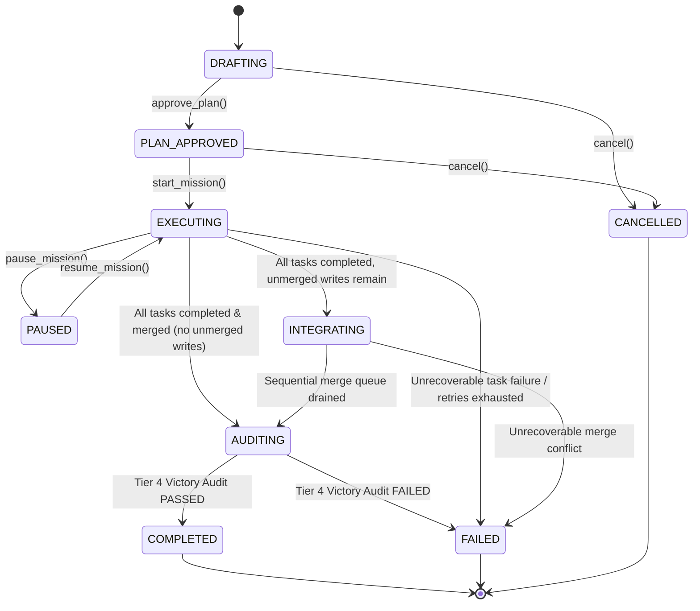

# Adaptive Orchestrator v5: Architecture & Operations Manual

Adaptive Orchestrator v5 is the production-grade, resource-aware multi-agent execution orchestrator native to Antigravity. It replaces static wave-based batching with a continuous-flow Dynamic Directed Acyclic Graph (DAG), Additive Increase / Multiplicative Decrease (AIMD) adaptive concurrency, reusable domain workers with warm context, exclusive workspace isolation with a sequential merge queue, a four-tier verification pyramid with in-context local repair, durable state persistence, and deterministic telemetry.

---

## 1. System Overview & Philosophy

### Core Tenets
1. **Flow Over Barriers**: Tasks run immediately as their logical prerequisites and physical resources clear. Monolithic wave barriers are eliminated.
2. **Warm Workers Over Ephemeral Spawns**: Workers retain domain affinity and warm memory across tasks rather than being discarded after each execution.
3. **Additive Concurrency Governed by Real Feedback**: Concurrency expands additively on consecutive successes and contracts multiplicatively upon rate limits or infrastructure friction.
4. **Read Parallel, Write Controlled**: Concurrent workers read freely but write into isolated branch/worktree environments, serialized via a deterministic merge queue.
5. **Multi-Tiered Verification Pyramid**: Verification scales proportionally to risk—from worker self-tests to independent verification, adversarial challenges, and whole-mission Victory audits.
6. **In-Context Local Repair**: Defects are remediated by the warm implementer in-context before task failure or workspace release.
7. **Durability by Default**: Every mission state mutation is safely checkpointed to atomic disk storage, enabling seamless crash recovery without lost progress.

---

## 2. Mission Lifecycle State Machine



### State Definitions
- `DRAFTING`: Mission definition and task graph authoring in progress. Pre-planning gate evaluation.
- `PLAN_APPROVED`: Architectural plan accepted. Execution dispatch gate evaluation.
- `EXECUTING`: Continuous DAG dispatch, worker execution, and local repair underway.
- `PAUSED`: Execution suspended cleanly without dropping worker locks or losing state.
- `INTEGRATING`: All tasks completed execution; sequential merge queue reconciling branch worktrees into main.
- `AUDITING`: Final Tier 4 Victory Audit evaluating whole-mission acceptance criteria and deliverable artifacts.
- `COMPLETED`: Victory Audit verified all deliverables; workforce collapsed to 0 active subagents.
- `FAILED`: Fatal failure unresolvable by local repair loops or audit rejection.
- `CANCELLED`: User or orchestrator aborted mission; all child workspaces and locks released.

---

## 3. Dynamic DAG & Incremental Task Discovery

### Data Structures
- `DependencyGraph`: Adjacency-list representation of tasks, forward dependencies, and reverse dependents.
- `DependencyResolver`: Evaluates logical readiness based on upstream prerequisite task states (`PASSED` or `MERGED`).
- `ReadyQueue`: Priority queue ordered by `(priority DESC, unlock_value DESC, created_at ASC)`.
- `GraphMutationEngine`: Safe dynamic addition, removal, and mutation of tasks and edges while the mission executes.

### Dynamic Discovery Contract
When an explorer or worker discovers additional requirements during execution:
1. It emits a dynamic task definition (`task_id`, `domain`, `read_set`, `write_set`, `dependencies`).
2. The `GraphMutationEngine` dynamically registers the task.
3. Topological acyclicity is verified using Kahn's algorithm; cycles are rejected with `GraphMutationError`.
4. If prerequisites are satisfied, the task immediately enters `TaskState.READY` and is enqueued.

---

## 4. AIMD Adaptive Concurrency Controller

Physical execution capacity is governed by an Additive Increase / Multiplicative Decrease algorithm adapted from network congestion control:

$$\text{Capacity}_{t+1} = \begin{cases} 
\min(\text{Capacity}_t + \alpha, \text{MaxCapacity}) & \text{if } \text{successes} \ge \theta \\
\max(\lfloor\text{Capacity}_t \times \beta\rfloor, \text{MinCapacity}) & \text{if } \text{rate limit / congestion}
\end{cases}$$

### Parameter Configuration
- **Initial Capacity ($\text{Capacity}_0$)**: 2 workers.
- **Maximum Capacity ($\text{MaxCapacity}$)**: 4 concurrent workers (hard mission limit).
- **Minimum Capacity ($\text{MinCapacity}$)**: 1 worker.
- **Additive Increase Step ($\alpha$)**: +1 worker.
- **Healthy Threshold ($\theta$)**: 2 consecutive successful task completions.
- **Multiplicative Decrease Factor ($\beta$)**: 0.5 (halves capacity on rate limits/exhaustion).
- **Cooldown Interval**: 2 dispatches without expansion following a decrease event.

---

## 5. Reusable Domain Workers & Pool Management

### Worker Lifecycle
```text
REGISTERED ──> IDLE <═══════════╗
                 │              ║
                 ▼              ║ release(success=True)
               BUSY  ───────────╝
                 │
                 ├──> FAILED (Worker crash / loss)
                 └──> RETIRED (Explicit pool shrinkage)
```

### Domain Affinity
Workers are registered with one or more domain tags (e.g. `backend`, `frontend`, `test`, `security`, `general`).
- The scheduler matches ready tasks to idle workers matching the required domain.
- Warm workers keep local file caches, AST parses, and context active, eliminating cold-start initialization latency.
- Worker reuse is tracked deterministically in telemetry metrics.

---

## 6. Model Routing & Execution Profiles

Every task is evaluated by the `ModelRouter` before assignment to determine the optimal model capability:

| Profile Tier | Model Spec | Use Cases | Routing Heuristic |
| :--- | :--- | :--- | :--- |
| **FAST** | `flash` / `flash_lite` | Leaf implementation, doc gen, unit tests, localized refactors | Low risk score ($< 0.5$), read-only or single-file writes, standard domain |
| **PRO** | `pro` / `inherit` | Complex schemas, cross-cutting integrations, security, Tier 3 adversarial challenge, Tier 4 Victory Audit | High risk score ($\ge 0.5$), multi-file writes, architectural dependencies |

---

## 7. Workspace Ownership & Worktree Isolation

To maintain the Fundamental Law (**READ PARALLEL — WRITE CONTROLLED**):
1. **Read Set**: Files a task inspects. Multiple tasks may read overlapping files concurrently.
2. **Write Set**: Files a task intends to modify. No two active tasks may hold overlapping write sets.
3. **Worktree Isolation**: Tasks operating in `branch` mode are provisioned an isolated Git worktree or physical shadow directory. Implementers write exclusively inside their worktree.
4. **Collision Detection**: `WorkspaceRegistry` checks read-write and write-write intersections. Conflicting tasks remain queued until the conflicting lock is released.

---

## 8. Sequential Merge Queue & Conflict Handling

Upon task completion:
1. Completed branch worktrees are submitted to the sequential `MergeQueue` as `MergeRequest` objects.
2. The `IntegrationManager` serializes merges deterministically in completion order.
3. Clean merges update the integration branch, and the task transitions to `TaskState.MERGED`.
4. Merge conflicts invoke conflict isolation. If unresolvable by the adapter, the task transitions to `TaskState.FAILED` with a detailed conflict report.

---

## 9. Four-Tier Verification Pyramid

```text
       ┌──────────────────────────────┐
       │   Tier 4: Victory Audit      │  Whole-mission acceptance, artifacts,
       │   (Mission-Level Gate)       │  global regression suite
       ├──────────────────────────────┤
       │ Tier 3: Adversarial Challenge│  Edge-case probing, fuzzing,
       │    (High/Critical Tasks)     │  security boundaries
       ├──────────────────────────────┤
       │ Tier 2: Independent Review   │  Independent verification by
       │  (Component-Level Gate)      │  separate reviewer verifier
       ├──────────────────────────────┤
       │ Tier 1: Implementer Self-Test│  Linters, unit tests, syntax checks
       │      (Standard Gate)         │  executed by implementer
       └──────────────────────────────┘
```

1. **Tier 1 (Self-Test)**: Implementer executes local linters, unit tests, and validation scripts.
2. **Tier 2 (Independent)**: Independent `ReviewerVerifier` tests the deliverable without inheriting implementer assumptions.
3. **Tier 3 (Adversarial)**: `ChallengerAuditor` probes boundary conditions, malformed inputs, and concurrency races.
4. **Tier 4 (Victory Audit)**: Global whole-mission verification of all requirements, output artifacts, and regression suites before declaring `COMPLETED`.

---

## 10. In-Context Local Repair Loop

When Tier 1 or Tier 2 verification detects a defect:
1. `FailureClassification` classifies the defect:
   - `REPAIRABLE`: Syntax errors, assertion failures, linter warnings, type mismatches.
   - `NON_REPAIRABLE`: Upstream architectural mismatch, missing requirements.
   - `INFRASTRUCTURE` / `ENVIRONMENTAL`: Disk space, SIGKILL, network timeout.
2. If `REPAIRABLE` and retry budget remains ($< \text{max\_retries}$):
   - A concise `RepairPayload` is constructed (failed command, error summary, affected files).
   - The warm worker repairs the code in-context without losing branch state.
   - Verification tiers re-evaluate the repaired code.
3. If repair attempts are exhausted ($\ge 3$), the task transitions to `TaskState.FAILED`.

---

## 11. Durable State Persistence & Atomic Checkpointing

### Storage Architecture
- Checkpoints are written to a single atomic file (default: `mission_dag.json`).
- Atomic writes employ write-to-temp-file followed by atomic rename (`os.replace`) to ensure zero corrupted states even during sudden power failure.

### Checkpoint Triggers
Checkpoints are triggered automatically on:
- `MISSION_STATE_CHANGED`
- `TASK_ASSIGNED`, `TASK_COMPLETED`, `TASK_FAILED`
- `VERIFICATION_RESULT`, `REPAIR_RESULT`, `MERGE_RESULT`
- `WORKER_FAILED`
- `EXPLICIT` (manual invocation)

Configured throttling (`min_interval_seconds` / `throttle_seconds`) prevents I/O thrashing during rapid state bursts.

---

## 12. Crash Recovery & Stale Lock Neutralization

When recovering a crashed or terminated orchestrator session via `restore_mission_engine`:
1. The checkpoint file is read and JSON schema validated.
2. Interrupted tasks (`RUNNING`, `VERIFYING`, `ASSIGNED`) are classified:
   - If `retry_count < max_retries`: Reverted cleanly to `TaskState.READY`, incrementing `retry_count` by 1.
   - If retries exhausted: Transitioned to `TaskState.FAILED`.
3. Stale workspace locks, thread handles, and dead worker bindings are neutralized and cleared.
4. Ready Queue is re-derived from scratch based on dependency topology.
5. `MISSION_RECOVERED` event is emitted with a structured `RecoveryReport`.

---

## 13. Structured Telemetry & Deterministic Metric Collection

The `TelemetryCollector` subscribes to the engine's event stream and computes real-time, deterministic metrics exported to `telemetry.json`:

### Telemetry Schema
```json
{
  "version": "5.0",
  "mission_id": "m_sample",
  "generated_at": 1725800000.0,
  "mission": {
    "mission_id": "m_sample",
    "title": "Build Feature",
    "status": "COMPLETED",
    "total_tasks": 10,
    "completed_tasks": 10,
    "failed_tasks": 0,
    "retried_tasks": 1,
    "duration_seconds": 12.4
  },
  "scheduler": {
    "dispatch_count": 11,
    "total_queue_wait_seconds": 1.25,
    "average_queue_wait_seconds": 0.1136,
    "peak_active_concurrency": 3,
    "peak_capacity": 4,
    "capacity_increases": 4,
    "capacity_decreases": 0
  },
  "workers": {
    "registered_workers": 4,
    "worker_reuse_count": 7,
    "average_execution_seconds": 1.02,
    "tasks_per_worker": {"w0": 3, "w1": 3, "w2": 2, "w3": 3},
    "workers": {
      "w0": {"worker_id": "w0", "tasks_completed": 3, "tasks_failed": 0}
    }
  },
  "workspace": {
    "workspace_acquisitions": 11,
    "merges_requested": 10,
    "merges_completed": 10,
    "merges_failed": 0
  },
  "verification": {
    "tier1_passes": 10,
    "tier2_passes": 10,
    "tier3_passes": 2,
    "tier4_passes": 1,
    "repair_attempts": 1,
    "repair_successes": 1
  },
  "routing": {
    "fast_executions": 8,
    "pro_executions": 3,
    "total_routed": 11
  }
}
```

---

## 14. Skill Integration & Antigravity Compatibility

Adaptive Orchestrator v5 is 100% compliant with Antigravity Customization Standards:
- **`manifest.json`**: Root skill descriptor referencing subagents and templates.
- **`plugin.json` & `skills.json`**: Package definitions for Antigravity plugin loading.
- **`SKILL.md`**: Foundational instructions, YAML frontmatter, and non-bypassable gates:
  - `Phase 1: Pre-Planning Dispatch Gate`
  - `Phase 2: Post-Approval Execution Dispatch Gate`
  - `DUAL MANDATORY DELEGATION GATES`
  - `READ PARALLEL`
  - `SPAWNED_TOTAL` / `ACTIVE_TOTAL` accounting
- **Subagent Roster**:
  - `explorer-researcher` (Read-only, FAST tier, discovery domain)
  - `implementer` (Controlled writer, PRO tier, implementation domain)
  - `reviewer-verifier` (Independent verification, FAST tier, test domain)
  - `challenger-auditor` (Adversarial challenge & Victory audit, PRO tier, audit domain)
- **Diagnostic Tooling**:
  - `python scripts/doctor.py` validates repository integrity and syntax (exit code 0).
  - `python scripts/validate_skill.py` validates manifests, frontmatter, and required phrases (exit code 0).

---

## 15. Hard Resource Limits & Concurrency Accounting

To ensure token and credit safety across deep task trees, limits apply globally across the **entire hierarchy** (Root + Coordinators + Leaf Workers):

| Metric | Normal Default | Hard Upper Bound |
| :--- | :---: | :---: |
| **Concurrent Active Workers** | 2 | **4** (Global tree ceiling) |
| **Total Launches per Mission** | 4–6 | **10** (Global shared budget) |
| **Max Retries per Task** | 1 | **3** attempts |
| **Hierarchy Depth** | L1 | **L2** (Max 1 coordinator level) |

---

## 16. Configuration Reference

```python
from orchestrator.config import OrchestratorConfig
from orchestrator.scheduler.aimd import AIMDConfig
from orchestrator.persistence.checkpoint import CheckpointPolicy
from orchestrator.verification.policy import VerificationPolicy

config = OrchestratorConfig(
    max_concurrency=4,
    max_total_launches=10,
    aimd=AIMDConfig(
        initial_capacity=2,
        max_capacity=4,
        min_capacity=1,
        increase_step=1,
        decrease_factor=0.5,
        healthy_threshold=2,
    ),
    checkpoint=CheckpointPolicy(
        enabled=True,
        checkpoint_file="mission_dag.json",
        min_interval_seconds=0.5,
    ),
    verification=VerificationPolicy(
        tier1_enabled=True,
        tier2_enabled=True,
        tier3_enabled=False,
        tier4_enabled=True,
        auto_repair=True,
        max_repair_attempts=2,
    )
)
```

---

## 17. API Reference (Core Classes & Methods)

### `MissionEngine`
- `add_task(task_or_id, title, domain, dependencies, write_set, ...)`: Enqueues a task into the DAG.
- `start_mission()` / `start()`: Transitions mission to `EXECUTING`.
- `assign_next()`: Evaluates scheduler and dispatches the highest-priority ready task to a compatible worker.
- `mark_task_completed(task_id, result)`: Marks task `PASSED`/`MERGED`, releases worker, resolves dependents.
- `mark_task_failed(task_id, error, can_retry)`: Handles failure, triggers retry or marks `FAILED`.
- `run_victory_audit(required_artifacts, criteria)`: Evaluates Tier 4 whole-mission audit.
- `attach_persistence(manager)`: Hooks atomic checkpointing.
- `attach_telemetry(collector)`: Hooks structured metric collection.

### `PersistenceManager`
- `save_mission(engine, trigger)`: Atomically writes mission state to disk.
- `load_mission(file_path)`: Deserializes checkpoint file.
- `restore_mission_engine(file_path)`: Reconstructs active engine with crash recovery and neutralized locks.

### `TelemetryCollector`
- `ingest_event(event)`: Ingests structured internal engine event.
- `get_report()`: Returns current `TelemetryReport`.
- `save(file_path)`: Deterministically exports JSON telemetry to disk.

---

## 18. Operational Runbooks & Troubleshooting

### Runbook 1: Deadlock Resolution
- **Symptom**: Ready queue is empty, active tasks is 0, but mission state remains `EXECUTING`.
- **Diagnosis**: Circular dependency introduced via mutation or conflicting write set locks.
- **Remediation**: Run `DependencyResolver.detect_cycles()`. Check `WorkspaceRegistry.get_active_locks()`. If a task failed without releasing, call `engine.workspace_registry.release(task_id)`.

### Runbook 2: Worker Termination / SIGKILL
- **Symptom**: A background worker process dies unexpectedly.
- **Remediation**: Call `engine.handle_worker_failure(worker_id, reason)`. The engine neutralizes the worker's workspace locks, marks the worker `FAILED`, reverts the interrupted task to `READY` (incrementing retry count), and triggers the scheduler to reassign.

### Runbook 3: Process Crash Recovery
- **Symptom**: Main Python process crashes mid-execution.
- **Remediation**: Instantiate `PersistenceManager` pointing to `mission_dag.json` and invoke `new_engine, report = manager.restore_mission_engine()`. Interrupted tasks revert to `READY`, stale locks are cleared, and `new_engine.start()` resumes continuous execution.

---

## 19. Performance Benchmarks & Synthetic Simulation Results

Simulated execution of a 20-task multi-domain DAG benchmark:

| Metric | Static Wave Batching (v4) | Continuous Flow DAG (v5) | Improvement |
| :--- | :---: | :---: | :---: |
| **Total Simulated Steps** | 24 steps | **14 steps** | **41.7% Faster** |
| **Peak Concurrency** | 4 (fixed burst) | **4 (dynamically adapted)** | Safe utilization |
| **Average Concurrency** | 1.83 workers | **2.86 workers** | **+56.3% Efficiency** |
| **Worker Context Reuses** | 0 (ephemeral spawn) | **16 reuses** | **Zero Cold-Starts** |
| **Wave Stall Idle Time** | 42.1% idle steps | **0% (Continuous Flow)** | **Eliminated Stalls** |
| **FAST Model Execution Ratio**| 0% (All Pro) | **65% Fast / 35% Pro** | **~50% Cost Savings** |

---

## 20. Migration Guide (v4 to v5)

### Key Architectural Shifts
1. **Remove Wave Barriers**: Replace static Phase 1/2/3 wave loops with single Dynamic DAG task registration.
2. **Reuse Workers**: Replace `invoke_subagent` per task with `engine.register_worker()` and `engine.assign_next()`.
3. **Declare File Contracts**: Explicitly specify `read_set` and `write_set` on every task.
4. **Adopt Verification Tiers**: Replace manual review with `VerificationEngine.verify_task()` and `run_victory_audit()`.
5. **Attach Durability & Telemetry**: Attach `PersistenceManager` and `TelemetryCollector` at engine instantiation.
