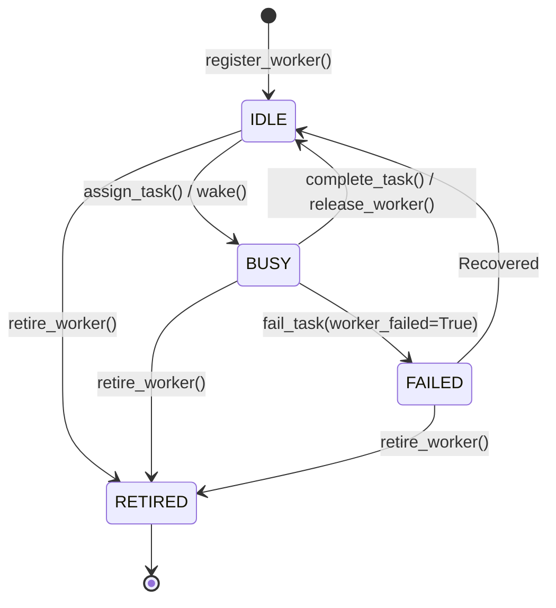

# Adaptive Orchestrator v5 — Worker Pool & Event-Driven Execution (Developer Guide)

**Module Status**: Phase 2 Execution Layer Architecture  
**Specification Authority**: `ADAPTIVE_ORCHESTRATOR_V5_ARCHITECTURE.md` (Sections 9, 11, 12, 13)  
**Package Paths**: `orchestrator/workers/`, `orchestrator/scheduler/`  
**Target Python**: $\ge 3.9$ (Pure standard library, zero external runtime dependencies)  

---

## 1. Overview

Phase 2 introduces the first real execution layer of Adaptive Orchestrator v5, bridging the gap between logical readiness (`ReadyQueue`) and active execution.

While Phase 1 answers:
> **"WHAT CAN RUN?"** (pure topological dependency resolution)

Phase 2 answers:
> **"WHAT SHOULD RUN NOW, ON WHICH AVAILABLE WORKER?"**

Crucially, Phase 2 replaces v4-style stop-and-go wave barriers with **continuous event-driven execution using warm, reusable workers**.

```text
               ┌───────────────────────┐
               │ Ready Queue (Phase 1) │
               └───────────┬───────────┘
                           │
                 [Evaluate Readiness]
                           │
                           ▼
               ┌───────────────────────┐      ┌─────────────────────────┐
               │ EventDrivenScheduler  │ <--> │ DomainAffinityPolicy    │
               └───────────┬───────────┘      └─────────────────────────┘
                           │
                     [Match & Wake]
                           │
                           ▼
               ┌───────────────────────┐      ┌─────────────────────────┐
               │ ExecutionAdapter      │ <--> │ Reusable WorkerRegistry │
               └───────────┬───────────┘      └─────────────────────────┘
                           │
                 [Dispatch Work / Wake]
                           │
                           ▼
               ┌───────────────────────┐
               │ Reusable Worker Pool  │
               └───────────┬───────────┘
                           │
             [Task Done / Worker Released]
                           │
                           ▼
               ┌───────────────────────┐
               │ Event Flow & Unlocks  │ ──> (Immediately re-evaluates Queue)
               └───────────────────────┘
```

---

## 2. Worker Domain Models (`orchestrator.workers.models`)

### 2.1 Worker Lifecycle State Machine
A worker progresses through four canonical lifecycle states:



* **`IDLE`**: Worker is warm, maintains conversational/AST context, and is available for task assignment.
* **`BUSY`**: Worker is actively executing an assigned task.
* **`FAILED`**: Worker process or communication layer suffered an unrecoverable error.
* **`RETIRED`**: Worker is decommissioned (e.g. mission complete or context ceiling reached).

### 2.2 Worker Entity (`Worker`)
* `worker_id: str`: Unique worker identifier.
* `domain: str`: Specialization tag (e.g., `"backend"`, `"frontend"`, `"general"`).
* `state: WorkerState`: Current lifecycle state.
* `current_task_id: Optional[str]`: Active task ID if `BUSY`.
* `task_history: List[str]`: Chronological record of completed/attempted task IDs.
* `metrics: WorkerMetrics`: Telemetry tracking completed tasks, error count, and total execution time.
* `last_active_at: float`: Epoch timestamp used for LRU load balancing.

---

## 3. Worker Registry / Pool (`orchestrator.workers.registry`)

The `WorkerRegistry` manages the lifecycle and pool of reusable workers:
- **Registration**: `register_worker(worker: Worker)` registers a worker; prevents duplicate IDs.
- **Worker Lookup**: `get_worker(worker_id: str)` and `get_worker_for_task(task_id: str)`.
- **Querying**: `get_idle_workers(domain=None)` returns sorted idle workers matching domain filters.
- **Assignment**: `assign_task(worker_id: str, task_id: str)` locks worker into `BUSY` state.
- **Release**: `release_worker(worker_id: str, success=True, duration=0.0)` returns worker to `IDLE` state, clears `current_task_id`, and appends to `task_history`.
- **Snapshots**: `snapshot()` provides an immutable, deterministic list of worker states for auditing.

> [!IMPORTANT]
> **Worker reuse is mandatory**. Workers are NOT destroyed and recreated for each task. Once a task finishes, the worker returns to `IDLE` and retains its context for the next compatible task in the queue.

---

## 4. Domain Affinity (`orchestrator.workers.affinity`)

The `DomainAffinityPolicy` determines the optimal worker for a ready task:
1. **Exact Domain Match**: Prefers workers where `worker.domain == task.domain`.
2. **General Fallback**: If no exact match is idle, falls back to idle workers where `worker.domain == "general"` (if `allow_general_fallback=True`).
3. **Cross-Domain Fallback**: If enabled (`allow_cross_domain_fallback=True`), any idle worker can be assigned.
4. **Deterministic Tie-Breaking**:
   - Fewest `tasks_completed` (distributes load across workers).
   - Oldest `last_active_at` (favors longest-idle workers).
   - Alphabetical `worker_id` (guarantees 100% reproducible scheduling).

---

## 5. Execution Adapter Boundary (`orchestrator.workers.adapter`)

The execution layer decouples scheduling logic from actual agent process invocation:
- **`ExecutionAdapter` (ABC)**:
  - `dispatch(worker: Worker, task: Task) -> ExecutionResult`
  - `is_reuse(worker: Worker) -> bool`: Identifies whether this dispatch is an initial spawn or a wake/reuse operation.
- **`MockExecutionAdapter`**:
  - Purely deterministic in-memory adapter for unit testing and simulations.
  - Records all dispatches, tracks spawn vs reuse counts, and supports configurable success/failure overrides.
- **`LocalExecutionAdapter`**:
  - In-process adapter executing custom Python callables per domain/task.

In production Antigravity environments, concrete adapters translate:
- First dispatch (`is_reuse == False`) $\rightarrow$ initial subagent spawn (`invoke_subagent`).
- Subsequent dispatches (`is_reuse == True`) $\rightarrow$ native wake (`send_message`).

---

## 6. Event-Driven Scheduler (`orchestrator.scheduler.scheduler`)

The `EventDrivenScheduler` orchestrates the continuous execution loop:

### 6.1 Core Responsibilities
1. **Inspect Ready Queue**: Scans topologically ready tasks.
2. **Inspect Worker Pool**: Finds available idle workers.
3. **Match & Dispatch**: Matches tasks to workers via `DomainAffinityPolicy` and dispatches via `ExecutionAdapter`.
4. **Continuous Execution**:
   - When a task completes, the worker is immediately released back to `IDLE`.
   - Downstream dependent tasks unlock and become `READY`.
   - The scheduler **immediately re-evaluates the queue** without waiting for global wave barriers.

### 6.2 Reactive Event Integration
The scheduler hooks directly into the `MissionEngine` event system:
- Listens to `TASK_READY`, `WORKER_IDLE`, `DEPENDENCY_SATISFIED`, and `MISSION_STATE_CHANGED`.
- **No polling loops**: Scheduling evaluation is triggered strictly upon state mutations.
- **Mission Gating**: Dispatch only proceeds when `mission.state == EXECUTING`. If `DRAFTING`, `PLAN_APPROVED`, or `PAUSED`, tasks remain safely enqueued in `ReadyQueue`.

---

## 7. Policy Boundaries Summary

| Component | Strict Responsibility |
|:---|:---|
| `ReadyQueue` | Logical task ordering (priority, unlock value, FIFO) |
| `WorkerRegistry` | Execution capacity, worker tracking, state transitions |
| `DomainAffinityPolicy` | Task $\leftrightarrow$ worker compatibility scoring |
| `ExecutionAdapter` | Subagent process invocation / `send_message` transport boundary |
| `EventDrivenScheduler` | Deciding **WHAT** runs **NOW** on **WHICH** worker |
| `MissionEngine` | High-level facade, DAG integrity, dependency resolution, event bus |

---

## 8. Deferred Systems (Phase 3+)

The following capabilities are intentionally NOT implemented in Phase 2:
- **AIMD Dynamic Concurrency**: Fixed worker pool configuration is used (dynamic auto-tuning arrives in Phase 3).
- **Model Routing**: No Flash vs Pro routing rules.
- **Workspace Isolation**: No Git worktrees or merge queues (Phase 4).
- **Verification Pyramid**: No Tier 1–4 automated verification gates (Phase 5).
- **Disk Persistence**: No `mission_dag.json` disk serialization.
